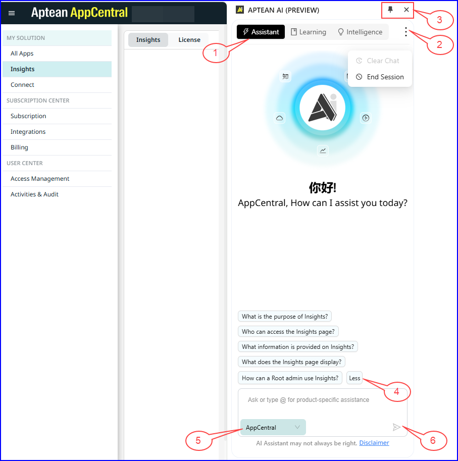

After successfully adding the extension, refresh the page to view the AI Assistant browser extension.

1. Click **AI-assistant** on your browser extension.   The **Aptean AI** slide-in window appears.

2.	In the Aptean AI window, click **AppCentral SSO** or **Aptean SSO**, then choose the appropriate option to sign in.  The AI Assistant will automatically sign you in using your AppCentral or Aptean credentials, providing help suggestions based on the screen.

3.	In the **Aptean AI** window, click **Pin** icon to bookmark the window in toolbar.

### Explore the AI Assistant

The figure below displays the AI Assistant screen, with callouts describing each tab and icon.

1. **Assistant** Tab: Use this tab to search for the information you need.    **Learning** Tab: This tab displays infographics for applications integrated with AppCentral. Click the video to open content in a new tab, or click **Read More** for a summary.  **Intelligence** Tab: View application-related queries.  

2. Click the following options:
    -   **Clear Chat**: Click to delete all messages from the chat window.
    -   **End Session**: Click to log out of the window.

3. Click the **Pin** icon to bookmark the window on your browser extension, or click the **Close** button to exit the Aptean AI window.

4. **More/Less**: Click to view additional help suggestions that can assist you in finding the information you require.

5. **AppCentral** drop-down list: Click the drop-down list to select the desired application, and enter your question related to that application in the text box. By default AppCentral is selected.

6. **Ask**: Click the Ask icon to search for information related to your question.
