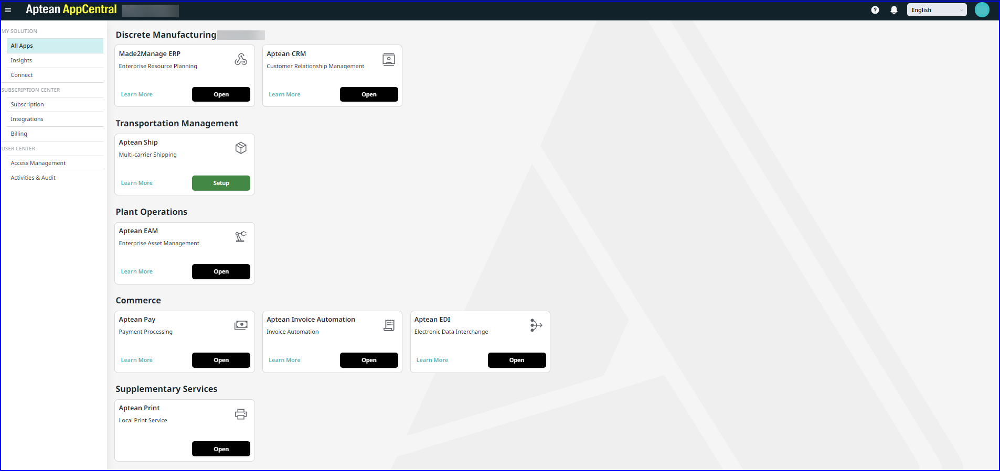

---

title: "All Applications (Apps)"
draft: false
type: Article

---
Aptean AppCentral is an all-in-one platform designed to meet your company’s needs. Whether you are managing resources, transportation, plant operations, or payment services, you can easily setup the applications required to handle these tasks efficiently. 

The available applications are organized into categories, making it simple to choose the ones that best align with your business requirements.

The following are the applications available at the different place holders:

-   **Discrete Manufacturing**
    - **Made2Manage (M2M) Enterprise Resource Planning (ERP)**   Also known as **Aptean Discrete Manufacturing ERP**, this application enhances operational efficiency and supports data-driven decision-making. It leads to shorter cycle times, better supply chain management, more efficient planning and execution, and improved communication, which are essential for success in lean manufacturing.

    -   **Aptean Customer Relationship Management (CRM)**  This application simplifies interactions and relationships between your company and current or potential customers enhancing workflows and increase profitability.
   
-   **Transportation Management**
    -   **Aptean Ship**   A flexible multi-carrier shipping solution designed to simplify shipping operations for businesses of any size. Its key features include carrier rate comparison, shipment tracking, and compliance management, all aimed at optimizing processes, lowering costs, and improving customer satisfaction. The platform integrates seamlessly with various e-commerce, ERP, and warehouse management systems, supporting a broad range of domestic and international carriers.

-   **Plant Operations**
    -   **Aptean EAM**   An all-inclusive system for managing a company’s physical assets throughout their entire lifecycle. This solution improves asset utilization, quality, productivity, and cost efficiency, while reducing operational risks. It features maintenance management, condition monitoring, and asset data management to ensure reliability and availability. By optimizing maintenance activities and lifecycle decisions from acquisition to disposal, it helps organizations effectively manage complex facilities, machinery, and equipment, ensuring their reliability, availability, and safety.

-   **Commerce**
    -   **Aptean Pay**  A digital payment solution that integrates with Aptean AppCentral to simplify payment processes and eliminate delays associated with paper check processing or incompatible digital solutions. Once a payment is received, an online invoice is instantly generated.

    -   **Aptean Invoice Automation**   A powerful solution automates the handling of accounts payable invoices, improving invoice management and increasing operational efficiency. Using AI technologies, it automatically extracts, codes, and processes vendor invoices, allowing for near real-time integration with your Aptean M2M ERP system.
    
    -  **Aptean EDI**   Aptean Electronic Data Interchange (EDI) facilitates the digital exchange of documents in a standardized electronic format, eliminating the need for traditional paper documents like purchase orders. This automation streamlines transactions, saving time and reducing costly manual processing errors.

-   **Supplementary Services**
    -   **Aptean Print**   This application enables you to connect printers in your offices and facilities with Aptean cloud-hosted applications. 
