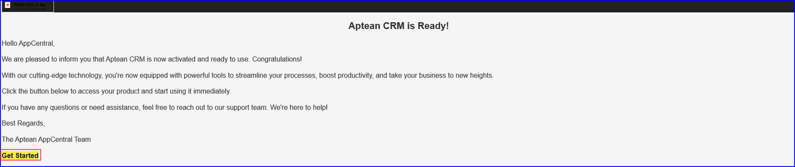
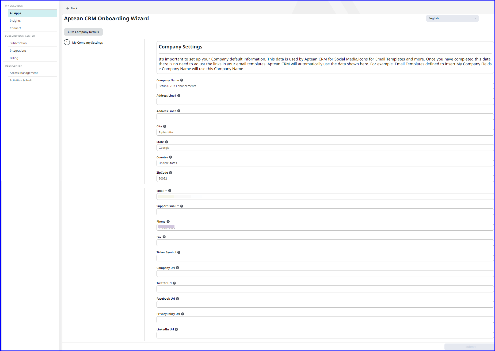

---

title: "Aptean CRM"
draft: false
type: Article

---
To activate Aptean CRM, follow the steps below:

1.	Navigate to **All Apps**, on the **Aptean CRM** application tile, click **Activate**. The **Activation** confirmation window appears. 

2.	Click **Start Activation**.  The Aptean CRM **Activate** button changes to a **gear** icon, indicating the start of the activation process. The application tile shows **Initiated Activation**, then updates to **Deployment Started**. 
 You will receive a confirmation email that Aptean CRM is active on Aptean AppCentral.

3. Click **Get Started** to launch Aptean AppCentral in the confirmation email and click **Setup**. 
OR
4. Click the **Setup** button on **Aptean CRM** tile in the Aptean AppCentral.   The **Aptean CRM Onboarding Wizard** window appears. 

5. On the **CRM Company Details** screen, a few text fields are auto populated based on the information you provided during your license subscription. 

6. To view the specification for each text field, hover over the information icon, and enter the required details, and then click **Submit**.   After the setup process, the Aptean CRM tile displays the Open button indicating the application setup is successful.
Note: The Submit button is enabled only when you enter details in the mandatory fields.

7. Click **Open**.   The Aptean CRM loading screen appears at startup, it leads to the CRM Workspace after your profile is loaded.

