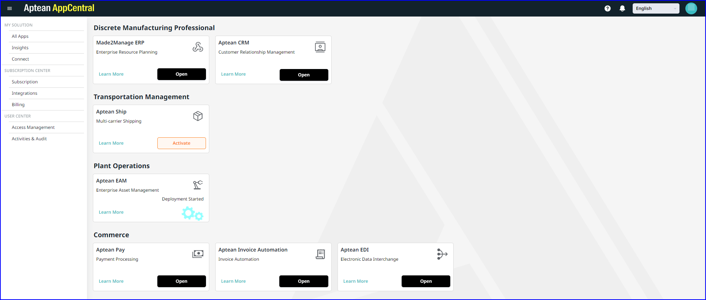
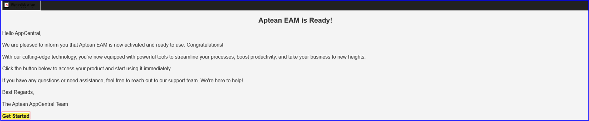
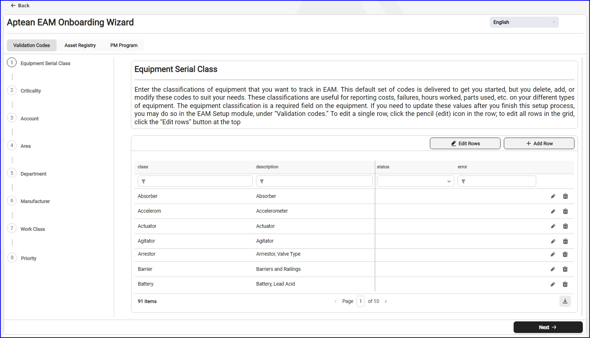
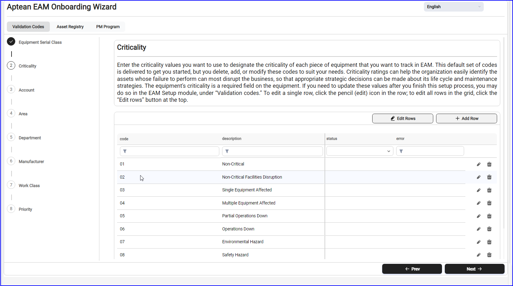
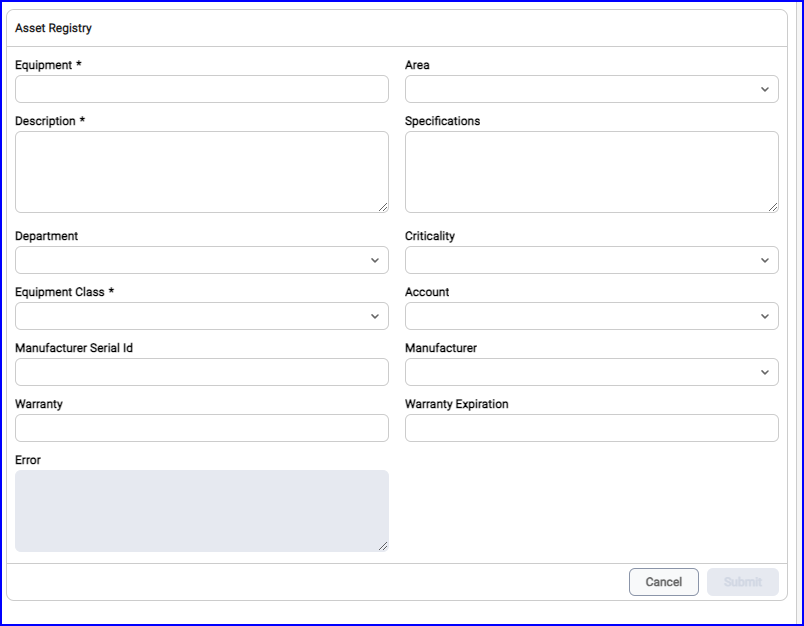
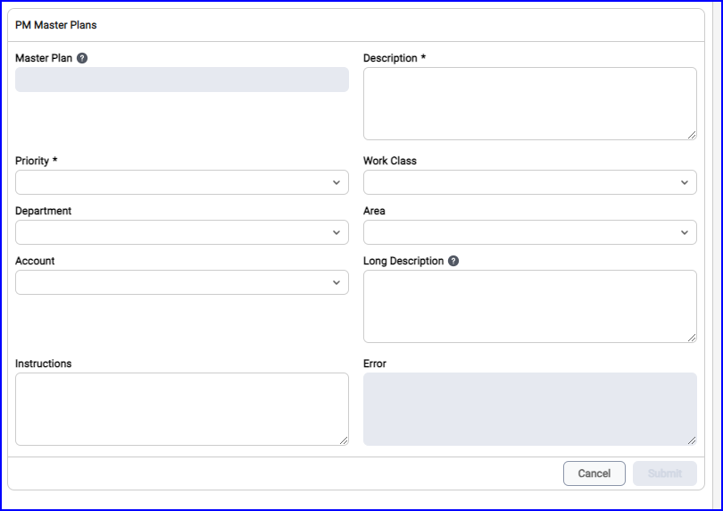
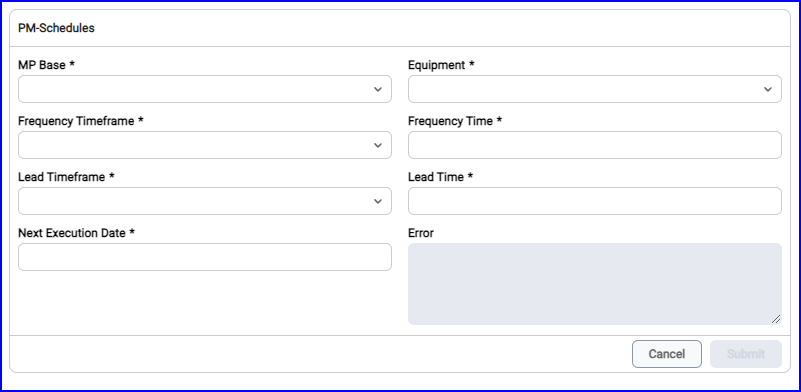

To activate and Setup Aptean EAM, perform the following:

1.	On the **Aptean EAM Essentials** application tile, click **Learn More** to watch a video about how Aptean EAM is designed to help businesses manage asset maintenance and make strategic decisions.  You can also view the infographic for a detailed understanding of the application.

2.	Click **Activate**.  The **Activation Confirmation** note is displayed.

   

3.	Click **Start Activation**.   The Aptean EAM activate button changes to a gear icon, indicating the start of the activation process. The application tile shows Initiated Activation, then updates to Deployment Started. You will receive a confirmation email that Aptean EAM is active on Aptean AppCentral.

   

4.	Click **Get Started** to launch Aptean AppCentral from within the activation email and click **Setup**. or click **Setup** on **Aptean EAM app** tile.
 You can view Aptean EAM Onboarding Wizard screen with three stages set up:
    -   Validation Codes
    -	Asset Registry
    -	PM Program

    The following table shows the action items mentioned in each setup procedure:
    |Icons| Action and Description | 
    |--|--| 
    Add |Click the icon to enter the necessary information in the corresponding text field.|	
    |Save 	|Click to save the entered information.|	
    |Edit |	Click to modify the existing details.|
    |Edit row |Click to select a specific row for editing and apply the necessary updates.|
    |Delete |Click to remove the selected row.|
    |Download |Click to export the data in CSV format.|
    |Prev or Prev Section|	Click to navigate to the previous tab or section respectively.|
    |Next or Next Section|	Click to navigate to the next tab or section respectively.|

5.	On **Validation Codes** tab, make sure to enter the appropriate information in below fields:
    -	For **Equipment Serial Class** - Enter details in class and description text field.  You can view the added details in the table and sort the table using filter for required name such as class, description, and error. Choose the appropriate status from the drop-down list. 

        

    -	For **Criticality, Account, Area, Department, Manufacturer, Work Class** and **Priority** - Enter details in code and description text field.  You can view the added details in the table and sort the table using filter for required name such as code, description, and error. Choose the appropriate status from the drop-down list.

       

6.	Click **Next Section** to navigate to **Asset Registry** tab, enter the appropriate details in the text fields such as Equipment, Description, Manufacture Serial Id, Warranty, Specifications, Error, and Warranty Expiration.  Choose appropriate from drop-down list for Equipment Class, Area, Criticality, Account, Manufacturer.
    >[!Note] Make sure that you enter the appropriate details in the mandatory fields.
    
    

7.	Click **Next Section** to save the details and navigate to the next tab. You can view the added information on the **Asset Registry** table.

8.  On **PM Program > PM Master Plans** tab, enter the details for the following text field shown in the figure.

    

9.	Click **Next** to save the details and navigate to the next tab.  You can view the added information on the PM Master Plans table.

10.	Click **Next** to navigate to PM Schedules, enter the details for the following text field shown in the figure.

    

11.	Click **Submit**.  The Aptean EAM setup process is successfully completed.

12.	Navigate to **All Apps**, you can view the **Open** button on **Aptean EAM** app tile.

