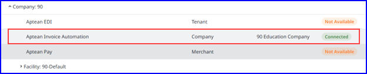

The Aptean Invoice Automation Module integrates seamlessly with M2M, enhancing efficiency, productivity, and reducing costs.

The application provides several key benefits, such as:

-   Scan vendor invoices and post them to M2M as either AP Invoices linked to PO receivers or AP Miscellaneous Invoices.
-   Improve accuracy in invoice processing, boost efficiency, and enhance productivity, saving valuable time in managing invoices.
-   Support sustainability by eliminating the need for printed invoices.
-   Accelerate invoice processing through automation.
-   Reduce errors by minimizing manual data entry.
-   Cut processing times and lower associated costs.
-   Fast return on investment while increasing overall savings.

By default, Aptean Invoice Automation is activated and setup. To access the application, you must add companies after the initial login to AppCentral.

### Add Company in Aptean Invoice Automation

1.	Navigate to **My Solution > All Apps** screen, click **Open** on the **Aptean Invoice Automation** app tile.   The **Aptean Invoice Automation Admin** opens in a new tab.

2.	On **Aptean Invoice Automation Admin** screen, click **+Create Invoice Automation Company**.   The **Create Invoice Automation Company** window appears.

3. Enter the company name in the text field. <ol> <li>You can enter M2M company ID in the text field.</li><li>Aptean Invoice Automation companies are linked to M2M companies.</li></ol>

4.	Click **Save**, to save the company name.

5.	If you choose to add additional companies, repeat steps 2 and 3.
    -   You can enter the required M2M companies ID to add in the Invoice Automation.
    
6.	You must integrate connect linking as follows: <ol><li> Navigate to **Subscription Center > Integrations**.</li> <li>On the **Application Integrations** screen, click expand icon adjacent to Made2Manage.</li> <li>Select the required company name you desire to connect with and click expand icon adjacent to company, and then click **Connect**.   **Note**: Make sure to choose the company name which has the status as Not Connected.</li> <li>On the Integration screen, select the Target company name you created in the Invoice automation that you desire to connect to M2M company, and click **Connect**.  The status changes to Connected.</li></ol> 
   
    

7.	Repeat Step 6 and sub steps to connect the additional companies.

    The companies added in Invoice Automation are set to default configurations, which allows vendors, purchase orders and receivers generated in M2M to be created in Invoice Automation through the established connection. It is recommended that you review the set up within Invoice Automation, where you can modify any settings or configurations from the default values as needed.

