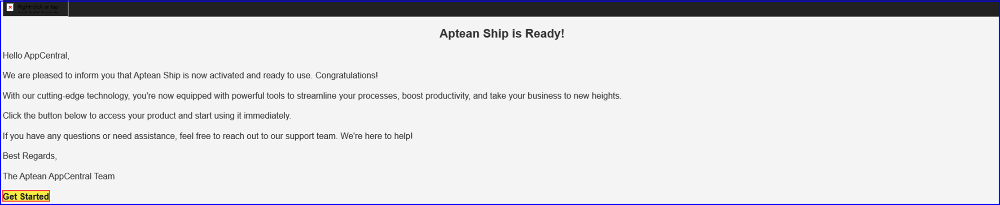
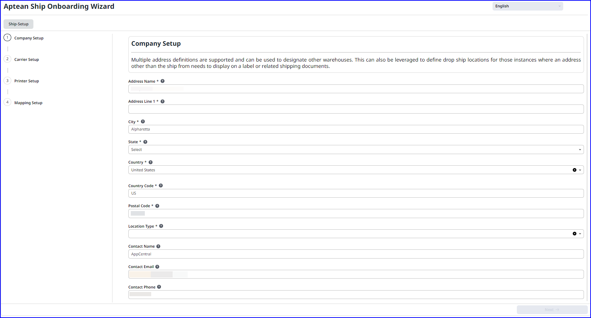

### Prerequisite
You will need your own carrier account, such as FedEx, UPS, or Pitney Bowes, as Aptean allows you to choose your preferred carrier services.  

To activate and setup Aptean Ship, perform the following:

1.  On the **Aptean Ship** application tile, click **Activate**.   The Activation confirmation window appears.

2.	Click **Start Activation**.   The Aptean Ship **Activate** button changes to a **gear** icon, indicating the activation process has started. The application tile shows **Initiated Activation**, which then updates to **Deployment Started**.   You will receive a confirmation email will notify you that Aptean Ship is active on Aptean AppCentral. The app tile will reflect the status as **Deployment Started**.

    

3.	Click **Get Started** to launch Aptean AppCentral within the activation email and click **Setup**.   Or in the AppCentral application navigate to **All Apps**, click **Setup** on the **Aptean Ship** app tile.
The Aptean Ship Onboarding Wizard window appears.
The Aptean Ship set up has four stages, namely:
    -   Company Setup
    -   Carrier Setup
    -   Printer Setup
    -   Mapping Setup

### Company Setup

1.	On the **Company Setup** tab, enter the details for the text field shown in the figure.
    >[!Note] Make sure that you enter the appropriate details in the mandatory fields.

    

2.	Click **Next** to save the details and navigate to the next tab.

### Carrier Setup

1.	In the **Carrier Setup** tab, the carrier details displayed in the table are automatically populated based on the information submitted during the license subscription bundle. 
    -   **Record per page** text field - Enter the number of carrier details to view on the page.  By default, it displays 10 record per page.
    -   Click **setup** icon to setup the carrier details.

2.	Click the **Setup** icon adjacent to each carrier item to configure the carrier. 
  The **Aptean Ship** appears in a new tab for configuration of respective carrier. 

3.	On the **Aptean Ship** window, you can add a new account.  To add a new account in Aptean Ship window, for example to add new account for FedEx carrier, perform the following:

    1. On the **Carrier Setup**, click **setup** icon adjacent to the carrier detail column.
     The **Aptean Ship** appears in a new tab for configuration of respective carrier.

    2. On the **Main** tab, make sure that the check box is selected for Enable background tracking.

    3. On the **Account** tab, click **New Account**.   The **Add FedEx Account** window appears.
    4. Enter the appropriate details in account name and account number in the text field and then click **Next**.
    
    5. On the **Billing Address** section, choose **Address ID** from the drop-down list and enter the appropriate address and then click **Next**.   The Address Validation window appears.
    
    6. Choose the address and click **Use Selected**.

    7. On the **Shipping Address** section, choose the box for the same billing address and click **Next**.
    8. Click **Finish**.  The notification appears the successful addition of the account.

4. On the **Carrier Setup** tab, the Status changes to **Ready**, that indicates that the new account has been successfully added to the carrier details.
    
5.	Click **Next** to navigate to the next tab.

### Printer Setup

1.	On **Printer Setup** tab, you can install printer to print carrier labels for documents like commercial invoices or bills of lading (BOL). To view the list of supported printers, click the link Click **Here**.   The Supported Printers list appears in a new window.

2. Click **Printer Setup**.  The **Aptean Ship** appears in a new tab.

3.	To configure a printer, on the **Printers** tab, click **Add Printer**.

4.	Navigate to Printer Setup tab, click **Next** to navigate to the next tab.

### Mapping Setup

1.	On **Mapping Setup**, you can define ERP values accurately reflect the shipping values. To view information about accessing field mapping, click the link **Click Here**.  The **Mapping M2M Fields** opens in a new tab.

2.	Click **Mapping Setup**.  The **Aptean Ship** in a new tab.

3.	To add a new company, on the **Companies** tab, click **New Company**.

4.	Enter the required details and click **Submit**.  The **Aptean Ship** is successfully setup now.

