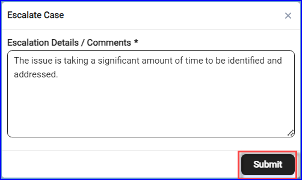

### Create a New Case

1.	In Aptean AppCentral, navigate to **My Solution** > **Connect** > **Support Cases** tab.

2.	Click **Create New Case** in the top right corner on the tab.  The **Create New Case** window appears. 

3.	Enter the required details in **Contact, Product, Type, Severity, Subject**, and **Description**. 
    >[!Note] Ensure that you enter data in all mandatory fields. 

4.	Click **Upload** to attach any related files.
    >[!Note] The file size maximum limit is 35MB.

5.	To record the issue, click **Start Recording**, choose the appropriate tab, or window, or full screen to show the issue as it occurs. 

6. Click **Stop Recording** to finish the session.  The recording will be processed and uploaded to the case. You can delete and create a new recording if needed. 

7.	To submit a case, click **Create Case**. 

### Track Updates and Manage Cases

To view updates and manage your cases, perform the following: 

1. On the **Support Cases** tab, double click  the highlighted case row to view the case details. The case details will be displayed on the case details screen.

2.	Click **Back** to navigate back to the **Support Cases** list screen.

3. Refer to the table for information about the Details and the Attachments tabs: 
 
|**Field**| **Description**|
|--|--|
|Application |The name of the application where the issue was reported.|
|Severity| Indicates the severity level, which determines the response time. Severity levels include:<ul><li> **Critical**: Immediate attention required, business operations halted. </li> <li>**Urgent**: Severe impact on the application, but it is still functional.</li>  <li>**Standard**: Minor disruption, work efficiency affected.</li> <li>**Low**: General query or enhancement request, no significant business impact.</li></ul>|
| Created Date|Displays the date and time when the case was escalated.|
| Status| Shows the current status of the case such as *Escalated*.|

4. Click the **Details** and the **Attachments** tab to view additional information about the case.

    

Refer to the table below for more details on the **Details** and **Attachments** tabs:

| **Field** | **Description**|
|-|-|
|**Details**||
|**Case Information**|
|Case Description|Provides details on the issue, including what actions triggered the problem.|
|**Case Resolution** |
| Root Cause|Describes the specific cause of the issue within Aptean AppCentral.|
| Resolution Type|Indicates whether the resolution was provided, referred to another department, or another action taken.|
|Resolution Summary|Summarizes steps taken to reproduce and resolve the issue in the test environment or outlines troubleshooting efforts.|
|Migrated Resolution Comments (Long)|Comments from the legacy system that exceed the 255-character limit for searchable resolution summaries.|
|**Contact Information**|
|Account|Shows the account name.|
|Contact|Displays the name of the contact person from the customer’s team.|
|Phone|Shows the contact person’s phone number.|
|Contact Email|Displays the contact person's email address.|
|Customer Email cc |Displays an additional contact’s email address.|
|**Attachments**| |
|File|Lists files attached to the case. To upload, click **Save Attachment** or drag and drop files.|
|Save Attachment|Click or drag files to upload. The **Save Attachment** button will activate.|
|Download|Click the download icon to download the attachment to your local system.|
|Remove attachment|Click the close icon next to the file to remove or replace the attachment.|

7. Engage with the Aptean AppCentral team through **Activity > New Post** and **Comment** section.

    
   
    1. To start a new conversation with Aptean Support, click **New Post**. Enter your details in the text box, click **Upload** to attach any relevant documents, and then click **Post** to submit.

    2. To comment on an existing conversation, click **New Comment**.    The **New Comment** window appears.

    3. Enter the details, and click **Post** to submit the comment. You can also attach files or use **Start Recording** to demonstrate the issue.

### Reopen a Case
If the issue remains unresolved, you can reopen a case at any time.
To reopen a case, perform the following:

1.	On the **Support Cases** tab, double-click the case you want to reopen or search for it using the Search feature.  The case details page opens.

2.	Click **Reopen Case**.

3.	Enter a detailed description explaining why the case is being reopened. For example if the resolution was insufficient or the issue recurred.   When you enter the information in the **Reopen Details/Comments** box, the Reopen button enables.

4.	Click **Reopen**.  The Status will change from **Closed** to **In Progress**.

     

### Request for Case Closure

Click **Request Close** if the issue has been resolved, either through the provided resolution or through internal resolution.

### Escalate a Case

If the issue remains unresolved or there is significant delay in response, you can escalate the case.

1. Click **Escalate**.  The **Escalate Case** window appears.

2. Enter the comments and click **Submit**.     The status will change from **Unassigned** to **Escalated**, and the **Escalate** button will disappear.

