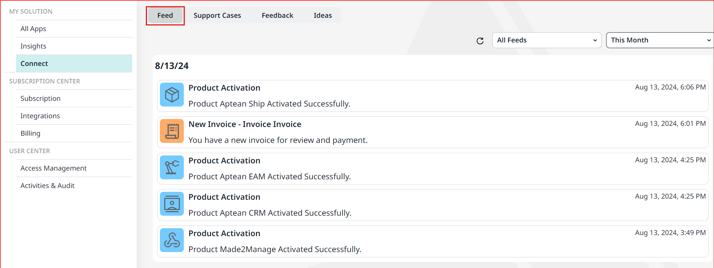

When you navigate to Connect, the Feed tab is displayed by default. Here, you can access system updates, support case changes, invoice updates, and new surveys. The Feed tab serves as a centralized location for all important notifications. To view the original source of any notification, click the **feed** notification. 

### Feed Notification

Below mentioned are few examples of feed notifications:
-   Alerts on support case progress
-   Announcements for application releases and updates
-   Reminders for pending surveys (CSAT and NPS)
-   Information on system updates and planned maintenance
-   Notifications for new invoices and overdue invoice reminders

The **Feed** tab updates in real time. If you like to refresh the feed manually, click the Refresh icon next to the **Filters** field. 

You can view all feeds through the **All Feeds** drop-down list, where you can filter and sort notifications based on categories such as System, Invoices, and more. Additionally, you can filter feeds by specific timeframes like **Today**, **This Week**, or** Last 7 Days**. 

