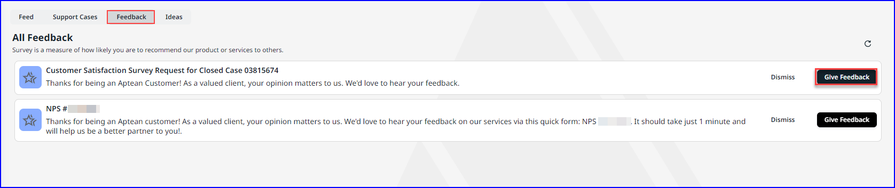

---

title: "Feedback"
draft: false
type: Article

---

The Feedback tab enables you to receive and fill out surveys related to the closed support cases, specifically focusing on Customer Satisfaction (CSAT) and Net Promoter Score (NPS).

On the **Feedback** tab, you can access a compilation of outstanding survey requests that have been previously issued.   

An Admin user role has the capability to view a comprehensive list of all pending surveys for every user role within the organization. The functionalities available in this area are:

-   You can select a feedback survey, complete the associated prompts, and submit the survey to Aptean.
-  You can **Dismiss** surveys from the list.
-  Aptean will contact you after you submit the survey..