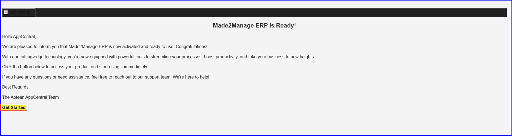
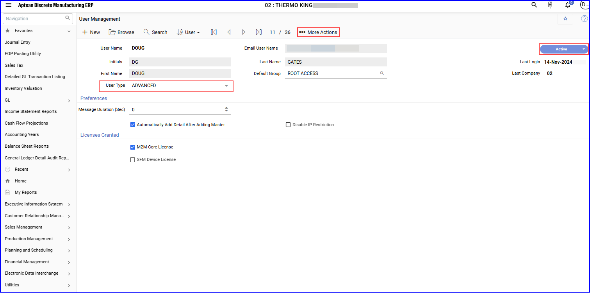

The application is activated and setup to access by default. However, you must activate the seed user profile to start using the M2M ERP application.

### Prerequisite

-   Ensure you click **Get Started** in the email to access M2M application.
-   The Seed user role must provide access to admin role in M2M application.

### Managing User Access in M2M ERP

To provide access to user roles for M2M, perform the following:
1.	Log in to Aptean AppCentral.

2.	Navigate to **My Solution > All Apps**, click **Open** on the Made2Manage ERP app tile.  The **Aptean Discrete Manufacturing ERP** application opens in a new tab.

3.	On the home page, click User Menu icon.(your name initials).

4.	Click **Company** and choose **01 Live** radio button.  The **Company** window appears.

5.	Click **New** to open the or refresh to change the option from 01 live to other. The **User Management** window opens in a new tab.

    

6.	On the left navigation panel, navigate to **Utilities > Maintenance > User Management** or search User Management in the **Search** box.   Or, alternatively, you can search, click **search** icon on the **User Management** screen and enter the required username to search and add that user to provide access to M2M.

7.	Make sure to choose the required group and licenses to grant access and then click **Active** to provide access.

8.	Click **User Type** as **Advanced** from the drop-down list, and click **Save**.

9.	Click **More Actions** in the toolbar.  The More Actions slide-in window appears.

10.	Click **Actions > Permission**.

11.	On the **User Permissions** screen, select **Company** as **00** from the drop-down list and choose the **Permitted** radio button.

12.	Navigate to the **User Management** screen and click **Save**.
