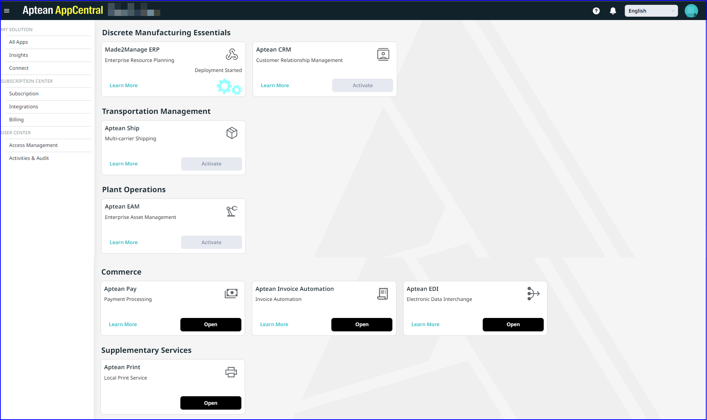

### System Requirements

#### Supported Browsers
-  **Windows**: Google Chrome version 132.0.6834.83 or later, and Mozilla Firefox version 134.0.1 or later, Microsoft Edge version 131.0.2903.147.
-  **MacOS**: Safari version 18.2 or later.

### First Steps in Aptean AppCentral

To get started with Aptean AppCentral, perform the following:

1.	**Identify Your License Subscription**
 The Aptean Support team will help you in choosing the license subscription that best fits your business needs. If you are already using Aptean products, you can easily migrate to Aptean AppCentral while retaining your existing user information. For assistance, contact the Aptean Support team.

2.	**Onboarding Process** 
  Once your order is processed, you will receive a Welcome email with the URL to access Aptean AppCentral, which also serves as your **Proof of Delivery** (POD). This email will guide you through the login process and include your Seed user credentials.

   

3. **Seed User Information**
  The Seed user is the primary user of Aptean AppCentral and has full admin privileges. As a Seed user, you can activate applications according to your license subscription. For more details on managing user roles, refer to [Create Users and Assign Roles](create-users-assign-roles.md). 

   >[!Note] The Seed user is designated as admin in Aptean AppCentral.

   By default, the Made2Manage (M2M) Enterprise Resource Planning (ERP) application will be activated and setup for access. You will receive an activation email after the AppCentral onboarding email.

### Sign In to Your Account

1.	Open the Aptean AppCentral URL in your browser.

2.	Sign in using the **SSO**.  SSO allows you to access different apps in Aptean AppCentral with a single set of credentials. After logging in, you will be directed to **All Apps** window.

   

