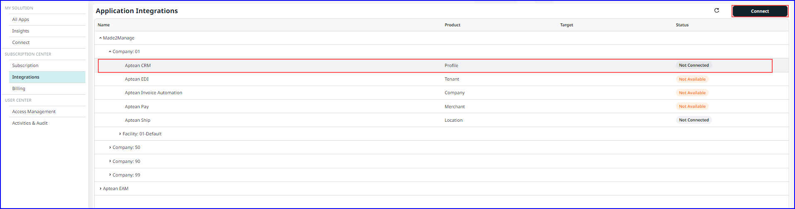

To integrate the application, perform the following:

1. Navigate to **Subscription Center > Integrations**.
  The **Application Integrations** window appears.

2. On the **Application Integrations** window, choose the appropriate application beneath the company name you want to integrate.   For example, choose Aptean CRM and click **Connect**.
  The **Connection Applications** window appears.
 
3.	Choose appropriate target from the drop-down list to establish a connection with Target, then click on **Connect**.
  On the Applications Integrations window, the status changes to Connecting. The background connection process takes few minutes, and once it is completed, the status will change to Connected.  It also displays the connection details, such as Source Name, Product and Target.

The following steps the procedure for integrating applications:
-   [Integrating M2M with Aptean CRM](integrating-m2m-crm.md)
-   [Integrating M2M with Aptean EAM](integrating-m2m-eam.md)
-   [Integrating M2M with Aptean EDI](integrating-m2m-edi.md)
-   [Integrating M2M with Aptean Pay](integrating-m2m-pay.md)
-   [Integrating M2M with Aptean Ship](integrating-m2m-ship.md)
- [Integrating EAM with Aptean M2M](integrating-eam-m2m.md)
