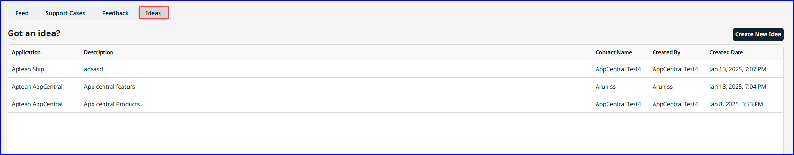

If you have innovative ideas for new products or enhancements, please submit them to Aptean support for review. Your suggestions will be forwarded to Aptean Support and shared with the relevant Product Manager, who will keep you informed through an email about the status of your submission.  
   

Use a filter to refine your search and receive results for ideas from various fields. The result screen refreshes automatically.

Refer to the table to below for more information about the ideas screen:

| **Field**     | **Description**   |
|---------------|--------|
| Application   | It is the name of the application for which you are suggesting the idea. |
| Description   | It is the description of the idea in detail to help convey your input. |
| Contact Name  | It displays the contact’s name who has submitted the idea.   |
| Created By    | It displays the account name of the contact who created the idea.   |
| Created Date  | It captures the date timestamp on which the idea was submitted to AppCentral.  |

### Suggest an Idea
To submit an idea, perform the following:

1.  Click **Create New Idea**.   
    The **Create New idea** screen appears with **Contact** and **Application** values already populated.
2.  Click to modify **Contact** and **Application** values from the respective drop-down menus.
3.  Enter your idea or suggestion in detail in the **My Idea** text box and click **Create Idea.**   
    Fields marked with asterisk (\*) are required.