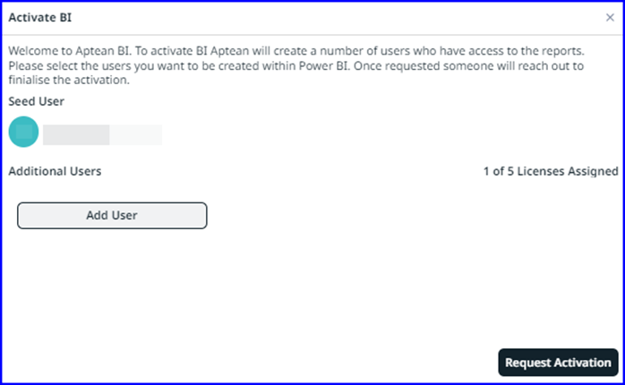

---

title: "Insights"
draft: false
type: Article

---
### Aptean Business Intelligence 
Aptean Business Intelligence (BI) provides seamless access to critical data, enabling you to quickly review key performance indicators and gain valuable insights for more informed decision-making.
> [!Note] Ensure that you have access to Azure tenant.

Aptean BI is integrated with Aptean ERP system through the Azure tenant. Aptean BI supports both strategic and operational decisions. It offers advanced analytics, customizable reporting, and real-time data visualization, helping you improve decision-making and drive business initiatives.

A Seed user or an admin can activate Aptean BI and assign licenses to users who require access. Licenses can be requested for users needing report access, and the Aptean team will assign them accordingly.

You can initiate by requesting licenses for a limited number of users in Aptean AppCentral and request additional licenses as needed.   To request licenses, navigate to the Insights screen or navigate to **User Center > Access Management** and click **Power BI**.

>[!Note] The number of Aptean BI license depends on the subscription license bundle selected.

### Activate Aptean BI

1.	Navigate **My Solutions > Insights**, click **Aptean BI**.  The **Activate BI** window appears.

    

2. On **Activate BI**, click **Add User**. The **Select users to assign BI license** window opens displaying existing username and email address.

3.	In the window, choose the appropriate name and click **Select**.

4.	In the **Activate BI** window, click **Request Activation**.   After submitting a request, the Aptean support team will assign licenses to the users. You can view the list of users with assigned BI licenses under the Power BI tab. For more information See [Power BI](power-bi).

