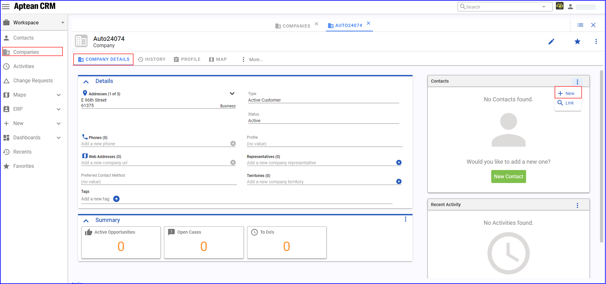
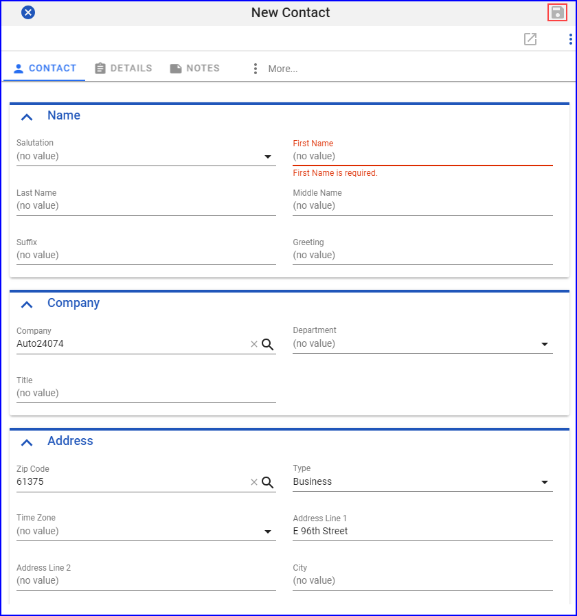

### Create a New Customer Record in M2M ERP

1.	Navigate to **My Solutions > All Apps**, click **Open** on M2M app tile.  The **Aptean Discrete Manufacturing ERP** window appears in a new tab.

2.	In the application window, search for the required Account or click **+ New** to create the customer record.

3.	On the **Accounts** page, enter Company name and enter the details in the mandatory field. Enter details in the following tabs:
    -   On the **General Information** tab, choose **Customer** as the Type, and enter the City, State, Country, and Zip.

4.	Click **Save**.

### Add a New Company in Aptean CRM

1. In Aptean AppCentral, navigate to **My Solutions > All Apps**, and click **Open** on CRM app tile.   The **Aptean CRM** application opens in a new tab.

2.	In the Aptean CRM application, navigate to **Companies**, enter the appropriate Company code in the search field.  The company code appears on the **Companies** screen.

3. Click the company code.  The slide-in panel displays the details of the company code.

    

4. On the company code, click launch icon to view company details. Under **Contacts**, click **+**, to create a contact for the existing company. 

    

5.	In the **New Contact** window, enter the appropriate details in the mandatory fields.

6. Click **Save** button.  The confirmation request window will appear, to send the contact record to ERP.

7. Click **Yes**.

8. In the M2M application, navigate to **Sales Manager > Master Data > Account Contacts**, or search for **Account Contact** in the search field. Click **Refresh** to view the added contact.
