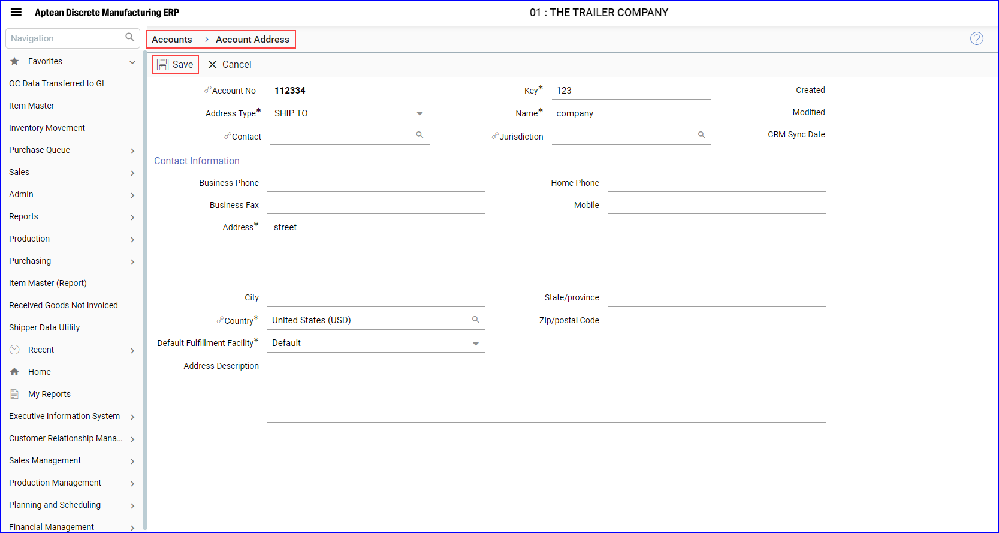
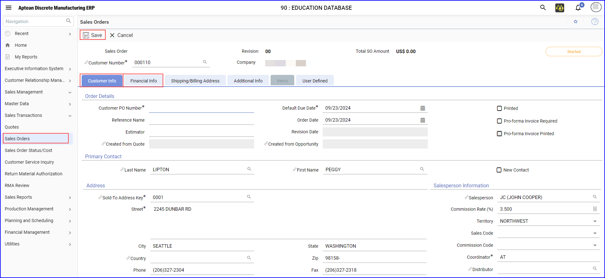

### Create Sales Order for New Contact in M2M 
To create a sales order record for the newly created contact, perform the following:

1. In the M2M application, navigate to **M2M > Accounts > Account Address**. Click **More Actions**.   The **More Actions** slide-in pane appears.

2. In the **More Actions** pane, click **Address**, On the Account Address screen, click **+New**.  The **Account Address** screen appears.

   

3. Enter the appropriate details in the mandatory fields and click **Save**.

4. In the M2M application, navigate to **Sales Management** > **Sales Transactions** > **Sales Orders**, or type **Sales Orders** in Navigation search field. The **Sales Orders** screen appears, click **+ New**.

   

5. On the **Sales Order** screen, search for the Customer Number. In the **Customer Info** tab, enter the appropriate Customer PO Number.

6.	In the **Financial Info** tab, select Payment Type and click **Save**.  The Sales Order is created.

###  Manage Sales Orders in Aptean CRM and M2M

1. In the **Aptean CRM** application, navigate to **ERP > Orders**, and search for the newly created sales order.  The **Orders** screen appears. 

2. Create a line item and save the changes. This update reflects in the M2M application.

3. In the M2M application, do the following:
    - In the search box, search Job Number in the lookup table, enter the Unit Price.
    -   Choose **Stock** as the Source from the drop-down list, and click **Save**.

4. In the CRM application, enter the part number in the search box or click the refresh icon in the order details tab to generate the order line.

5. Navigate back to M2M, refresh the screen, or search for the Sales Order to change the status from **Started** to **Open**.

6. Click **Yes** to update the status to Credit Hold, even if the credit limit has been exceeded.

7.	Return to the CRM application to check for the updated status and refresh the screen.
