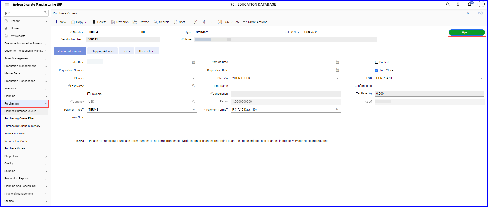

### Manage Vendor data in M2M
#### Create a Vendor 

1.	In the Aptean Discrete Manufacturing ERP application, either enter **Vendors** in the navigation bar or navigate to **Production Management** > **Master Data** > **Vendor** and click **Vendors**.   The **Vendors** window appears.

2. In the **Vendors** window, click **+New**.   The **Vendors** screen appears. 

     

3. On **Accounting** tab, enter details for the following:
    - In the **Vendor Number** section, enter the company name in the text field.
    - In the **Remit To** section, enter the address, city, country, state, zip, and phone.
    - In the **Contact** section, enter first and last name in the respective text field.
    - In the **Payment Details** section, search and enter payment terms and credit limit.

4. On **Additional Info** tab, enter details for the following:
    -   Enter the **EAM Supplier Code** in Vendor type text field.
    -   Enter USD in the default currency text field or click search to choose it from the default currency window, and then choose the United States Country and click **Select**. 
    -   Enter the appropriate amount in **Minimum Order Amount** text field, and click **Save**.   A new vendor is added in the M2M application. Once the vendor is created, update the status from **Started** to **Approved**.

#### View Vendor Creation Status 
When a new vendor is created, an event is triggered. 

-   To view the integrated events, navigate to **User Center** >  **Activities & Audit** > **Integration Events** tab.  To check if the event was successfully triggered or if the vendor was created, choose the event in the **Application Events** section. 
-   Detailed information, including the event status, can be found in the **Event Details** section.

#### Create New Vendor by Replication
To copy an existing vendor and create another vendor in M2M application, perform the following:

1.	In the Aptean Discrete Manufacturing ERP application, either enter Vendors in navigation bar enter or navigate to **Production Management > Master Data > Vendor** and click **Vendors**.   The **Vendors** window appears.

2. In the window, choose the company you want to copy and click **Copy**.

3. Make the required changes in the newly created vendor and click **Save**.

### Manage Vendor Data in EAM application

#### Search a Vendor
1.	To search for a vendor in the Aptean EAM application, navigate to **Supplier > Supplier Search**.

2.	Search for the vendor by its supplier number and click **Search** then click **Details**.   The information about the new vendor will be displayed in the **Main** tab. By default, the new vendors is set to **Active** status. 

#### Edit a Vendor

1. To edit a vendor, navigate to **Supplier Search** window.

2. Enter the supplier number or supplier name and click **Search**.

3.	Click the supplier name to view the details of the vendor.

4.	In the **Main** tab, click **Edit** to update the vendor details.

5.	Do the required changes and click **Save**.

### Deactivate Vendor in M2M

When a new vendor is created, it is set to **Active** status by default. If you change an existing vendor to inactive, it will no longer appear in the All Inactive Supplier list.

To deactivate a vendor, perform the following:
1.	In the M2M application, enter Vendors in search field.   The **Vendor** screen appears.

2. On the Vendor screen, click **search** icon, enter the vendor number, and click **Search**.

3.	On the Vendors screen, change the status from **Approved** to **Inactive** in the drop-down list.   The Vendors Change Status dialog box will appear.

4.	In the **Vendors Change Status** dialog box, delete the name of the user and click **OK**.

5. The event **Vendor Master Deleted** will be displayed in AppCentral. To view the details, navigate to **User Center** > **Activities & Audit** > **Integration Events** > **Application Events**.

### Set Up Query Wizard in EAM
This is a prerequisite in Aptean EAM for searching both active and inactive suppliers. 
1.	Navigate to the Aptean EAM application and enter **Query Wizard** in the search bar.

2.	On the Query List screen, choose **Supplier** from the Module drop-down list.

3.	To create a new query, click **+ NEW**. Alternatively, select an existing **Query Name** and click **Copy** to create a new query.

4.	Enter the desired query name and description.

5.	In the **Criteria** tab, for a new query, the default selected criteria will be blank. For a copied query, select the existing criteria Active = 'Yes', click **Delete**, and then click **Save**.   This will create a query to show only the inactive suppliers.

#### Search for Disabled Vendor

1.	In the EAM application, navigate to the **Supplier > Supplier Search**. 

2. In the screen, choose **All InActive Supplier** from the search drop-down list and enter the supplier number or click **Search**.

3. Click the supplier to view details.

4. In the **Main** tab, you can view the supplier is inactive.

### Add Supplier in EAM and Validate in M2M

1. To create a supplier in EAM application.
    -  Navigate to **All Apps**, and click **Open** on the EAM app tile.   The **Aptean EAM** application opens in a new tab.
    -  In the Aptean EAM application, search for Supplier Search.
    - On the Supplier Search screen, go to the **Supplier** tab.
    - Choose **All Active Supplier-All Active Supplier** from drop-down list and click **Search**.   The Ask At Execution dialog box appears.
    - In the dialog box, click Search.   A new supplier is created.

2. To verify supplier in M2M application

    >[!Note]: In the M2M application, the field referred to as Supplier Name in Aptean EAM is called as Company Name.

    -  To check if the new supplier has been created in M2M and has an active status, navigate to the Supplier Search screen and go to the **Supplier** tab.
    -   In the Supplier tab, in **All Active Supplier** section, search for the supplier or supplier name. The supplier details along with its status as Active will appear in a new tab.
