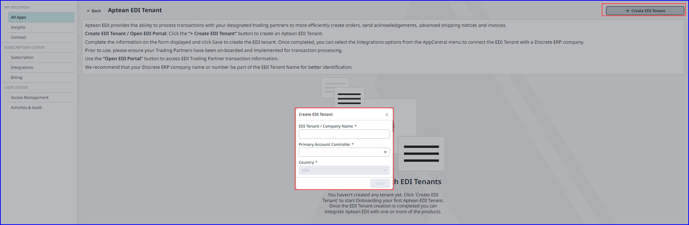
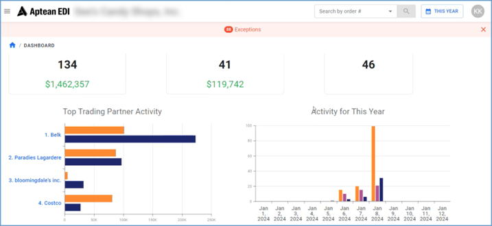

One-way data integration is supported from M2M to CRM applications.

To integrate tenant data from M2M and Aptean EDI, perform the following:
1.	Navigate to **My Solutions > All Apps**, click **Open** on Aptean EDI.
  The **Aptean EDI Tenant** screen is displayed.

2. On the **Aptean EDI Tenant**, click **+ Create EDI Tenant**.   The **Create EDI Tenant** window appears.

    

3. In the **Create EDI Tenant** enter the below required details:
    -   EDI Tenant / Company Name - Enter the appropriate name.
    -   Primary Account Controller - Choose the appropriate account holder from the drop-down list. 
    -   Country - Choose the country from the drop-down list. 

4. Click **Save**.

5.	Select the newly created EDI profile or click **Open EDI Portal** from existing profiles.   The **Aptean EDI** application opens in a new tab.

5.	In **Aptean EDI** application, click **Trading Partners**.      After establishing the trading partner and the EDI profile, the dashboard displays a visual overview of all Purchase Orders, Invoices, and Shipments.     You can filter the views to limit your search results.

6. Navigate to **AppCentral > Subscription Center > Integrations**. On the Application Integrations screen, choose **Aptean EDI** for the appropriate Made2Manage company, then click **Connect**.

