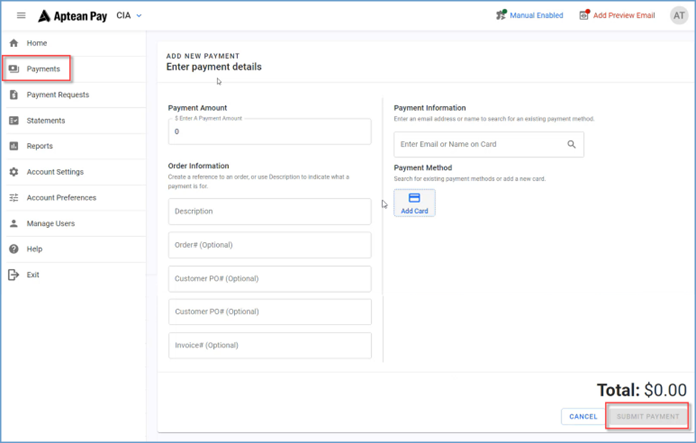

One-way data integration is supported from M2M to Aptean Pay applications.

To integrate M2M to Aptean Pay, perform the following:
1.	Navigate to **My Solutions> All Apps** and click **Aptean Pay**.  The **Aptean Pay Merchants** window appears.

2.	In the **Aptean Pay Merchants** window, click **+ Create Merchant Account**.  The **Create Merchant Account** window appears.

3. In the **Create Merchant Account** window, enter the following required details:
    -   Merchant / Company Name: Enter the appropriate name.
    -   Primary Account Controller: Choose the appropriate account holder from the drop-down list. 
    -   Country: Choose the country from the drop-down list. 
4. Click **Save**.
5. Click the newly created merchant or click **Open Merchant Portal**.  The **Aptean Pay Merchant portal** opens in a new tab.

    

6.	Click **+ New**.
7.	On the Payments page, enter the required detail in **Add New Payment** screen. 
8.	In the **Payment Method** section, click **Add Card** and enter your card details.
9.	Click **Submit Payment**.  The **Payment Request** screen appears.

10.	Click **Payment Requests**.  Here, you can view all pending payment.   For example, if you create an order in M2M and submit a request, the related invoices will appear. This section displays the reference number associated with each payment request, along with details about the order, payment status, recipient, the person who submitted the request, and the amount requested.
 