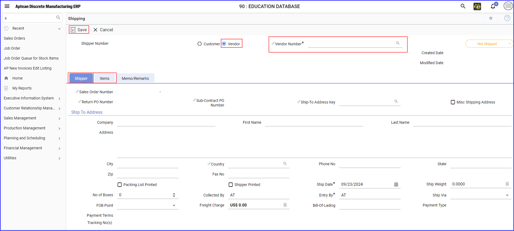

To integrate data between M2M and Aptean Ship, perform the following:
1. Navigate to **My Solutions > All Apps**, click **Open** on M2M app tile.   The **Aptean Discrete Manufacturing ERP** window appears in a new tab.

    >[!Note] You can only integrate shipper details from M2M to the Shipper Document in the Ship application.

2. In the application, navigate to **Production Management > Production Transactions > Shipping** or type shipping in search field to create a shipper record.   The **Shipping** screen appears.

3. Click **+ New** and enter the mandatory fields.

    

4.	On the **Shipping** screen, choose **Vendor** and search for Vendor Number.

5.	In the **Items** tab, enter the Part Number, Quantity, and choose the Unit of Measure, and then click **Save**   The shipper record is created successfully.

6. In the **Aptean Ship** application, refresh the records to view the new shipper record.

7. Click **Create Shipment**.

8. On the **New Parcel Shipment** screen, confirm the recipient's address by selecting it from the Address Validation pop-up dialog and clicking **Use Selected**.

9.	If required, click the **Edit** icon to modify the Sender address.

10. In the Confirm Address Validation Changes pop-up dialog box, select the validated sender address and click **Use Validated Address**.   If address validation fails, check the **Transportation > Carrier company** and **Service and Packaging > Actual Weight** sections.   The freight charges will adjust in the Total Charges (USD) table based on the selected criteria.

11. Click **Ship/Process**.   The shipment is shipped or processed.

12. Navigate back to the M2M application, refresh the records, go to the **Shipper** tab to view the shipper details.

13. In the **Items** tab, click the **Item Number** to open the item detail view, modify, and click **Save**.

14.	Return to the Aptean Ship application to verify that the changes are visible.   The shipper record is updated with a new Shipper Number.

15.	To initiate a new shipment, click **Create Shipment**, and update the address.  Since the shipper record has already been processed, you must create a new shipment. 

16. Repeat steps 7 – 11 to create shipment, validate address, and process shipment.

