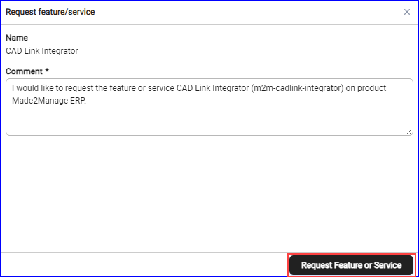

To buy an extra feature or service, send a request, and the Aptean support team will take care of the license assignment.

To request for the additional features and services, perform the following:
1.	In **Additional Features and Services**, choose the required feature and click **Request Now**.
  Enter the required feature in Features and Services search box and click Request Now.
The **Features and Services** search box to search for the add on.
The **Request feature/service** window appears.

2.	In the **Request feature/service** window, by default the comment is added, or you can enter the custom message and click **Request Feature and service**.
  The Aptean support team will contact you regarding the status of the add-on feature and service. After the purchase, the status in the column changes to **Purchased** and after successfully processed, the status changes to Included.
3.	To include additional users for the same feature and service in your current plan, click **Add More**.
  The Request feature/service window appears.
4.	In the **Request feature/service** window, by default the comment is added, you can enter the custom message and click **Request Feature and service**. 
