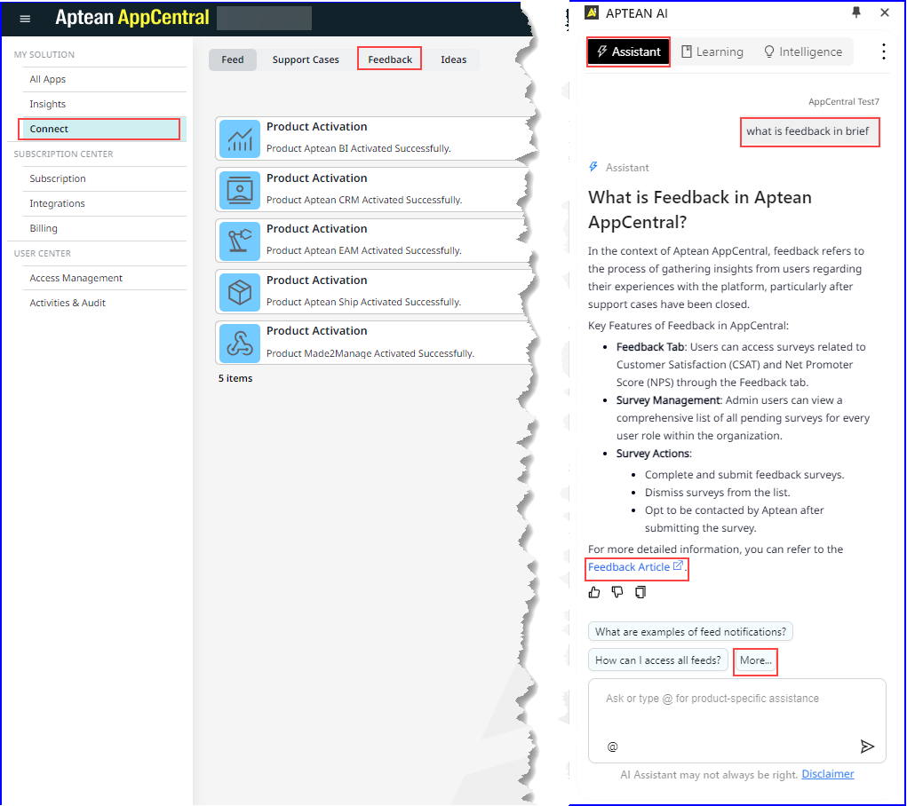

1.	Log in to AppCentral and ensure that the AI Assistant browser extension is added.

2.	Click the AI Assistant icon in your browser extension and log in.  The **Aptean AI** slide-in window will appear, displaying help suggestions relevant to your current screen. By default, the Assistant tab will be shown.
    

3.	As shown in the figure above, navigate to **My Solutions > Connect** to view help suggestions specific to the Connect window.

4.	In **Aptean AI** window, click **More** to explore additional help suggestions that can assist you in finding the information you need.

5.	Enter the specific information you are looking for in the text box and click **Ask** icon.  For example, to search for details on the Feedback tab, type "What is the Feedback tab?" in the text box.   The **AI-assistant** window will display information related to the Feedback tab, including links to the relevant sections in the guide.

6.	Click the hyperlink text or the **Launch** icon to view the specific procedure in a new tab.

7.	To access context-specific information for a particular application, type **@** in the text box, then select the desired application from the drop-down list.

8. Enter the question related to the application in the text box and click **Ask** icon.

9. When you open an integrated application in AppCentral, the AI Assistant will show help relevant to that specific application. By using the **@** function, you can search for questions related to other applications while working in your current application, and the Assistant will display relevant information.
