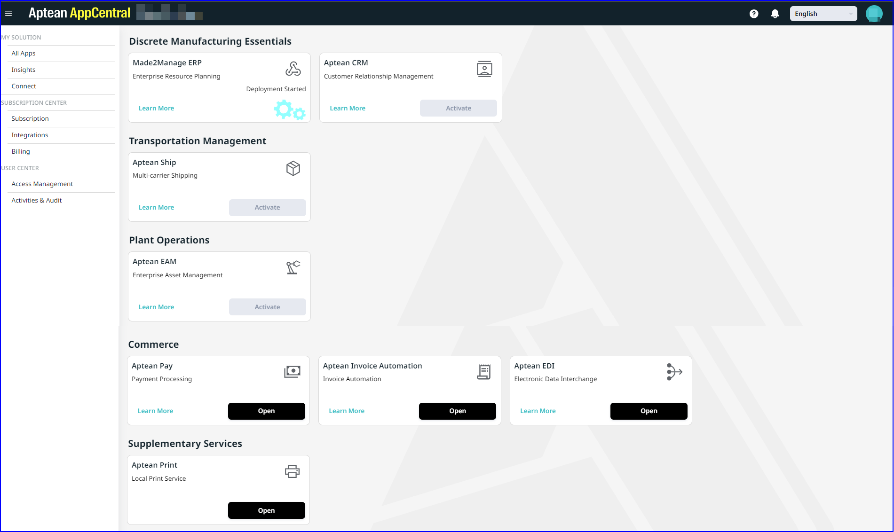

To sign in to Aptean AppCentral, perform the following:
1.	Launch the Aptean AppCentral URL in your browser.
2.	Sign in with the SSO login.
SSO is an authentication service that allows you to access various applications in Aptean AppCentral using a single set of login credentials, including a username and password. After you login, you can view All Apps window by default.

