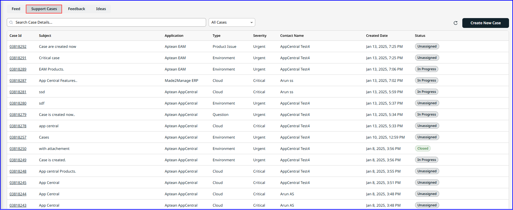

---

title: "Support Cases"
draft: false
type: Article

---
You can create and track support cases using various filterable fields.

The following functions are available on this tab:

-   Create a New Case.
-   Check the latest status of a specific case and view its details.
-   View, post, and comment on existing cases.
-   Case access is permission-based. Standard users can only view cases they have submitted, while admin user role has access to all cases within the company.
-   Search a case based on key words, to view the case details.
-   Sort and view cases using filters such as All Cases, Cloud Down, Environment, General Inquiry, Product Issue, or Services.

The following tables describes the field and description on the Support Cases tab:

| **Field** | **Description**|
|-|-|
|Case Id |Displays the unique Case ID number. Click to view detailed information about the case.|
|Subject| Indicates the relevant application for which the Case ID was generated.|
|Application| Specifies the name of the application where the issue was reported, such as M2M or EAM.|
| Type |Identifies the type of case.|
|Severity|Defines the severity of the defect. Each severity level has a specific response time. Severity levels include: <ul><li> **Critical**: Requires immediate attention, and business operations are completely halted.</li> <li>**Urgent**: The application is severely impacted but still functional</li> <li> **Standard**:Minor service disruption, affecting work efficiency but not preventing it.</li> <li>**Low**:General customer query, enhancement request, or a non-critical issue that doesnot significantly impact business operations.</li></ul> 
| Contact Name|Specifies the name of the customer who created the case.|
| Created Date|Displays the date and time when the case was escalated.|
| Status |Shows the current status of the case, such as In *Progress*, *Unassigned*, or *Escalated*.|
|Reload Data |Click **reload** icon to refresh the tab and update the screen with the latest information.