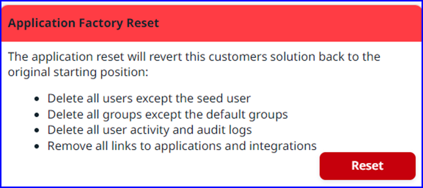

---

title: "View System Settings"
draft: false
type: Article
---

Performing a factory reset will restore the company's solution to its original state. This action removes all users, except the Seed user, deletes all groups except the default group, and clears all user activity and audit records.

To reset the application to its factory settings, navigate to **System Settings**. There, you can view the **Application Factory Reset** tile. Click **Reset** to start the process. 
> [!Note] Only Seed users can perform a factory reset in AppCentral.

