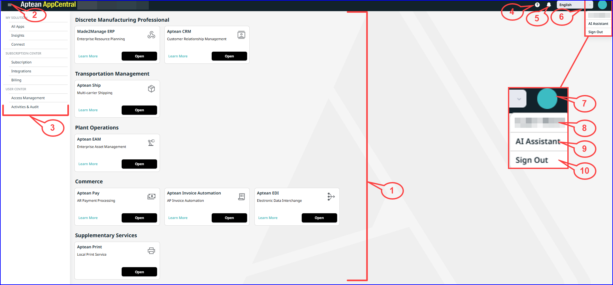

---

title: "Your AppCentral Workspace"
draft: false
type: Article

---
After logging in, the **All Apps** page will be displayed by default. 

The figure below shows this page, with detailed descriptions of the callouts provided beneath it.

The following table shows the menu items, icons available on Aptean AppCentral home page.
|  **Callouts**  |**Menu items/Icons**|  **Description**|
|-|-|-|
|1|APPLICATION WIDGET|This is the primary activity window for all AppCentral users. An admin user can configure the required applications in the application widget.|
|2|Toggle icon |Click the icon next to Aptean AppCentral to toggle between the Application Widget and the left navigation panel.   This simplifies the workspace, enhancing clarity and user experience.|
|3|Left navigation panel|It serves as the main menu, offering links to the key sections of the platform.|
|4|Show Help icon|Click the help icon to access documentation for AppCentral and its integrated apps. A new tab will open with links to the relevant application guides. Click the appropriate tile to view the guide.|
|5|Show Notifications icon|Click the Show Notifications icon, it will navigate you to the **Connect** > **Feed** section.   You can view real-time updates such as invoices, surveys, system information, case details, maintenance information.|
|6|Language selector|The Language selector in AppCentral is designed with localization features to enable future integration of additional languages.   **Note**: Currently, AppCentral supports only English.|
|7|User Menu|Click the user's initials to view the User menu.|
|8|User Profile|Click your username to view your details. The profile window will display information such as your username, email address, user role, assigned groups, and product access permissions.|
|9|AI Assistant|The Aptean AI Assistant is a context-sensitive tool that enhances your experience with Aptean solutions by providing relevant information for the current tab in AppCentral. For more information, refer [AI Assistant](ai-assistant.md).|
|10|Sign out|	Click **Sign Out** to successfully log out of Aptean AppCentral.|

