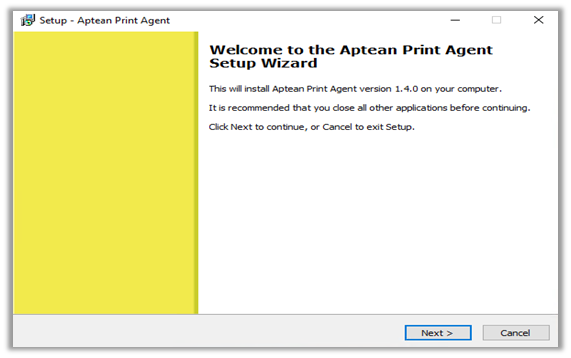

### Installing the APS on Windows

#### Overview

This section describes the procedure to install Aptean Print Services onto a Windows Platform. Close any other programs that are running before proceeding with the installation.

### Installing APS

1.  Run the ApteanPrintAgent.exe installer.

2.  Click **Next** in the Welcome dialog box.  
      
    

3.  Select a destination folder for the Aptean Print Agent installation. For the smooth installation, we recommend using the default destination folder.

    

4.  Enter your Account ID and Agent Key for the specific environment. Make sure the Agent Key begins with 'AGT' and validate your input.

    >[!Note] If you don't have these credentials or are unsure, contact your Aptean representative for assistance.

    

    a. If you try to validate without entering credentials, A pop-up will appear.  
     You can choose to enter your credentials or skip this step.

      
      
    b. After entering your credentials and clicking 'Validate', you can proceed **Next** if the validation is successful.

    

    c. If validation fails, you'll be asked if you want to continue with the wrong credentials. If you choose to proceed, remember to update the keys in the application yaml file after installation. 
    Click **OK** to continue despite the validation failure.

    >[!Note] Skipping Step 4 without entering credentials by clicking **Next**? You'll be reminded to update keys in the application yaml file after installation. Click **OK** to proceed.

    

5.  Choose the **Log on** as **Local System** option for the service settings, to continue with default printers.  
    Then, click **Next** to proceed with the installation.

     
      
    a. To connect to network printers, select **Network** **Service**. Enter your credentials.

     Click **Next** to continue.

    >[!Note] You need administrative privileges to run these services. Without them, the service won't work.

      
      
    b. If the entered credentials are correct, you'll see a 'Log on successful' message in a pop-up box.

     Click **OK** to proceed.

    

6.  This step is for existing users. You can choose to start fresh configuration or continue with your existing configuration stored in the application.yaml file.

    Click **Next** to proceed installation

    

    > [!Note] If you enter new keys during this installation, they will replace the existing ones in the yaml file. **  
    **

7.  Click **Install** and **Finish**. 

8.  After installation, the Agent becomes a Windows Service and should start automatically. If it doesn't, you might need to manually start it in the Service Management console.

    > [!Note] Please verify in the Services console whether the agent is currently running. For additional details, please refer to the Troubleshooting guide.

#### Upgrading from a previous version of APS

The upgrade option is exclusively supported from Aptean Print Services V1.3.0 onwards. Versions prior to this require manual installation.

#### Upgrade single Agent

1.  Ensure your agent is connected.

2.  Use the REST API's **GET/print/agents/upgrade** operation.

3.  This will trigger a self-update to the latest version.

4.  The agent will then automatically restart itself.

    

#### Upgrade multiple Agents

1.  Ensure your agents are connected.

2.  Use the REST API's **GET/print/agents/upgradeAll** operation.

3.  All connected agents will silently update to the latest version.

4.  Each agent will restart automatically.

    > [!Note] Only the connected agents are upgraded to latest version and the not-connected ones should be upgraded on the need after getting connected to the server.

    