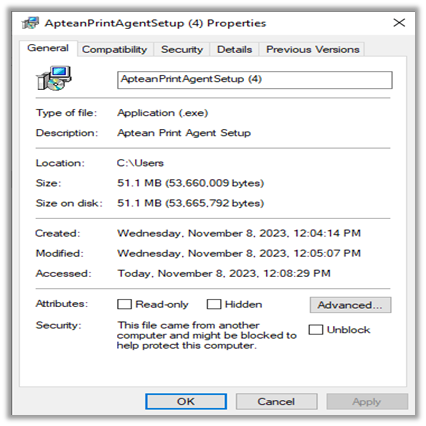
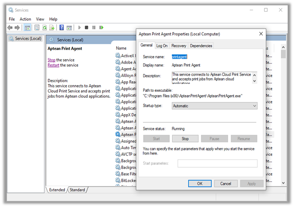

### Introduction

After installing APS according to the above procedure, if you have problems starting the APS service, you can refer to the following list of common issues and how to resolve them. The following sections show the most common issues that can occur.

### Not able to run *ApteanPrintAgent.exe* file

Unable to run .exe file and receive a Windows blocking notification.

#### Solution

The following steps describe the restart of services:

1.  Locate the blocked *ApteanPrintAgent.exe* file.

2.  Right-click on the *ApteanPrintAgent.exe* file.

3.  Select **Properties** and navigate to **General** tab.

4.  Unblock the file by selecting the **Unblock** option.

5.  Apply and click **OK**.

6.  Run the *ApteanPRintAgent.exe* file.

    > [!Note] If the **Unblock** option is not visible, this file may not be blocked, or you may need administrative privileges to unblock it.

    

### Not able to run Print agent

The Aptean Print Agent is not running as a service.

#### Solution

The following steps describe the restart of services:

1.  Open Service Management Console.

2.  Select **Aptean Print Agent**.

3.  Right click on **Aptean Print Agent** and choose **Properties**.

4.  Ensure the startup-type is **Automatic**.

5.  Click on **Start.**

6.  Check that the service is running.

    

### Not connected to Print server

The agent is not connected to the server and experiencing functionality issues.

#### Solution

1.  Restart agent:
     If the agent is disconnected due to a temporary issue, try restarting the agent to re-establish the connection.

2.  Network configuration issues:

    -   Ensure the computer is connected to the internet and the network is stable.
    -   Confirm that the server’s URL or IP address is accessible from your network.

3.  Disable the proxy server in **Internet Options**.

4.  Disable the firewall and allow the application calls.

5.  Whitelist URLs and IPs:
    If firewall or security settings are blocking communication between the agent and the server, please whitelist the following URLs and IP addresses to allow proper connections.

    -   apteanprinterqueueprd.blob.core.windows.net = 20.60.88.36

    -   print.api.apteancloud.com = 20.49.97.29

    > [!Note] You should only perform Whitelisting of URLs and IP addresses if it is a known and approved solution within your organization's security and network configuration policies. Please consult your IT department or network administrator if you are unsure about modifying firewall or security settings.