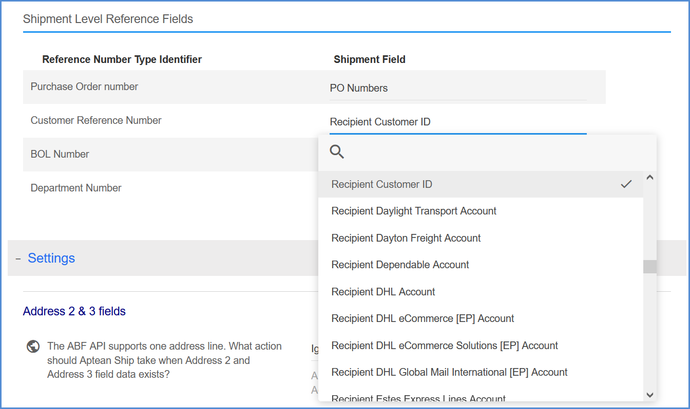

These settings apply to all ABF Freight accounts and can be accessed from Setup > Carrier Interfaces > ABF Freight > Settings.
### Reference Fields

Reference fields allow you to define additional information for the shipment; for example, you can define a field that you want to print on the ABF BOL. Aptean Ship supports up to 4 different reference fields at the shipment level.

Specify the shipment fields to include as reference fields by selecting them from the drop-down lists. You can type into the magnifying glass field to search for and select another shipment field.

>[!Tip] For more information, see [Reference Fields](carrier-reference-fields.md).

 
### Address 2 & 3 Fields

The ABF Freight API supports one address line. In cases where Address 2 and Address 3 field data is present, select how Aptean Ship should handle it.
* Ignore: Address 2 and Address 3 field data is discarded.
* Warn: Aptean Ship prompts the user with the option to stop processing the shipment and change the recipient address, or continue processing the shipment with the address as-is.
* Combine: Address 2 and Address 3 field data is appended to the Address 1 field. The text will end when the maximum character limit is reached.

    

