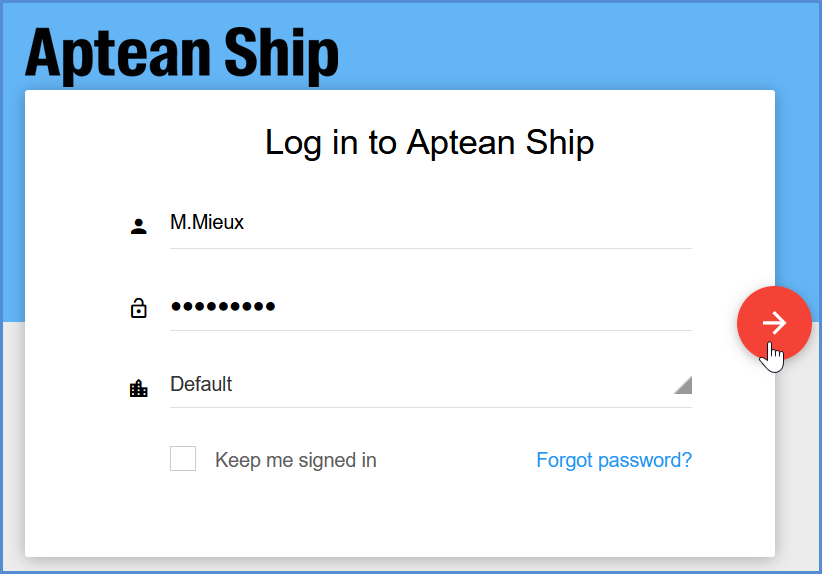
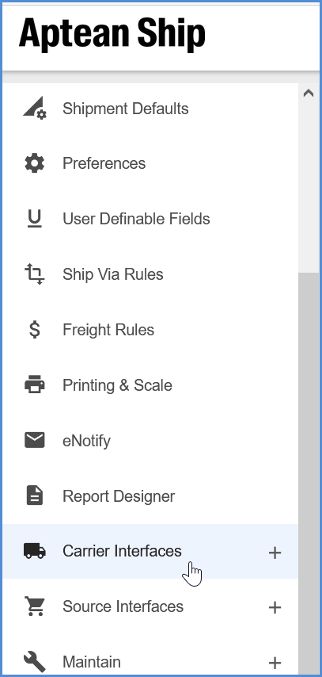

In order to ship Made2Manage Shipments, you'll need to set up your carriers in Aptean Ship. You must add at least one account for each carrier that you want to ship with.
1. Log in to your Aptean Ship tenant. 

2. Select **Setup** from the top navigation bar.

3. From the side menu, select **Carrier Interfaces**.

4. Then, select the carrier to set up from the expanded carrier list.

>[!Tip] Set Up Specific Carriers  You can find a detailed description of each supported carrier's setup process in the [Carriers](carriers.md) section of this help site. Jump to [Parcel Carriers](parcel.md) or [Freight Carriers](freight.md). 

