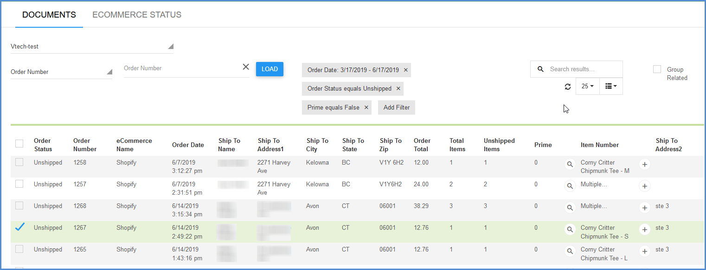
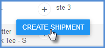
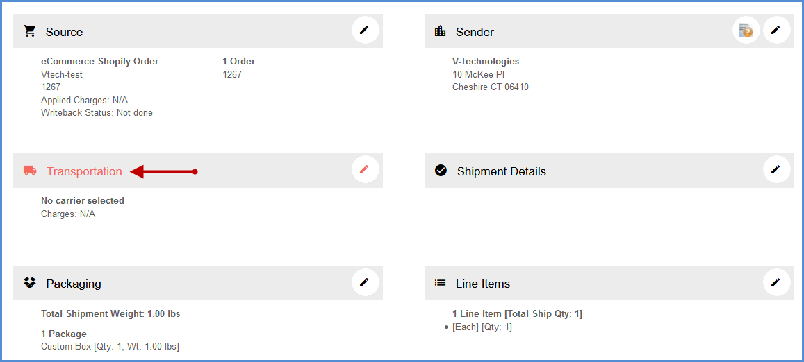
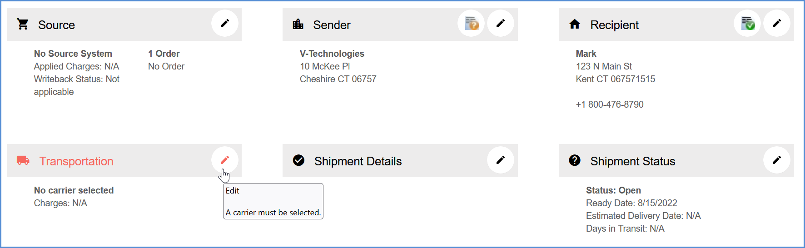
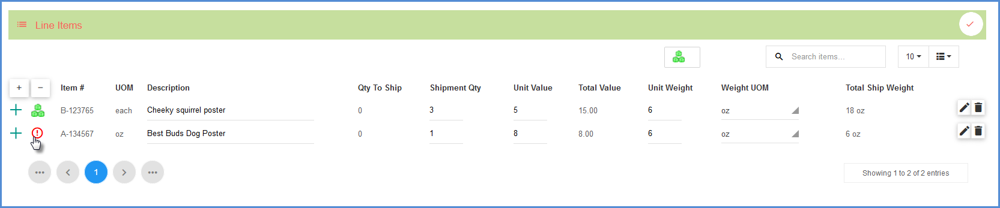

>[!Tip] Click the **Rate/Ship** button on the toolbar to begin the shipping process. You can select a source document to ship against and click Create Shipment. If you're not shipping an order or other source document, just click the Create Shipment button to start a shipment.

## Select the Source Document

The documents grid on the Documents page allows you to select from a list of source documents, based on filters and search results.

>[!Note] Browsing or searching for source documents may be disabled if the "Disable Search of Source Documents" setting is checked under your Source Interface options. A message will appear telling you that search is disabled for documents if this is the case. See [Search](searching-in-aptean-ship.md) for more information.

Select the document from the grid:

## Create the Shipment

Click the **Create Shipment** button to launch the new shipment.

On the new shipment page, any areas of the shipment that have incomplete information or an issue will be highlighted in red.

 

**General Tips** 
 You can hover over the section's icon to view a more detailed message about what's missing or what needs to be corrected. Then, click on the pencil icon to expand the area.

 

>[!Tip] For Line Items, Packages, Pallets, and Orders, you will see a red indicator on any specific items that need attention.

When you are done with a section, click the check mark to accept the changes.

## Transportation

Select or confirm the shipping method (Ship Via) - **Carrier and Service** - in the Transportation section.

Aptean Ship allows you to automate the import of Ship Via values from your source interface (ERP or Ecommerce system) into the Aptean Ship shipment. You can also customize the Ship Via based on the carrier values set up in your source interface. See [Automate Ship Via Translations](automate-ship-via-translations.md) for more information.

   

The Aptean Ship Preferences setting "[Automatically Generate BOL](bill-of-lading.md#automatically-generate-bol)" allows Aptean Ship to create the BOL # for a shipment. If you don't have this setting enabled, you would enter the BOL # in this section. You can also set Billing, Tendering, PRO Number, FOB and other options here.

>[!Tip] **BOL Settings**  For complete information about the BOL and settings, see the [Bill of Lading](bill-of-lading.md) topic.

## Line Items

If you're not shipping against a source interface document, or one that contains line item detail, you can expand the Line Items section to add line items from the Aptean Ship Inventory Items database. For information about creating or adding to the Inventory Items database, see Maintain > Inventory Items [Inventory Item Packaging](inventory-item-packaging.md).

Once you've added an item, you can edit item details by clicking the Open button in the item row.

**More Information**  When you open the item, you get all of the item details, including packaging information.

## Packaging

Next, open the Packaging section. Aptean Ship will automatically put default packages on your default pallets, but you can add or change packages and pallets. Use the Add New Pallet button to add handling units and then drag and drop packages onto them.
Enter the weight of the packaging manually or by using an electronic scale to read the weight.

>[!Note] 
>* Default packages and pallets can be set up in Maintain > Packaging [Packaging Overview](packaging-overview.md).
>* Line items can be packed using learned or created packaging scenarios added or modified in Maintain > Inventory Items [Inventory Item Packaging](inventory-item-packaging.md). If you've shipped any of the items before, Aptean Ship retrieves packaging scenarios and automatically packs those items into first level packaging (boxes, cartons, etc). By default, auto-packing based on packaging scenarios is not enabled. You can enable this setting in Setup > Preferences > Freight > Packing Preferences [Freight Packing Preferences](freight-packing-preferences.md); check the option, "Automatically pack items based on packaging scenarios." You can additionally control how items are packed using the related [Auto-Pack Preference](freight-packing-preferences.md#automatically-pack-items-based-on-packaging-scenarios) setting below it.

### BOL

Aptean Ship populates the Bill of Lading using line item and packing information. [Bill of Lading](bill-of-lading.md) settings in Freight Preferences allow you some flexibility regarding how Aptean Ship converts item packaging information into the Bill of Lading body. Typically, similar items with the same class are grouped under one general description. Click **BOL View** to view the BOL entries.

 **Pallet Details** 
 To change the description or other details, click the pencil icon on the pallet row.

This will expand the pallet details:

### Repeat Packages

To duplicate a package, in the Packaging section, click the "Repeat Package" button on the line of the package you want to copy.

In the Repeat Package window, specify the number of times to repeat the package. You can also copy the weight of the original package.

### Add a Package

The behavior of the Add Package button at the top of the Packaging section is determined by the setting in Setup > Preferences > Freight > Packing Preferences, "[Automatically Pack all loose items and packages onto one pallet](freight-packing-preferences.md#automatically-pack-all-loose-items-and-packages-onto-one-pallet)". If this setting is checked, the package will be packed on the first pallet that matches the default pallet. If a default pallet doesn't exist, one will be created. If the setting is unchecked, however, Aptean Ship will leave the package unpalletized.

>[!Important] If "Custom Pallet" is the default, changing its dimensions causes it to no longer match the default pallet definition, so Aptean Ship will add a new Custom Pallet (without dimensions) and put the package there.

To add a package to the current pallet, regardless of the Freight > Packing Preferences setting, you can click the "+" sign to the right of the pallet row. That will always add the package to the selected pallet.

## Shipment Details

Enter or select any **Shipment Details**, such as Shipment Options, and any other shipment information that wasn't populated.

## Rate/Rate Shop

The shipment may be automatically rated when you add enough shipment detail and have a carrier selected, but if you change shipment details or the Carrier/Service, you can also rate the shipment with the currently selected carrier by clicking **Rate** from the menu or clicking the "$" in the Total Charges section.

Or, to rate shop, select **Rate Shop** from the menu or press Ctrl + Alt + S.

Select a carrier from the Rate Quotes section to continue.

## Process the Shipment

Click **Ship/Process** or hit F3. This will tender the shipment to the carrier. If you have write-back enabled for a source interface, the shipment information will be written back to the source document. Bills of Lading and/or labels that are set up to print automatically are now generated.

If you don't want to process the shipment at this time, you can also save the shipment by selecting Shipment > Save or pressing Ctrl + S. This action saves the shipment as a draft, but does not process the shipment, request pickup from the carrier, automatically print shipping documentation, or write back any information to the source document. The shipment is essentially saved as a draft so you may open it and make changes.

Once a shipment is saved or processed, it can be viewed or edited by clicking **Shipments** on the left menu.

