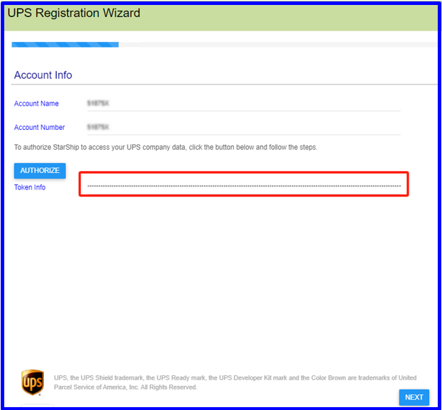

UPS has implemented an OAuth 2.0 security model for all APIs to enhance overall security. As part of the process to keep customers secure, UPS will deprecate the existing access key-based authorization for their APIs. 

Beginning February 1st, 2024, UPS will no longer distribute new access keys, and after June 3rd, 2024, UPS will not support all existing access keys. We have implemented the OAuth security model by sending a bearer token with every API request. Existing UPS accounts will require re-authorization of each shipping account.

## Existing UPS Account

1. Open the Aptean Ship Web Client and log in. Navigate to Setup -> Carrier Interfaces -> UPS.

2. Navigate to the ACCOUNTS tab. If there are existing UPS accounts, proceed to edit them.

 

3. Click AUTHORIZE. It will redirect the user to the ups.com site. Enter the Username and Password on the opened UPS page and log in. After a 5-second delay, it will return to the Aptean Ship page. 		
Pre-conditions Customers need to be aware of their UPS profile account linked to the provided UPS shipping account.

 

4. The token will be saved automatically; click the Save button. The Edit and Authenticate process will be completed. 
> [!Note] You must authenticate all existing UPS accounts individually if you intend to use all of them.

 

5. You must authenticate all existing UPS accounts individually if you intend to use all of them.

6. The users can effectively use UPS carrier services for shipping now.

## Add New UPS Account

1. Login to the Aptean Ship Web Client and navigate to Setup -> Carrier Interfaces -> UPS.
2. Read the UPS Technology Agreement and proceed by clicking Next to agree.

 

3. Navigate to the ACCOUNTS tab and click NEW ACCOUNT to create a new UPS account.

 

4. Click NEXT.

 

5. Enter the Account Name and Account Number, then click AUTHORIZE. It will redirect the user to the ups.com site. Enter the Username and Password on the opened UPS page and log in. After a 5-second delay, it will return to the Aptean Ship page. 		
Pre-conditions Customers need to be aware of their UPS profile account linked to the provided UPS shipping account.

 

6. The system automatically saves the Token Info and click NEXT.

 

7. Enter the Billing Address and Shipping Address details and click NEXT.

 

8. Select the account’s Contract Services and Internal Settings, and proceed by clicking the NEXT button until completed.

 

9. The UPS carrier and services are now available for shipping.

## Troubleshooting “Shipper ID Not Approved for Negotiated Rates”

If you receive the error “shipper ID is not approved for negotiated rates” when rating a shipment, please go to the UPS site and make sure your UPS shipping account is added properly. To perform this, follow the below procedures:

1. Log into UPS.com.

2. Click the Profile icon and select the Accounts and Payment option.

 

3. In the Add a Payment Method field, select Add New Account or Existing Account.

 

4. Enter your account information and select Next.

 

5. Choose your Account Verification Method and select Next.

 

6. Enter the required information on the Confirm Your Information page and select Save.

 

7. The account has been successfully added to the UPS user profile.

 

## Troubleshooting “Account is added to UPS.com login but negotiated rates are not being returned”

1. Log into UPS.com.
2. Click the Profile icon and select the Accounts and Payments option.

 

3. Select the Ellipses icon under the Actions column and choose View Account Details.

 

4. You will be asked for authentication and use your invoice information for authentication, which will resolve this issue.
