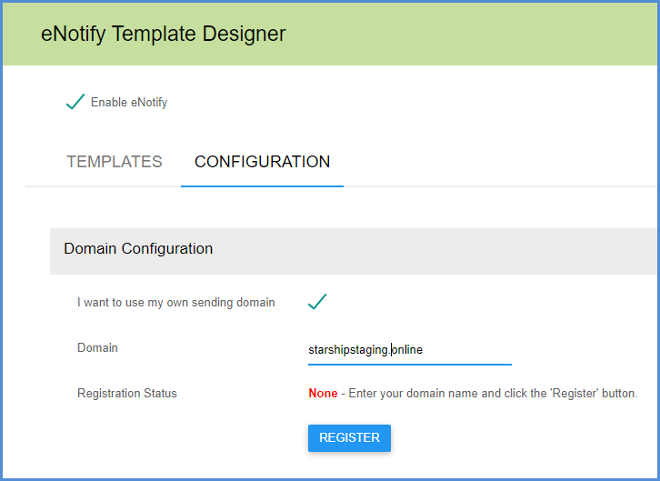
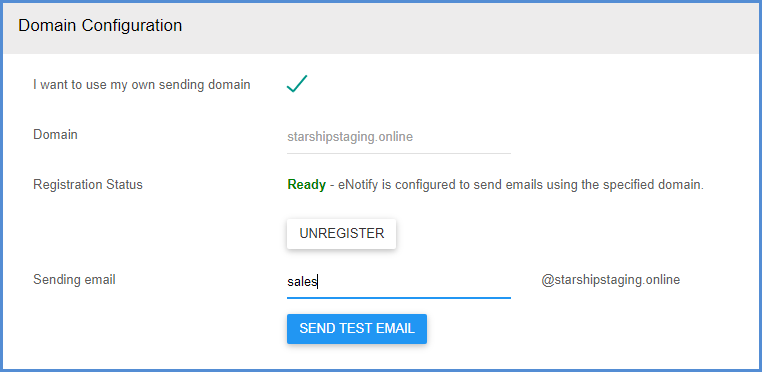
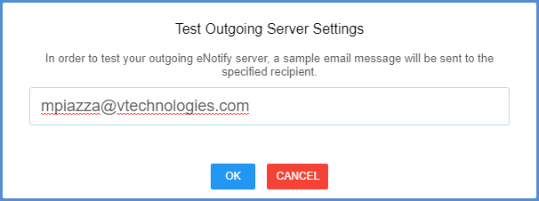
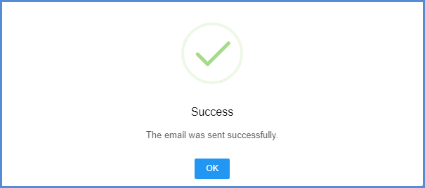

---

title: "Using Your Own Domain with eNotify"
draft: false
type: Article

---

These instructions show you how to use your own domain to send emails. You will need to add DNS records for your domain.

### Register the Domain in Aptean Ship

To use your own domain for sending eNotify emails, check the "I want to use my own sending domain" check box.

Next, enter the domain name and click **Register**.

[Configure the domain used for sending emails.](assets/images/shipping-software-starship-cloud-enotify-1.png)

### Add the Text Records

For the next section, you'll want to work with your network administrator to add the DNS records displayed on the setup page.

### DNS Provider Steps for Mailgun Authorization

If you need additional help adding the DNS records, these are instructions provided by specific DNS Providers:

* [Amazon Route 53](http://docs.aws.amazon.com/Route53/latest/DeveloperGuide/R53Console.html)

* [Digital Ocean](https://code.krister.ee/mailgun-digitalocean/)

* [GoDaddy](https://www.godaddy.com/help/add-a-txt-record-19232)

* [NameCheap](https://www.namecheap.com/support/knowledgebase/article.aspx/579/2237/which-record-type-option-should-i-choose-for-the-information-im-about-to-enter/)

* [Network Solutions](https://customerservice.networksolutions.com/prweb/PRAuth/webkm/help/article/KC-454/networksolutions)

* [RackSpace Email and Apps](https://docs.rackspace.com/support/how-to/set-up-dns-records-for-cloud-office-email-and-skype-for-business/)

* [RackSpace Cloud DNS](https://docs.rackspace.com/support/how-to/cloud-dns/)

 
### Verify

Generally, it will take a few hours until the records go live, but it could take up to 24 hours for the changes to propagate. Once the records are live, click the **Verify Domain** button. The Registration Status will change to **Verified/Pending**.

Once the Registration Status has changed to "Ready", enter the sending email address that will be used to send eNotify emails. It may take some time until the Registration Status is Ready, and during the interim, the sending email will default to "eNotify@shipping.apteancloud.com" so that Aptean Ship can continue to send eNotify emails.

### Test

Click the **Send Test Email** button to test that the sending email is working correctly. Enter an email address where the test email should be sent.

If the email is successfully sent, you will see a confirmation.

