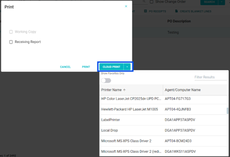
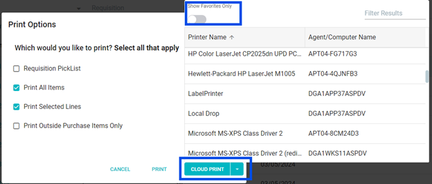
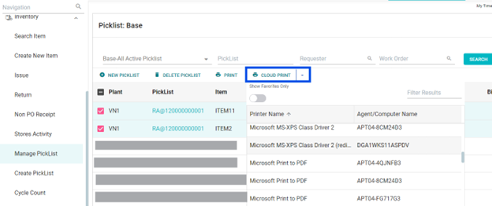
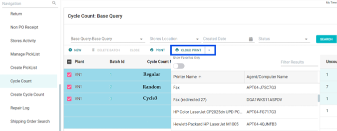
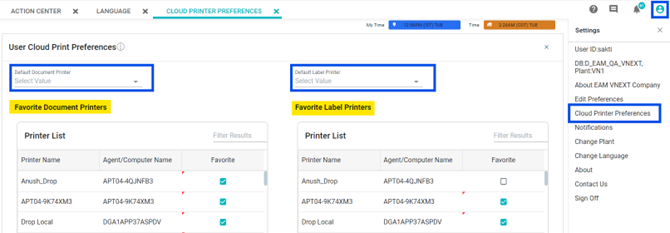

---  

title: "Setup and Cloud Printing"  
draft: false 
type: Article

---

Setting up the cloud printing allows you to print documents and labels on any
printers configured in the network cloud.

## Setting Up Cloud Printing to Print Documents and Labels

To enable cloud printing in EAM, perform the following steps:

  1. From the left panel, navigate to **Setup** > **Setup** **Options**.

      
 
  2. In the **Setup** **Options** panel, click **Cloud** **Printing**.

  3. From the right panel, turn on the **Enable Cloud Printing** toggle button.

  4. In the **Account** **Id** field, enter the account id.

  5. In the **Account Key** field, enter the API key.

      >[!Note]
      >Contact your PM to get the account details for Production. PM can refer to the internal document (**Cloud Printing Account Setup and Agent Configuration**) to create cloud printing account.

      >[!Note]
      >The Account information is unique for each plant and it can be used for
printing to multiple printer servers.

  6. Click the **SETUP ACCOUNT** button. All the available physical printers installed on the agent computer will be displayed in the **Printer List** section. 

  
      >[!Note]
      >The **Cloud Printing** option will be enabled for Work Management, Requisition, Purchasing, Picklist, and Cycle Count modules.  
      The **Print Labels** option will also be enabled for Inventory module.  
      You can reset the account configured using the **RESET ACCOUNT** button.

From the **Printer List** section, you can perform the following actions:

  * Edit the printer details 

  * Delete a printer

  * Retrieve printer list

On setting up the cloud printing, you can print the Work order, Purchase
order, Pick List, Cycle Count, and Requisition, and item labels on any printer
configured in the network cloud.

### Edit Printer Details

Using this option, you can hide a printer/ make it visible in the printer
list, set the default document printer, and set the default label printer.

**Visible** : Turn on the toggle button to make it visible in the printer
selection list. Turn off the toggle button to hide it in the printer list. By
default, this option is set to **Yes** when a printer is initially found and
added to the printer list.

**Default** **Document** **Printing** : Turn ON the toggle button to make it
as a default document printer.

**Default** **Label** **Printing** : Turn ON the toggle button to make it as a
default label printer.

### Delete Printer

Using this option, you can delete a printer and remove the printer from the printer list. Once deleted the printer will not be available for cloud printing.

### Retrieve Printer List

Using this option, you can retrieve the deleted printer and the latest list of printers. Retrieving printer list will not erase the current settings, such as visibility of the printer, default document printer, and label printer, for
the existing printers.

>[!Tip]
>If a new printer is added to a printer server, restart the Aptean Print
service on that server, and then click the RETRIEVE PRINTER LIST button in EAM
to get the latest list of printers.

## Configure Multiple Printer Servers

The Account information is unique for each plant and you can use the same
account details to configure multiple printer servers. To configure another
printer server, repeat the process of installing the cloud printing agent and
entering the account details.

## Work Order Cloud Printing

To cloud print a work order, perform the following steps:

  1. Navigate to the **Work Order Search** page and select the work order to be printed and click **DETAILS**.

  2. From the **ACTIONS** menu, click **PRINT**.

      

      The **Print Options** pop-up appears.

      

  3. Select the options to print.

  4. Click the **CLOUD PRINT** button, to print the documents through the default document printer.

      

  5. To select a printer, click the drop-down arrow and then select the printer. The document will be printed through the selected cloud printer. When a default printer is set, the cloud printer will automatically select it without presenting any printer options.

  6. Once the printing is completed/failed, you will get a notification.

>[!Note]
>The procedure for cloud printing in following modules is almost same as the printing in work order module.  
    1.  Purchase Order Cloud Printing  
    2.  Requisition Cloud Printing  
    3.  Pick List Cloud Printing  
    4.  Cycle Count Cloud Printing  

## Batch Work Order Printing

To perform batch work order printing, perform the following steps:

  1. In **Task Management** , create a schedule for **WO_Print** task.  
Enable **Cloud Print** in **Print Options** screen and choose an available
physical printer.

      

  2. Click **OK** to submit this task schedule. 

## Setting up Label Format

To print a label, you need to setup a label format in the system first.

To setup a label format, perform the following steps:

  1. Navigate to **Setup** > **Setup** **Options**.

  2. In the **Setup** **Option** s panel, click **label Formats**.

  3. From the right panel, click the **New** button to upload a new label format.

      >[!Note]
      >To create a label format record in the system, you need a BTW file locally for uploading.

  4. Click the **UPLOAD LABEL FORMAT** button and select the local BTW file. **For example, DefaultBinLabel.btw.**

  5. The **Label Name** will be auto populated. Enter a **Description** for the label.

      

  6. Enter the name of the **Bartender Connection Properties Name** which will be used as the label data source. **For example, DefaultBinLabel.**

      >[!Note]
      >**Bartender Connection Properties Name** is the name of the XML file which is used to map the data to the related BTW file to form the label. To review the data on this file locally, from the **Inventory** page select the item and click **EXPORT XML** to download the XML file.

  7. You can turn on the **Default Label** toggle button to make this label format as a default label format in this plant.

  8. Click **ADD**. The label format will be added to the Label Format list.

Once a label format is added, you can edit, delete, or download the label
format.

## Item Label Cloud Printing

To cloud print an item label, perform the following:

  1. Navigate to the **Inventory** page (navigate from Search Item menu), choose one existing query, **for example, “DefaultBinLabel”** , and select the items in the results for which the label will be printed.

      

  2. Click the **PRINT LABELS** option. The **Print Item Labels** page opens. The columns in this new screen are same as the ones in existing query “**DefaultBinLabel** ”.

      >[!Note]
      >The **PRINT LABELS** option will be enabled only if the Cloud Print option is
enabled. Refer Cloud Print Preferences, for more details.

  3. From the **Label Format** drop-down menu, select the required label format.

      

  4. From the **Printer Selection** drop-down menu, select the required printer.

  5. If default printer and/or default label format is setup, then the respective one will be auto selected.

  6. You also have an option to print multiple copies of labels. In the **Number of Labels to Print** field enter the number of copies required to print.

  7. Click **CLOUD** **PRINT**. The label will be printed.

      >[!Note]
      >If you receive an error message saying, **Please fill required fields**, despite properly filling in the **# of labels** , make sure that the **Default Label Printing** and the **Visible** options, for the virtual printer **Label Printer** are set to **Yes**.  
Although the Label Printer is set as the default printer, you cannot print
using it. You will need to use a valid printer instead.

  8. Once the printing is completed/failed, you will get a notification.

>[!Note]
>Using the **EXPORT LABEL DATA** button you can export the label data in a XML file to review locally.

## To Cloud Print Purchase Order

To cloud print Purchase Order,

  1. From the left menu, click **Purchasing** and then click Purchase Order Search. The Purchase Order search screen displays the list of purchase orders.

  2. Search and select the purchase order to print and click **PRINT** button.

      

  3. The **Print** dialog box appears. Click **Cloud Print** to open the printer options from the drop-down menu as shown.

      

  4. Select a suitable printer to print the purchase order.

>[!Note]
>The user can toggle the “Show Favorites Only” button, to see favorite
printers. Refer Cloud Print Preferences, for more details.

>[!Note]
>If a default printer is set, clicking Cloud Print automatically selects it
without presenting any printer options.

## To Cloud Print Requisition

To cloud print Requisition,

  1. On the left menu, click **Requisition** and select Requisition Search. The Requisition Search screen displays the list of requisitions.

      

  2. Search for the required Requisition and click **Print** , to open the Print dialog box.

      

  3. Select from the Print options and click **Cloud Print** , to choose the required printer from the drop-down menu.

  4. Click the printer to complete the action.

>[!Note]
>The user can toggle the “Show Favorites Only” button, to see favorite printers. Refer Cloud Print Preferences, for more details.

>[!Note]
>If a default printer is set, clicking Cloud Print automatically selects it without presenting any printer options.

## To Cloud Print Pick List

To cloud print PickList:

  1. In the navigation pane, click **Inventory** and select Manage Picklist.

  2. Enter the search parameters in the search window and click “Search”.

  3. Select one or many records from the grid and click **Cloud Print**.

      

  4. Choose the required printer from the drop-down menu.

  5. Click the printer to complete the action.

>[!Note]
>The user can toggle the “Show Favorites Only” button, to see favorite
printers. Refer Cloud Print Preferences, for more details.

>[!Note]
>If a default printer is set, clicking Cloud Print automatically selects it
without presenting any printer options.

## To Cloud Print Cycle Count

To cloud print Cycle Count:

  1. In the navigation pane, click **Inventory** and select Cycle count.

  2. Enter the search parameters in the search window and click “Search”.

  3. Select one or many records from the grid and click **Cloud Print**.

      

  4. Choose the required printer from the drop-down menu.

  5. Click the printer to complete the action.

>[!Note]
>The user can toggle the “Show Favorites Only” button, to see favorite
printers. Refer Cloud Print Preferences, for more details.

>[!Note]
>If a default printer is set, clicking Cloud Print automatically selects it
without presenting any printer options.

## Cloud Print Preferences

By setting a default printer, all print jobs are automatically directed to it
unless the user specifies otherwise, eliminating the need to manually select
the desired printer for each task.

To set default and favorite printers:

  1. Click Settings from the top bar and select “**Cloud Print Preferences** ” to open the User Cloud Print Preferences screen.

      

  2. The user can follow the steps for document and label printer settings:

     * **Document Printer (Default)**

       1. Click the drop-down to see all the available printers.

       2. On selecting the required printer, the DefaultDocPrinterSelection prompt appears.

       3. Click yes, to set the selected printer as the default value.

     * **Document Printer (Favorite)**

       1. The user can check the boxes provided against the printers, to mark them as favorite printers, from the list of printers.

     * **Label Printer (Default)**

       1. Click the drop-down to see all the available printers.

       2. On selecting the required printer, the DefaultLabPrinterSelection prompt appears.

       3. Click yes, to set the selected printer as the default value.

     * **Label Printer (Favorite)**

       1. The user can check the boxes provided against the printers, to mark the favorite printers, from the list of printers.

