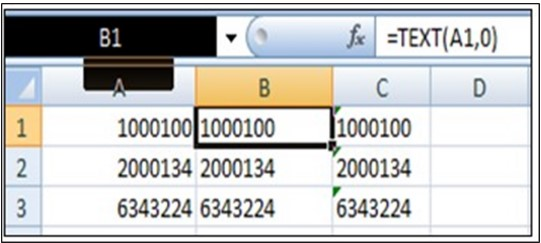

---  

title: "Manipulating Data"  
draft: false 
type: Article

---

The data loading process can be run with multiple check boxes checked - so that a given run could process **New rows** , **Updates** , **Deletes** , and **Process rows** marked **Error**.

### Add New Items

To load new data into the EAM database, check the **Add New Items** check box.
With checked:

  * The Data Loader will attempt to load all spreadsheet rows with an empty/blank value of **Status** ('Status' and 'Error' are the last columns in every data spreadsheet and are used by the utility to control processing).

  * The data in each row will be validated.

  * If a row is successfully loaded, its **Status** field will be set to **Added** ; and the **Error** field will remain **Empty**.

  * If the row cannot be loaded, its **Status** field will be set to **Failed add** , and the **Error** field will contain an **Error Message**.

  * For example, suppose you attempt to load a piece of equipment and enter an Area code on the spreadsheet containing more than 30 characters, In that case, the row will not be loaded into EAM, and the **Error** field will contain a message saying that the **value for Area exceeded the maximum field length**.

  * If the row already exists in the database, the database will be updated with the values in the spreadsheet, and the **Status** field in the spreadsheet will be set to **Updated**.

### Update Existing Items

You can update items, equipment, suppliers, etc., that are already in the database, applying data values from a spreadsheet as follows:

In the spreadsheet, set the **Status** field to **Update** for every row to be applied to the EAM database.

On the Data Loader screen, check the **Update Existing Items** checkbox. With
the check box checked:

  * This will attempt to process all rows in the spreadsheet where **Status** equals **Update**.

  * The data in each row will be validated.

  * If a row is successfully updated, its **Status** field will be set to **Updated** , and the **Error** field will remain empty.

  * If the row cannot be updated, its **Status** field will be set to **Failed update** ; the **Error** field will contain an **Error message**.

  * If the row does not exist in the database, the row will be added to the database using the values in the spreadsheet, and the **Status** field in the spreadsheet will be set to **Updated**.

### Delete Rows Flagged for Deletion

You can delete **Items** , **Equipment** , **Suppliers** , etc. from the EAM
database as follows:

  * In the spreadsheet, set the **Status** field to **Delete** for every row to be deleted from the database.

  * Check the **Delete Rows Flagged for Deletion** checkbox on the Data loader screen.

With the checkbox checked:

  * The utility will attempt to process all rows in the spreadsheet where **Status** equals **Delete**.

  * If a row is successfully deleted, its **Status** field will be set to **Deleted** , and the **Error** field will remain **Empty**.

  * If the row cannot be deleted, its **Status** field will be set to **Failed delete** , and the **Error** field will contain an **error message**.

  * If the row to be deleted does not exist in the EAM database, the **Status** is set to **Deleted** , as if the deletion occurred.

### Process Rows Marked "Error"

To re-process errors, check the **Process Rows Marked "Error"** checkbox. With
the check box checked:

  * The utility will attempt to process all rows in the spreadsheet where **Status** equals **Failed Add** , **Failed Update** or **Failed Delete**.

  * The data in each row will be validated.

  * If a row is successfully processed, its **Status** field will be set to **Added** , **Updated** or **Deleted** , and the **Error** field will be **cleared**.

  * If the row cannot be processed, its **Status** field will remain **unchanged** , and the **latest error** will be written to the **Error** field.

To see errors in the data loading process, users can download the spreadsheet
and check the contents of the **Error** column. Alternatively, they can click
the **See More** button in the status grid to access details on the number of
processed rows along with their respective statuses.

## View Uploaded Data

As soon as the data loads, the data file and its status will be recorded in
the **Data Loading Status** grid.

You can click on the **Refresh** button to view the latest data loading status
to the EAM database.

You can select any record and click on **Task Detail** to see its processing
details.

The grid consists of the following columns:

**File Name** : It is the name of the file for loading the data.

**Status** : It is the data loading process status. It can be **Created**
(Amber), **In Progress** (Amber), **Processed** (with green) and **Fail**
(with red). If the status is **Processed** , you can click on the record to
open the processing status of each row in the spread sheet. If selected,
**Sheet Process: \<Sheet Status\>** pop up appears with the following columns:

  * **Sheet Name** : Name of the file.

  * **Total Rows** : Total number of processed rows in the excel sheet.

  * **Success Rows** : Total number of rows processed successfully.

  * **Failed Rows** : Total number of rows processed in fail.

  * **Unprocessed Rows** : Total number of unprocessed rows.

  * **Download** : You can only download the records with Processed status. If you click on download hyperlink, the file will be downloaded, and you can see the success and errors if any to update and address them.

  * **Uploaded By** : This represents the logged in user for Tenant Portal.

  * **Uploaded Date** : This is the file uploaded date.

## Formatting of Data in Excel

When you key in or paste data into a spreadsheet, Excel can automatically
change the format of the cell based on the values entered.

Format errors can occur when entering values for ‘plant’ in column A of the
spreadsheets.

For example, if your plant code is ‘100’, Excel may interpret this as numeric
and process the plant code as a number, resulting in an error on every row of
the spreadsheet. This error is easy to fix: In cell A2, simply enter a single
quote in front of the 100, and then copy-and paste that value into column A
for all remaining rows in the spreadsheet.

You can usually tell if Excel is interpreting a text field as numeric if the
values are displayed as right justified. Pay attention to how Excel treats the
values of Item Manufacturer Part Number, Equipment Model Number, etc. These
fields are text/character fields in the EAM database, but your data may
contain only numbers. For example, if you have values of ‘Model’ that consist
solely of numbers 0 through 9, and they are right justified, then Excel is
interpreting the data as numeric, and incorrect values may be loaded (usually
blanks will be loaded). In this case, you can use the Excel command of TEXT to
force Excel to handle the values as text.

Here is an example, using the Equipment field of ‘Model’:

  * Open a blank spreadsheet. In column A of the blank spreadsheet, cut-and-paste in the values of ‘Model’ from the original spreadsheet.

  * In the blank spreadsheet, make sure that the Excel format of column B is ‘General’. Enter this formula into the corresponding rows of Column B:

  * = TEXT(A1,0)

  * = TEXT(A2,0) etc.

  * Copy the contents of Column B, and then paste them into Column C – USING PASTE SPECIAL...VALUES. The new spreadsheet now looks like this:

    

  * Copy the contents of Column C back into the original spreadsheet, over top of the values of ‘model’. You have now forced Excel to treat the values for ‘model’ as text data.

## Using Data Loader to Update Data

When updating existing data using Data Loader, a data field is updated only if a value is entered in the spreadsheet. For example, supposed Item ABC exists in the EAM database, with unit cost equal to $123.45. The Data Loader is being
run to update the item’s description. The row in the spreadsheet contains the plant code, item number and description. The spreadsheet column titled ‘unit_cost’ is left empty. When the data loader is run, it will update the
description for the item, and leave the unit_cost unchanged. Note that if the
spreadsheet contained a zero in the unit_cost column, the item’s unit_cost
would be changed from $123.45 to 0.

When updating existing data, text fields can be nulled out using the Data
Loader by entering \<null\> in the spreadsheet cell. The greater than/less-than
symbols (<>) are required.

