---  

title: "Grid Operations"  
draft: false 
type: Article

---

You can perform the following actions on grid records:

  1. **Search** : You can search each columns values in grid. To search, enter the required value(s) in the field(s) provided under each column and press Enter key. Only those records which contain the search key value(s) will be displayed in grid.

  2. **Select** : You can select one or multiple records by clicking the  icon in each row. To select all the records, click  in grid header.

  3. **Filter** : You can enter the required value to filter in **Filter Results** field on top right corner. The filtered results will be displayed based on the entered value. You can also click on  icon to enable the filtering of individual column values in the grid.

  4. **Sort** : You can sort the grid column values in ascending or descending order by clicking   and 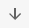  icons respectively. These icons will be enabled if you select that column.
  5. **Scroll** : You can scroll both in horizontal and vertical directions to cover the entire grid.
  6. **Drag and Drop** : You can select the column and drag that column to the required position in the grid.

  7. **Miscellaneous** : Click on 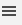 icon in any column header and you can get the pop to perform various operations. See [Miscellaneous Operations](Grid-Operations.md#miscellaneous-operations) for more details.

  8. **Right Click Operations** : Right click on any record to see various operations. See [Right Click Operations](Grid-Operations.md#right-click-operations)  for more details.

  9. **Total Rows** : You can always see the number of rows in the grid in Total Rows field at the bottom of the grid.

### Miscellaneous Operations

#### Group 

Selecting this will enable you to perform the following:

  1. **Pin Column** : You can select pin the column to **Pin Left, Pin Right** or **No pin**. The column will be pinned accordingly.

  1. **Autosize This Column**: You can select this to adjust the column width to its standard defined value.
  2. **Autosize All Columns**: You can select this to adjust all column widths to their standard defined values.

  3. **Group By (Column Name)**: You can select this to group the grid records based on the selected column. Grouped records can be un-grouped by deleting that group.
  4. **Reset Columns** : You can select this to bring back the column widths if they are auto sized.

#### Global Filter

Global filtering is a feature that allows users to apply a broad filter across
multiple columns simultaneously, using the search functionality in the
**Action bar**. To perform Global filtering:

  1. Once you have the search records available on the grid, the user can type the value to be filtered in the "**Filter Results** " field.

  2. This filter is applied across all relevant columns in the grid.

  3. The grid is updated to display records that match the entered criteria across multiple columns.

Example: To find all work orders related to a specific piece of equipment, the
user can enter the equipment name in the "**Filter Results** " field. This
filter will check across all columns and return any record that matches the
equipment name in any relevant field.

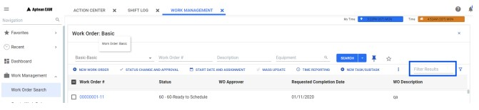

#### Grid Filter 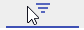

Grid filtering in Aptean EAM allows users to apply specific criteria to
individual columns within a grid. This enables a refined search and sorting of
data directly within the grid. To use Grid Filtering:

  * Click the filter icon next to the filter results field in the **Action Bar**. This opens up column-level filtering, allowing users to search within the column

  * To perform advanced filtering for each column,

    1. Click the filter icon (add the filter icon symbol) next to the column header where you want to apply the advanced filter.

    2. Select the required search operator from the drop-down list. The options include:

       * Equals

       * Not equal

       * Starts with

       * Ends with

       * Contains

       * Not contains

          > ![Note]  
          > By default, "**Contains** " is selected.

    3. Enter the value you want to filter by in the "**Filter** " field.

    4. The user can also combine multiple conditions using the "And" or "Or" options.

The filter will be applied based on your selections, and only those records
matching the criteria will be displayed in the grid.

Example: To find all work orders containing the word "Inspection" in their
description, you would select "**Contains** " from the drop-down and type
"**Inspection** " in the filter field.

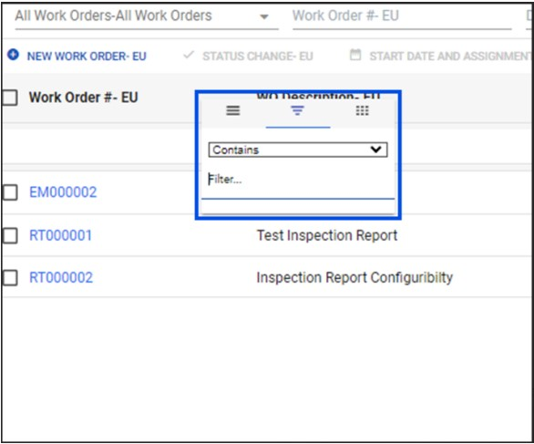

The filter will be applied based on the above selection and only those records
which match the filter criteria are displayed on the grid.

#### Column Selection 

This lists all the columns present in the grid. By default, all columns are
selected.

You can **un-select** the column(s) which is(are) not required in grid and
that (those) column(s) will be removed from the grid. You can select them if
required again and they will be displayed accordingly.

You can also scroll to see all the columns and search the required column
using **Filter...** field.

### Right Click Operations

Following operations can be performed when you select and right click on any
grid record:

  1. **Copy** : This will copy the values of the selected record. You can also click on **Ctrl + C** key to copy the record values.

  2. **Copy with Headers** : This will copy the values of the selected record along with the grid headers.

  3. **Paste** : This will paste the copied values to the selected record. You can also click on **Ctrl + V** key to paste the copied values. The feature is disabled by default.
  4. **Export** : This will export the record data to the selected format. The formats available are **CSV Export, Excel Export (.xlsx)** and **Excel Export (.xml)**.

## Generic Components

### Search Screen

  **Miscellaneous** : You can select the drop down next to **Search** button in all the modules search screen to perform the following:

  1. **Required Columns** : This displays the fields that are required to be part of a query. **No required columns is available for this screen** message appears if there is no required columns available for that query.

  3. **Query Info** : This provides the detail information of the selected query in Query Info pop up window. It has Query Details, SQL Test and SQL Parameters sections with their details. You can scroll to view the complete SQL Test. You can click **Copy To Clipboard** to copy the query details to clipboard. You can click X button to close the pop up.

  2. **Set as Default** : You can make the selected query as default by clicking on Set as Default icon . This query will be saved as default and when the same screen is opened next time, this query will be visible as default query.

  3. **Add to Favorite** : You can make the current screen favorite by clicking favorite icon  . The screen will be added to the **Favorites** list in TOC (Table of Content in Navigation panel). You can un select if required and that favorite will be removed from the Favorite list.

### Drop Down

Drop down allows you to select the required value from the set of values. In
Aptean EAM application, you can find the drop down fields in various modules
and sub modules.

You can set the drop down display setting in **Setup > Setup Options > EAM
Options > Settings**. The same setting will be applicable to all drop down
fields in the application.

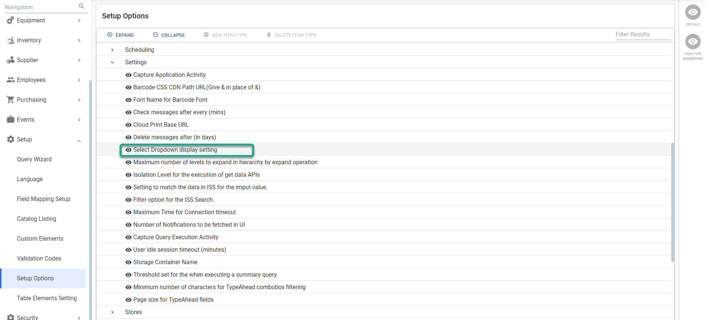

In the dropdowns, the maximum lengths of code/Id and descriptions are set at
30 and 80 characters respectively.

To set drop down values at the field level, you can contact your product
administrator and Aptean EAM support team.

### Check Boxes and Toggle Buttons

In the entire application, in **View** mode, the check boxes and toggles are
represented as follows:

  * 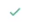: If the check boxes and toggles are enabled.
  * 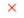: If the check boxes and toggles are disabled.

In **Edit** mode, they will be represented as the standard UI.

### Date and Time

You can see your **local** date and time on any date and time fields in the
application.

You can perform the following in any date and time fields:

  * You can click on 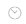 icon to add the current local date and time. 

  * You can click on  icon and calendar opens with today's date and current time (only if it is both date and time field) as default. 
    * Click on **Now** to update the current date and time or select the date and time based on the requirement.
    * Click on **Today** to update the today's date if it is only date field. You can select the different date based on the requirement.

### Time Zone

There are different time zones across the globe.

In the application, you can see the date and time based on your local
machine's timezone or the time zone set for the logged in plant (Default time
zone is **UTC**). A onetime activity will be done to convert the existing data
to support **Time Zone** feature for the existing users.

> [!Important]  
> To set/change the time zone for your plant, contact the system administrator.

If the time zone feature is enabled for the plant, you can see the following
in the application:

  1. The toast message **Your time zone (\<Your Time Zone>)** is different than the **Plant time zone (\<Plant time zone>).** will appear when logged in to the application. You can click **OK** to proceed further.

  2. The logged in User's and Plant's time, timezone and day will appear on the top right corner of the application in different colors.

      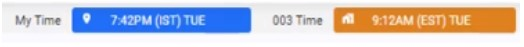

  1. When you edit any date and time fields in the application, the corresponding Plant time zone details will appear in a banner.

      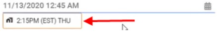

