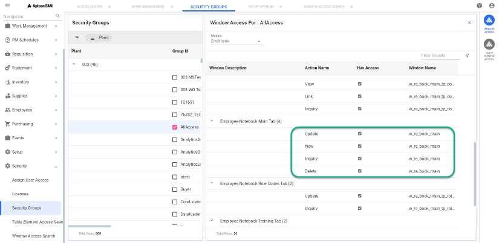

---  

title: "Create New Employee"   
draft: false 
type: Article

---

**Menu Path: Employees > Create New Employee**

The **Create New Employee** window allows you to add a new employee.

To create a new employee, perform the following:

  1. From the navigation menu, select **Employees > Create New Employee**
 Or  
In the window, select **New Employee** from the action bar.  
The **Employee** window opens with **Employee Module**.

  2. Enter the necessary details in the **Main** tab and click on **Create**. The new employee will be created. You can update other tabs in the **Employee Module**. For more information, see the .

The **New Employee** options is a secured action. Only if you have security
access, then you can add an employee. You can check the following access in
**Security > Security Groups > Group ID > WINDOW ACCESS**.

