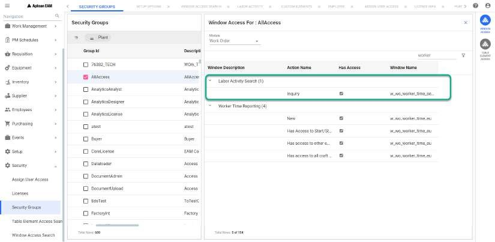

---  

title: "Labor Activity"   
draft: false 
type: Article

---

This section allows you to search for Worker Time Information for work orders
and employees. **Worker Time** is equivalent to **Labor**. You can use this
window to find and display labor transactions entered through the **Worker
Time Reporting** window.

The entries shown in the **Labor Activity Search** page reflects any updates
made to an employee's time through the **Worker Time Reporting** window.

For example, if an entry for 12 hours was charged to a work order and later
changed to 1 hour for that work order and 11 hours for another work order, the
**Labor Activity Search** page shows both the entries.

You must have the access to the following security in **Security > Security
Groups > Group ID > WINDOW ACCESS** to inquire the labor activity feature:

## Searching for Labor Activity

Perform the following procedure to search for labor activity:

  1. Choose **Employees > Labor Activity** from the main menu or Select **Labor Activity** from Employee Search screen **contextual panel**.
 The **Labor Activity: \<Query Name>** page opens.

  2. Click the drop down arrow in the **Query** field to display a list of available queries. Select the required query. 
  3. Optionally, enter full or partial values in the **Employee** and **Work Order #** fields. The Employee field will be defaulted to the logged in Employee. If you select **Labor Activity** from Employee Search screen **contextual panel**, Employee field will be auto populated with the selected employee Id.
  4. Click **Search** button to display the labor transactions that match the selection criteria. See Grid Components also.

## Labor Activity Search Screen Grid

In Labor Activity search screen, a list of labor activities matching the
selection criteria will be displayed in grid. See for more details on grid.

## Action Bar

In the **Labor Activity: \<Query Name>** window, you can see the following
action bar item:

  1. **Export** : Exports the grid data to an excel sheet. The data will be downloaded in excel and you can open the excel to view the grid details.

>[!note]
>Action Bar will not be available if you select **Labor Activity** from
Employee Search screen **contextual panel**.

## Contextual Panel

In the **Labor Activity: \<Query Name>** window, you can select one or more of
the displayed records to enable the contextual panel located at the top right
of the window. The actions available depend on the security settings of the
user. The available features are:

  1. **WO Module** : See WO Module for details. You can also click on the hyperlink provided for the records under **Work Order #** column to open the Work Order Module.
  
  2. **Employee Module** : See Employee Module for details. You can also click on the hyperlink provided for the records under **Employee** column to open the employee Module.
  3. **Time Entry** : See Time Entry for details.

