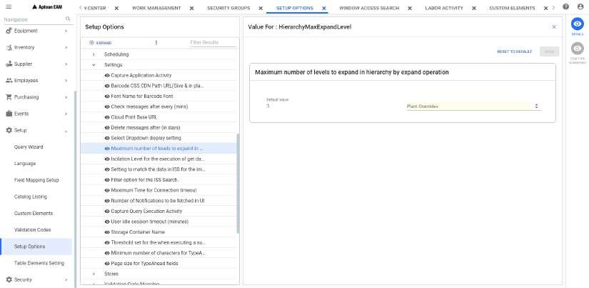

---  

title: "Hierarchy"   
draft: false 
type: Article

---

Hierarchy shows relationships between the parent, sibling, child, grandchild
components, and so on. It is similar to the bill of material structure in
which the parent-child relationships depict the working components of a
process. An equipment hierarchy shows relationships between an equipment item
and the parts and components used to assemble it. During the work order
planning process, planners have access to the hierarchy for copying materials
directly to the work order. The hierarchy also displays parent-child
relationships between equipment locations, and displays the serialized assets
installed at various locations.

Equipment hierarchy improves the technician wrench time by eliminating the
time spent searching for equipment, serials, part numbers, catalogs, and item.
It also helps to identify the equipment relationships quickly. Additionally,
the user can also select a component of the equipment displayed in the
equipment hierarchy and create work orders immediately.

>[!Tip]  
>*The term **Node** represents the individual element of the hierarchy.*

## Hierarchy Elements

You can use an **Equipment ID, Serial ID, Catalog Entry, Manufacturer Part #**, or **Stock Item** as an element for a hierarchy.

### Equipment ID

The **Equipment ID** can be a parent to another Equipment ID, a catalog entry,
a MPN (Manufacturer part number) and a stock item. It can only be a child if
the parent is another Equipment ID.

### Serial ID

A **Serial ID** , if assigned through the **Equipment Module** , displays
below the equipment ID. It can be a parent to a catalog entry, a MPN
(Manufacturer part number) and a stock item.

### Catalog Entry

The **Catalog Entry** usually designates an intangible object that has other
catalog entries, MPN, stock items or has children. A catalog entry cannot be a
parent to an Equipment ID.

### Manufacturer Part # (MPN)

A **Manufacturer Part #** is a tangible object that is not stocked by the
storeroom but can be ordered by using a manufacturer's part number. A
manufacturer part number can be a parent to another manufacturer part number,
a catalog entry or stock item, but cannot be a parent to an Equipment ID.

### Stock Item

A **Stock Item** is a tangible object that has an item number and is normally
available for issue by the storeroom. A stock item can be a parent to another
stock item, a catalog entry, or a non-stock item, but cannot be a parent to an
Equipment ID.

## Hierarchy Window

In the **Hierarchy** window, you can perform the following functions:Menu Path **: Equipment > Hierarchy**

  * Select the required element from Equipment, Serial, Catalog, Stock and MPN to search the hierarchy. By default, Equipment is selected.
  * Enter the ID or Description based on the selected element. You can also search them from the search icon and select the required item from the respective search pop up.
  * After entering/searching an item, click **Go** to view the details in **Hierarchy** page.
  * You can click on **Go to Default Hierarchy** button. See [View the Default Hierarchy](#view-the-default-hierarchy) for more details.

## Hierarchy Page

You can perform the following functions available for the selected work order,
equipment, serial, stock, catalog and MPN in hierarchy header:

  * **Search** : You can click on Search button to navigate back to Hierarchy home page. 

  * **Breadcrumb Navigation** : You can see the navigation hierarchy (**/.../...../....**) of the selected equipment or serial after search button. This represents the placement of the selected node with respect to its parent nodes in a descending order. You can see that the parent node is represented first followed by its children nodes separated by **/**. Clicking on a breadcrumb causes the hierarchy to be redisplayed with the selected node as the root in the hierarchy panel.

    >[!Note]
    >Search and Breadcrumb Navigation feature will only be visible for Equipment and Serial nodes.

Inside the hierarchy page, you can select a node and perform the following:

  * **Isolate** : You can select any child node and click on Isolate to make that as the root node. This root node will open in a new tab.

  * **Create Work Order** : Allows you to create a work order for the equipment/serial. For more information, see . 
  * You can click on   
 and   icons in equipment nodes to perform expand and collapse respectively.
  * You can double click on any node to open the hierarchy in a new tab.

## Action Bar

You can select any node in the hierarchy to perform the following functions:

  1. **Expand** : Allows you to open all the children nodes of the equipment element. Select the equipment for which you want to expand.   
You can set the maximum number of levels to expand in hierarchy by expand
operation in the field shown below:  
Path: **Setup > Setup Options > EAM Options > Settings**

       

  1. **Collapse** : Allows you to close all the child nodes of the equipment element. Select the equipment for which you want to collapse the child nodes.

  2. **Edit** : Allows you to edit the details for the selected node. See [Editing the Node](#editing-the-node) for more details. 

## Contextual Panel

You can select any node in the hierarchy to view the following contextual
panel elements on right corner:

  1. **Details** : Allows you to view and edit the details of the selected node in Hierarchy.
     * For Catalog and MPN nodes, You can view and edit the required fields using **Edit** button on top. After editing the required fields, see [Editing the Node](#editing-the-node) for more details.

     * For Stock node, it will display the item module placeholder.

     * For Equipment and Serial Nodes, it will navigate to Equipment and Serial Note book page. See [Equipment](Using-the-Equipment-Search.md) and [Serial](Using-the-Serial-Module.md) for more details.

      >[!Note]
      >For Catalog, MPN and Stock **Root** nodes, **Details** feature will be
      disabled.

  2. **Work Order** : Allows you to view the open and closed work orders for an equipment/serial in a grid. 
  
  3. **Plans** : Allows you to view the master PM schedule plans available for equipment/serial nodes. 
  4. **Where Used** : When looking at an Hierarchy, you see parent-to-child relationships. When you want to see the opposite view, child-to-parent relationships, you can use the Where Used Inquiry. It lists the selected node and its parent nodes association in a separate page. You can click on **X** to close the page. You can also select the node and click on **Expand** and **Collapse** if required. See Expand and Collapse in [Action Bar](#action-bar).

      Example: By selecting an item from a hierarchy structure, you can view all the
      occurrences of that item in a child’s role.

## Editing the Node

You can click on **Edit** button on top right corner and select any node in
the hierarchy to perform the following functions:

  * **Edit Selected** : Allows you to edit the node information in the hierarchy. You can select the node and update the required information. You click on **Save** to update the information. You can select **Cancel** to exit the edit operation.

    >[!Note]
    >Editing is not allowed for Equipment/Serial nodes. If an equipment node is
    selected to edit, it will display the message, You can view the message and
    proceed accordingly to edit that node. Click **Back** to cancel the message.

  * **Add Child** : Allows you to add another node as a child to the hierarchy. You can enter the required information and click on **Add** to add the new child. You can select **Cancel** to exit the addition operation. You can add Catalog, MPN and Stock nodes as child nodes in the hierarchy. For the root equipment node, you can add an equipment child node as well. The new node will be added as the first child of the selected parent unless the first child is already a serial number, in which case the added node will be the second child.

  * **Remove** : Allows you to remove the selected node from the hierarchy. You can't remove the root node from the hierarchy. If selected, pop up will appear with description. You can select **Yes** to remove that node, **No** to cancel the pop up and **Send Email** to send the details in email to the concerned supervisor.

    >[!Note]
    >It will remove the node only from the hierarchy and not actually delete the
    node from system.

  * **Cut/Copy and Paste** : See for more details.

  * **Undo** : Allows you to reverse the last related action performed in hierarchy. This will be enabled only if you perform any of the actions above.
  * **Done** : Allows you to exit the edit mode.

## Changing the Hierarchy

You can change the position of the nodes in hierarchy by any of the following:

  1. **Drag and Drop** : You can perform the following to move a node within the hierarchy:
   You can select the node you want to move and drag that node. You will get a floating information box with the name of the node. 
   You can drop that node to the required location. The node will be moved to that new location. If not, it will throw an error in the pop up.
 Consider the following in moving a node:  
        1. You can only move a node to be a child of another node or to be a sibling.  

        2. The node which is moved will be the first child of the node it was dragged onto, unless the first child of that is a serial node. If the first child is a serial node, The node which is moved will be the second child.  
        3. You can not move the root node.  
        4. If you drag a node onto a leaf node (A node which has no child) then it becomes the first child. If you drag a node into the white space just above or below the leaf node then it becomes a sibling.    
        5. If the node can not be moved, it will pop up an error. You can check the error message and do the necessary actions accordingly.

  2. **Cut/Copy and Paste** : You can perform the following to change the position of a node in the hierarchy:
  3. **Cut** : Allows you to cut the selected node from a hierarchy.
  4. **Copy** : Allows you to copy the selected node from a hierarchy. You can't copy Equipment/serial nodes in the hierarchy.
  5. **Paste** : Allows you to paste the selected node to a specific location in the hierarchy. You can consider the constraints mentioned above for Pasting the node to new location. You can only paste only if you have performed Cut or Copy operation before.

## View the Default Hierarchy

When you open the **Hierarchy** window, it allows you to select any of the
hierarchy from Equipment, Serial, Catalog, Stock and MPN elements and view the
default hierarchy assigned to that selected element.

To view the default hierarchy:

  1. Navigate to **Equipment > Hierarchy**.

  2. Select the element for which you want to view the default hierarchy. 
  
  3. Click **Go to Default Hierarchy**.

The **Hierarchy** tab of that element opens and you can view the default
hierarchy.

