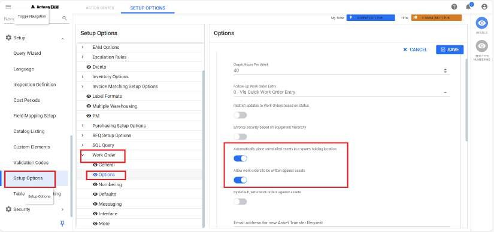

---  

title: "New PM Schedule"   
draft: false 
type: Article

---

The **New PM Schedule** feature enables users to swiftly create tailored PM
schedules for their Equipment/Serial. Users are prompted to indicate whether
they possess an existing Master Plan. Based on their response (**Yes** or
**No**), the users will be directed to perform two distinct workflows to
generate the new PM schedule

## To Create a New PM Schedule

  1. Navigate to the **Equipment Search/Serial Search** grid and select the desired **Equipment** or **Serial**. Note that the selected serial should be linked to the equipment, which is called Serialized Equipment.

  2. Click **New PM Schedule** on the action bar.

  3. An **AskMpExists** pop-up will appear.
      * Click Yes if you have an existing Master Plan
      * Click No if you don’t have an existing Master Plan

          

      >[!Note]
      >After confirmation, users are directed to their respective tabs to create a
      New PM Schedule tailored to their requirements.

### Creating a New PM Schedule with Existing Master Plan

1. Upon confirmation (**Yes**), users will be directed to the **Set PM Schedule tab** to create a new PM schedule.

2. The base **Equipment ID/Serial ID** automatically populates based on the Equipment or Serial selected in the initial step. Refer to Step 1.

    >[!Note]
    >For the Serial ID to be displayed the following toggle button should be
      enabled. To enable security, Refer to the [Enable the toggle button](#enable-the-toggle-button).<ul><li>Automatically place uninstalled assets in a spares holding location.</li><li>Allow work orders to be written against assets.</li></ul>

3. Do one of the following:
    
    * **Master Plan** : Enter the **Master Plan ID** or select it by clicking the **Search** icon to locate and choose the **Master Plan** from the **Work Order Search** screen.
    * Click **Next**.

    * This action directs users to the **Create New PM Schedule** tab using the newly created **Master Plan ID** and **Equipment**.
    * Enter the required information in the following sections: **Execution Plan** , **Set Schedule** , **PM Options** , and **Work Order Values**. Refer to the PM Schedule Details
    * Click **Create**.
    * A Pop-up will appear confirming,**“PM Schedule Update Successfully.”**

    **Or**
  
    * Click the **New Master Plan** icon.

    * This action directs the user to the **Create New Work Order** tab, with a pre-populated **Equipment ID** and work order type as **Master Plan**.
    * Click **Next** to initiate the creation of a **New Work Order**. Refer to the Create New Work section.
    * Once all the necessary information is entered, click **Create**.
    * This action redirects users to the **Create New PM Schedule** tab, utilizing the newly created **Master Plan ID** and **Equipment**.
    * Enter the required information in the following sections: **Execution Plan** , **Set Schedule** , **PM Options** , and **Work Order Values**. Refer to the 
    * Click **Create**.

### Creating a New PM Schedule when a Master Plan doesn’t exist.

  1. Upon confirmation (**No**), users will be directed to the **Create New Work Order** tab, with a pre-populated **Equipment ID** and work order type as **Master Plan**.

  2. Click **Next** to initiate the creation of a **New Work Order**. For more information, Refer to the Create New Work Order section.

  3. Once all the necessary information is entered, click **Create**.

  4. This action redirects users to the **Create New PM Schedule** tab, utilizing the newly created **Master Plan ID** and **Equipment**.

  5. Enter the required information in the following sections: **Execution Plan** ,**Set Schedule** ,**PM Options** , and **Work Order Values**. Refer to the PM Schedule Details.

  6. Click **Create**.

>[!Note]
>The newly added PM schedule linked to the respective equipment can now be
viewed under the contextual icon Plan.

### Enable the toggle button.

  1. Navigate to the **Setup** >**Setup Option** in the navigation pane.

  2. In the grid, search for and select **Work Orders**.

  3. Click the **Details** icon in the contextual panel; this action will open the **Options** tab on the right-side panel. 

  4. Enable the toggle button and click **Save**.
     * **Automatically place uninstalled assets in a spares holding location**
     
     * **Allow work orders to be written against assets.**

      

