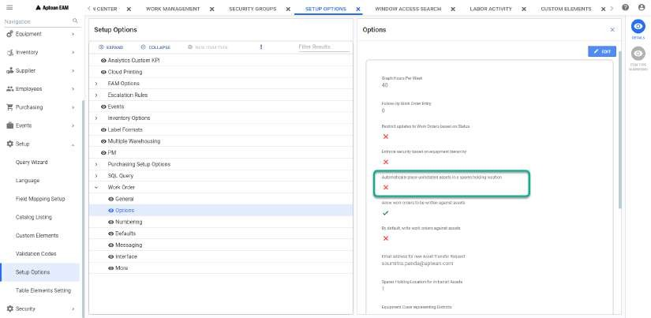
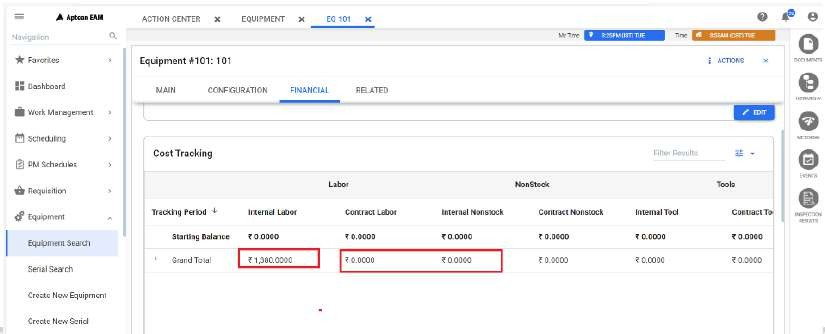
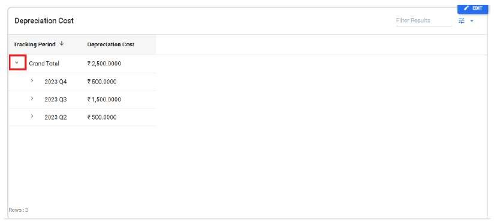

---  

title: "Using the Equipment Details"   
draft: false 
type: Article

---

The Equipment Module page consists of the equipment details. You can select a
record in Equipment Search grid and click on **Equipment** in Contextual Panel
to open the Equipment Module. If selected, **Equipment \<Equipment Name\>: \<Equipment Description\>** page appears.

The equipment module has four standard tabs:

  * [Main](#main-tab)
  * [Configuration](#configuration-tab)
  * [Financial](#financial-tab)
  * [Related](#related-data-at-a-glance)

Also you can perform the following actions in Equipment Module page:

  1. **Delete** : You can delete the equipment by selecting and **Delete** option. See [Delete an Equipment](Using-the-Equipment-Search.md#delete-an-equipment) for more details.

  2. **Rename** : You can rename the equipment by selecting and **Rename** option. See [Rename Equipment](Using-the-Equipment-Search.md#rename-equipment) for more details.

  3. **Work Order** : You can create a new work order by selecting and **Work Order** option. See Create Work Order for more details.
  4. **Open in New Tab** : You can click on to open the Equipment Module page in a new separate tab. You can also double click on any grid record to open that record in a separate tab. This feature is applicable across all the records in all modules in the application.
  5. **Close** : You can click on **X** button to close the Equipment Module page.

## Main Tab

The **Main** tab consists of the following sections:

### **Equipment Details**

Here you can provide some basic details of an equipment. It consists of the
following:

**Basic Info**

This section consists of Equipment Name, Equipment Description*, Department,
Class*, District, Account fields. You can add new translation to the selected
equipment description if required. See Translation also.

**Add to Hierarchy**

This section enables you to add the parent to the selected equipment. The same
will be visible in Equipment Hierarchy. You can select the required parent in
**Select Hierarchy Parent** drop down. Turn on **Use Serial # Tracking**
toggle to enable **Installed Serial #** field. You can enter the required
value from the drop down.

**Status**

In this section, you can enter the required values for Criticality*, Service,
Location Status fields to update the selected equipment status. You can not
edit Status Change Date field. While adding/updating value to **Location
Status** dropdown, **Status Change Date** field will be enabled with today’s
date. If you save this change, It will do the action similar to [Location Status Change](Using-the-Equipment-Search.md#location-status-change) feature.

**Reliability**

You can select the required values from Mechanical Integrity and ISO 9000 drop
down. Enable **Use as Calibration Instrument** toggle to turn on calibration
for the selected equipment. The toggle button is turned off by default.

**Location Type**

This section will be visible only if the following flag is enabled in
**Options** tab under **Setup > Setup Options > Work Order > Options** path:

 

If enabled, you can see the following fields:

You can enter any values from the following in **Location Type*** drop down.
By default, **Equip Location** will be displayed.

  1. **Equip Location**: It is the default type for all equipment created and used to represent the equipment is in installed state.

  2. **Spares Holding**: Select this if the location represents a spares holding area for assets.
  3. **Repair Supplier**: Select this if the location represents a supplier used to repair assets.

**Location is a site** toggle is disabled by default. Select this toggle if
the location represents a site. A site is a high-level Location ID that has a
designated spares holding area. Assets can be transferred between sites.

You can enable the toggle to see the following fields:

  * **Spare Holding Location for Site** : The Spares Holding Location field can be entered for locations that are flagged as Sites. When an asset is uninstalled from any child location within the site, the asset will be automatically placed in this Spares Holding Location. You can enter or search the required value.

  * **Asset Transfer Email** : When an Asset Transfer Request is created to move an asset from one site to another site, an email is sent notifying the To site of the pending transfer. You can enter the email address of the person at the **To** site who should receive this notification.
  * **Accounting Crossref** : The Accounting CrossRef field can be entered for locations that are flagged as Sites. If each site is assigned a specific account ID in your corporate accounting system, you can enter that value here.

**Events Email** field will be visible only if event_email_address_method flag
is set to 1 or 2. You can enter the valid email id to send the event
notification.

You can enable the **Marked as Deleted** toggle which is off by default to
view if the equipment is deleted or not.

### **Specifications**

You can add any specific instructions for the selected equipment. You can add
translation to the specification during creating/editing the equipment. See Translation for more details.

### **Purchase**

Using the fields displayed on the **Purchase** section, you can enter a
description of the following:

  1. Warranty, Purchase Date, Warranty Expiration Date, Original PO, Replacement Cost and any warranty information in **Warranty** Section. 

  2. In the **OEM Detail** section, the fields that describe the equipment include **Model** , **Manufacturer** , **Manufacturer's Serial ID** , and **Asset Reference Number.**

  3. In the **Annual Depreciation%** field, enter the annual depreciation percentage for the asset. For example, if the depreciation is 10%, the asset's value is expected to decrease by 10% of its original cost each year.

  4. The **Current Cost Value** field represents the current assessed value of the purchased item. This field will be disabled by default and auto populated whenever the depreciation process is run.

### **Custom Information**

The Custom Information section displays any custom elements defined for your
site. You must enter all the fields during a new equipment creation.

## Configuration Tab

The Configuration Tab consists of the following sections:

### **Work Order Configurations**

Information entered in fields on the Work Order section controls how an
Equipment Location interacts with the Work Order module. You can define
conditions for allowing the creation of a work order or assign values used for
tracking lost production data.

Work Order Permission

The three **Allow Work Order Entry** options in **Work Order Permission** drop
down enable you to designate the conditions for creating work orders (WOs) for
different equipment locations.

  1. **Allow WO Entry and Completion:** Selecting this option allows you to use this **Equipment Location** both when creating a work order and when completing a work order.

  2. **Allow WO Entry; Completion not allowed:** Selecting this option allows you to enter the **Equipment Location** when creating a work order, but you cannot complete a work order using this **Equipment Location**.
  3. **Do not allow WO Entry or Completion:** If you select this option, you cannot use this **Equipment Location** when entering or completing a work order.

**Calibration**

Under Calibration, you can see the selected equipment calibration details. You
can see **Calibration Expires** and **Last Calibrated** date and time. You can
edit these fields if you have got sufficient security access in User setup
(Back end). Also, you can view/edit the **Cost per Lost Unit** field if
required.

### **Lost Product Configurations**

The Lost Product Configurations section contains the following fields:

  1. **Production UOM:** You can enter a unit of measure (UOM) such as ton or hour in this field.

  2. **Monthly Cost Standard:** This is the amount budgeted per month for maintenance at this equipment location.
  3. **Stores Location for Planning (visible only if Multiple Warehousing is active):** This drop-down field, which is visible only if **Multiple Warehousing** is turned on for your plant, shows all available stores locations for the **Plant Code**. When planning stores material on a work order for the equipment location, the stores location shown here automatically appears as the default value of the storeroom from which the materials will be taken.

### **Meter Definition**

The Meter Definition section provides the meter details connected with the
selected equipment. This section contains the following fields:

  1. Meter ID*
  2. Meter UOM*

  3. PM Schedule Meter Flag: Toggle button which is disabled by default.
  6. Digital Meter Flag: Toggle button which is disabled by default.
  7. Element Type
  8. Maximum Meter Reading
  9. Valid Values

>[!Note]
>During new equipment creation, you can add a new meter by clicking New Meter
button. Click  **Update** to update the addition.

## Financial Tab

The Financial tab consists of the following sections:

### **Lost Production**

This section consists of Cost Per Lost Unit and Production UOM fields.

### **Cost Tracking**

Breakdowns of labor, Non stock, material, Tools and other costs display on the
**Costs Tracking** section in grid. The **Grand Totals** shown originate from
postings through other windows or from inter-system transfers of information.
The definition of **Cost Periods** in the Setup module determines the
allocation of individual transactions to a cost period.

You can refer Grid Operations for various grid operations.

In the grid, parent record will be represented with **D** as suffix and rollup
records will be represented with **R** as suffix.

You can search the required value in **Filter Results** field at the top of
the grid. The data which matches the search criteria will only be displayed in
the grid.

You can click on Filter icon to select the required filter from
the list. The data will be displayed based on the selected filter. You can
select one or multiple from the following:

  * Period Totals
  * Month Totals
  * Quarter Totals
  * Grand Totals

    >[!note]
    >All the above four are selected by default. You can un select if not required.

  * Direct Charges Only
  * Rollup Charges Only
  * Both Direct and Rollup Charges (Selected by Default)
  * Total (Direct + Rollup) Charges

### Depreciation Cost Details

Users can add depreciation cost manually and view details. This section
displays data in the following columns: **Depreciation Cost, Cost Period, Cost
Month, Cost Quarter, Cost Year, Depreciation Percentage, Installation Cost,
Entered By, and Depreciation Transaction Date time**.

Add Depreciation Cost

  1. Click the Add Depreciation Cost button in the section header. A New Depreciation Cost grid expands below, including the following fields:

      * **Equip/Serial ID** and **Equip/Serial Indicator**.

      * **Cost Year** : Select the year associated with the depreciation cost from the drop-down menu.

      * **Cost Quarter** : Select the quarter (three-month period) associated with the depreciation cost from the drop-down menu.

      * **Cost Month** : Select the month within the chosen quarter associated with the depreciation cost from the drop-down menu.

      * **Cost Period** : Select the cost period from the drop-down menu.

      * **Depreciation Cost** : Enter the depreciation amount incurred for the specific period. The entered amount will be displayed with the currency symbol based on the currency set at the plant level. Negative values are supported to make any corrections.

  2. Click **Add**. The entered details will appear in both the **Depreciation Cost and Depreciation Cost Details grid**, updating the **Depreciation Cost** grid with the new entry.

      >[!Note]
      >To distinguish between system-calculated and manually added entries, certain
      columns are populated with zero.

        

**Depreciation Cost**

This section displays the tracking period and the total depreciation cost for
the equipment. Each time a Depreciation Cost is added, this field is updated.
Click the **Arrow** icon on the Grand Total to view all the tracking periods.

 

You can search the required value in **Filter Results** field at the top of
the grid. The data which matches the search criteria will only be displayed in
the grid.

You can click on Filter icon to select the required filter from
the list. The data will be displayed based on the selected filter. You can
select one or multiple from the following:

  * Period Totals
  * Month Totals
  * Quarter Totals
  * Grand Totals

## Related Tab

The Related Tab consists of the following sections:

### Related Data at a Glance

This section is read only section and you can view the number of Open Work
Orders, PM Schedule and Closed Work Orders

### Open Work Orders

Displays the number of open work orders for the current equipment and lists
them in the grid.

### PM Schedules

Displays the number of PM Schedules for the equipment in the grid.

### Closed Work Orders

Displays the number of closed work orders for the current equipment and lists
them in the grid. You can enable **Show Work Orders for Children** toggle
button to view the closed work orders for children in grid for that selected
equipment. The toggle is disabled by default.

You can search the required value in **Filter Results** field at the top of
the grid. The data which matches the search criteria will only be displayed in
the grid. You can refer Grid Operations for various grid operations. You can click on **X** to
close the grid.

## Editing the Equipment Module

You can click **Edit** button to open the Equipment note book in edit mode.
You can update all the required/ mandatory fields (The fields marked with *)
and perform all the necessary functions in all the tabs explained above.

See Edit for more details.

>[!Important]
>The fields marked * above in each tab represent the mandatory fields
during **New Equipment Creation**. If the new equipment ID is created by
copying the values from an existing id, the mandatory fields values will be
auto updated with copied values.

