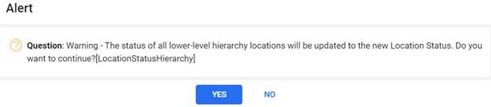

---  

title: "Using the Equipment Search"  
draft: false 
type: Article

---

Using the **Equipment Search** , you can search for and display records
related to equipment locations or equipment serial numbers. From the list of
equipment displayed, you can click an equipment id hyperlink or select the
required equipment and click **Equipment Module** in the **contextual panel**
to access the equipment module that contains detailed information about the
selected equipment.

The equipment search window allows you to search by equipment id or equipment
description. If you do not enter a value in the equipment id or equipment
description field, the search uses only the selection criteria of the selected
query.

To perform a search:

  1. Select a **Query** from the drop-down list and click **Search**.  
It displays all the equipments for the selected query.

  2. To search for a specific equipment, perform the following:
       1. Enter a full or partial value in the **Equipment** or the **Equipment Description** field. The value you enter becomes an add-on to the selection criteria built into the selected query. The more complete the description entered, the narrower the resulting search will be.
        2. Click **Search**. 

It displays a list of equipments matching the selection criteria. See Generic Components and TroubleShooting also.

## Equipment Search Screen Grid

In Equipment Search Screen, a list of equipments matching the selection
criteria will be displayed in grid. See for more details on grid.

## Action bar

In the **Equipment Search** window, you can select one or more of the
displayed records to enable the action bar located at the top of the window.
The Equipment Search window remains open when you jump to other windows using
the action buttons. The actions buttons are:

  * [New Equipment](Create-New-Equipment.md): Opens New Equipment window to create a new equipment. 

  * New Work Order: Opens New Work Order window to create a new work order for the selected equipment 
  * New Quick WO: Opens Quick Work Order window to create a new quick word order for the selected equipment. 
  * [Delete](#delete-an-equipment): Opens Delete pop up to delete the selected equipment. 
  * [Undelete](Using-the-Equipment-Search.md#undelete-an-equipment): Allows user to restore the deleted equipment.
  
  * [Location Status Change](#location-status-change): Opens location Status Change pop up to change the location status and status change date. 
  * [Rename Equipment](#rename-equipment): Opens Rename Equipment window to rename the selected equipment. 
  * [New PM Schedule](New-PM-Schedule.md): Enables users to swiftly create a new PM schedule aligned with the selected Equipment. 
  * EXPORT, PRINT LABELS, EXPORT XML

## Contextual Panel

In the **Equipment Search** window, you can select a record to enable the
Contextual Panel located at the right of the window. The Equipment Search
window remains open when you jump to other windows using the Contextual Panel.
The Contextual Panel consists of the following:

  * [Hierarchy](Hierarchy.md): Opens the hierarchy for the selected equipment.
  * [Equipment Module](Using-the-Equipment-Details.md): Opens the equipment Module for the selected equipment. 

  * Documents: Opens Document window which contains all the reference documents attached for the selected equipment.
  * Metering: Opens Metering window which contains all the meters and their readings for the selected equipment.
  * **Plans** : Enables users to view and modify the master PM schedule plans associated with the chosen equipment.
 To edit, select a record from the **Plan** grid.
      * Click **Edit PM Schedule**.

      * The Master Plan opens in a new tab on the top bar.

      * Click the **Edit** icon, make the desired changes, and click **Save**.

      * A Pop-up will appear confirming, “ **PM Schedule Update Successfully**.”

  * Events: Allows users to view the event details for the selected equipment.
    >[!note]
    >An additional Inspection result icon is added within the equipment details. To
  view, select the desired **Equipment** from the equipment search grid result.
  **Double-click** , and the selected equipment opens in the new tab. The
  contextual panel of this window will have the **Inspection Results** icon.

  * Inspection Results: Allows users to view the results of all inspections performed for the selected Equipment. See Inspection Results.

## Delete an Equipment

You can delete an equipment from the **Equipment Search** screen.

To Delete an Equipment:

  1. In the [Equipment Search](Using-the-Equipment-Search.md) window, select an equipment to delete. 
  2. Click **Delete** from the action bar.  
A message prompt appears: **Are you sure you want to delete the selected
Equipment?** with the following buttons:

  1. **Delete** : You can select this to delete an equipment. If deleted successfully, the **Equipment Deleted Successfully** notification appears. 
  2. **Cancel** : You can select this to cancel the equipment deletion.
  3. **Send Email** : You can select this to send an email to your supervisor to understand what needs to be done.

## Undelete an Equipment

To undelete an Equipment
1. In the Equipment Search window, select the Deleted Equipment Query.
2. Select the Equipment you want to undelete.

3. Click Undelete in the Action bar.    
A message prompt appears: Are you sure you want to restore this equipment? with the following buttons:
    * Yes: Click Yes to successfully restore the selected equipment.
    * No: Click No to abort the process.

> [!Note]   
> Deleted Equipment cannot be edited. It can be edited only after undeleting it. 

> [!Note]     
> To provide the required access, follow the below steps.   
Path: Security > Security groups > Plant <ol><li> Select **AllAccess** </li> <li>Click **Window Access** in the contextual pane.</li><li>Choose **Equipment** in Module field.</li> <li>Click **Edit**</li> <li>Provide the necessary access in Equipment Notebook.</li><li>Click **Save**. </li></ol>

## Location Status Change

The location status of an equipment can be changed from the Equipment Search
screen.

>[!Note]
>To update the **Location Status** , you must have security access to the
window action **Update Location Status** for the **Equipment Module** window.
For more information about Security access, see the Security Setup.

If the status of the location is updated on an earlier date, the value of **As
Of Date** can be changed to a past date. When you click OK to change the
location status in the **Location Status** window, a warning message appears
that says **The status of all lower-level hierarchy locations will be updated
to the new Location Status**.

**To Change the Location Status:**

  1. In the [Equipment Search](Using-the-Equipment-Search.md) window, select an equipment to update the location status.
 The **Location Status Change** window opens.

  2. Select the **Location Status** from the drop-down.
  3. Enter the required date in the **Status Change Date** or select it from the **Calendar** icon. 
  4. Click **OK**.
 A message prompt appears: **The status of all lower-level hierarchy locations
will be updated to the new Location Status. Do you want to continue?**

  5. Click **Yes**.
 The **Location Status Updated** notification appears.

### Updating Equipment Location Status for operational day PM schedule: From Non-operational to Operational

  1. When changing the status of an equipment parent location from **Non-operational to Operational** , A **Warning** alert prompt will appear, stating, “The status of all lower-level hierarchy locations will be updated to the new Location Status.” Click **YES** to confirm. Clicking **NO** will result in no changes.

      

  2. On confirming, a second alert prompt will open, stating “All assets installed at or under this location will be put into operation. Next execution Dates for PM Schedules based on operational hours will be recalculated. Do you want to continue?” Click **Yes** to confirm.

      

  3. **Next Execution Date** is recalculated considering the operating days tallied against the previously generated PM and is automatically updated for all PM Schedules defined for Assets installed in the child Locations.

### Updating Equipment Location Status for operational day PM schedule: From Operational to Non-operational

  1. When changing the status of an equipment parent location from **Operational** to **Non-operational** , A **Warning** alert prompt will appear, stating, “The status of all lower-level hierarchy locations will be updated to the new Location Status.” Click **YES** to confirm. Clicking **NO** will result in no changes.

      

  2. On confirming, a second alert prompt will open, stating “All assets installed at or under this location will be put out of operation. PM work orders based on operational hours will no longer be generated. Do you want to continue?” Click **Yes** to confirm. The PM work orders will no longer be generated.

      

## Rename Equipment

You can assign a new ID to an existing equipment id. After you have provided
the new name, the normal process is to have Task Management Portal implement
the change throughout all records in the database.

To Rename an Equipment:

  1. In the **Equipment Search** window, select an equipment to rename.

  2. Click **Rename Equipment** from the action bar.
 The Rename Equipment window opens.

  3. Enter a value in the **New Equipment ID #**.

  4. Click the check box to acknowledge the renaming action.

      On checking the box, the user can choose from the following options, to
      complete the action, as required:

      1. **Execute now** : The option sends a request to complete the rename process immediately.

          > [!Note]
          >When the user clicks ‘Execute now’, the changes and notifications can be seen
          by reloading or refreshing the tab.

      2. **Save:** The option sends a request to complete the action at the scheduled time (midnight). The user can view the changes after the scheduled time.

          >[!Note]
          >When the user clicks ‘Save,’ they will see a notification indicating whether
          the changes were successfully implemented or failed, after the scheduled time.

  5. Click **Save/ Execute now**.
      

To see the notifications related to the above-mentioned actions (Save /
Execute now), the user can click on the Notifications icon located at the top
bar.

  * After successfully renaming the equipment, the user will receive a RenameSuccess notification, as shown.

    

  * If the process fails, the user will receive a RenameFailed notification. To understand the cause and make necessary changes, the user can refer to the Task Management Portal.

>[!Note]
>The renaming changes can take a long time to execute, changes on the **Rename
Equipment** window are normally handled through Task Management Portal. If the
job is not on a regular schedule, you may need to notify your systems support
to have it executed. Refer _Task Management User Guide_ for more details.

