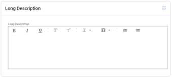

The Events module has been added to Aptean EAM, which allows the user to query, report, and view system generated events such as work order events and serial installations.

You can also define own event types, create user defined fields for each event type to track specific data points, attach documents, execute a workflow for the event, and optionally associate the event with an asset.

This feature helps you to document, track, and report on (via the Query Wizard or Analytics) any organizational task or workflow. Other key features in module are tracking safety events, environmental events, audit findings and any needed follow up, capturing shift notes, and accepting data feeds from 3rd party systems for visibility or analysis.

From the Events Management module, you can create a new event, search for an event, delete an event, and export the details of the event.

## Create Event

Events are categorized into user defined event and system generated events.
You can create the user defined events manually, whereas the system events are automatically generated by the system when some specific actions occur.

To create a manual event,

  1. From the left Navigation pane, click **Events** and then click **Create Event** menu.

      OR

      You can also create a new manual event from the **Events Search** page, Hierarchy Detail page, by clicking on **New Event** button.

  2. The **CREATE EVENT** page appears.

  3. Enter the mandatory details in **MAIN** tab and click **CREATE**.

  4. Click the **FINANCIAL** tab and enter the financial information when necessary.

  5. Click the **ANALYSIS CODE** and add the analysis codes when necessary.

  6. When a specific Event is finished and can be closed, click **the** EDIT button, and navigate to **MAIN** tab.

  7. Change the Event Status to Closed and select the End Date-Time.

  8. Click **SAVE** to save the changes.

## Updating Event

You can view and update the following for an event:

  * **Event Details** – You can edit and update the details of the event, based on the security permission assigned to the user.

  * **Documents** - You can view and manage the documents attached to the event.

  * **Equipment** – You can link equipment information to the event.

  * **Serial** – You can view and manage the serial number associated to this event.

  * **Hierarchy** – You can view the equipment associated to the event in hierarchy. If you don’t have any equipment associated to the event, you can create a new hierarchy or you can set the default hierarchy.

  * **Comments** - You can view or add the comments of the events, if any.

  * [Follow-Up Events](#follow-up-events): Enables you to add follow up work order to events.

## Search Event

To search an event,

  1. From the left Navigation pane, click Events and then click **Events Search** menu.

  2. Choose an existing event query, and can also enter the event name, Equipment, WO Base, or the Serial number, and click **SEARCH**.

      The search result of those related events appears with respect to your search key.

## Delete Event

You can delete the user defined events, but you cannot delete system generated events.

To delete an event,

  1. From the left Navigation pane, click **Events** and then click **Events Search** menu.

  2. Search and select the event to delete in the **Results** grid.

  3. Click the **DELETE EVENT** button to delete the selected one.

## Export Event Details

To export an event,

  1. From the left Navigation pane, click **Events** and then click **Events Search** menu.

  2. Search and select the event to export in the Results grid.

  3. Click the **EXPORT** button. The event details will be exported to an excel file.

## Data Loader

You can create, update, and delete events by using the Data Loader process in Task Management.

### Create a manual event

To create a manual event through Data Loader,

  1. Launch the **Task Management** app from EAM main screen, navigate to **Data Loader** task and click **Execute** to launch the process screen.

  2. From the **Select Type of Sheet** drop-down list, select **Events**.

  3. Click the **SELECT FILE TO UPLOAD** button and select the sheet that contains the details of new event.

      >[!Note] 
      >You can click on **Download Template & Instruction** to download the related template and instruction and then create the sheet for events data referring to that.

  4. Click **RUN PROCESS**.

  5. The file will be processed, and the event will be created.

  6. Click the **See More** link in the grid to view the number of success rows and failed rows. Click the **Download** link in the grid to download the updated import file which contains the information for new created events, such as the Event ID for each new event.

### Update an existing event

To update an event through Data Loader,

  1. Trigger the **Data Loader** from **Task Management** and navigate to **Data Loader** task.

  2. From the **Select Type of Sheet** drop-down list, select **Events**.

  3. Click the **SELECT FILE TO UPLOAD** button and select the sheet that contains the update for the existing event.

  4. Click **RUN PROCESS**.

  5. The file will be processed, and the event will be update.

  6. Click the **See More** to check the process situation and click **Download** to check the Update Status of each event line on the downloaded file.

### Delete an event

To delete a manual event through Data Loader,

  1. Trigger the **Data Loader** from **Task Management** and navigate to **Data Loader** task.

  2. From the **Select Type of Sheet** drop-down list, select **Events**.

  3. Click the **SELECT FILE TO UPLOAD** button and select the sheet that contains the **Status** as **delete** for the required event.

  4. Click **RUN PROCESS**.
  
      The file will be processed, and the event will be deleted.

  5. Click **See More** to check the process situation and click **Download** to check the delete result of each event line on the downloaded file.

## Follow-Up Events:

Enables you to add follow up work order to events.

1. Choose **Events** > **Create Events** in the navigation pane. 
    
    The **Create Events** window will open in a new tab.

2. Refer to [Create Event](#create-event) to fill the fields.

3. Fill in the required information in the **Main** tab and activate the **Follow Up Required** flag in the **Failure Reporting** section. Click **Create**. A **Follow-up Info** opens in the right-side panel.

4. Click the **Link Event/WO** button in the header and the Follow-Up Info grid expands.

5. Refer the Follow-up info to add an event.

## Shift Log

The shift log feature allows you to log information about a shift. You can search, create, and update the status of the shift logs. The two default queries provided are Logs by Shift/Area-Logs grouped by Shift and Area, and Open Shift Logs-Open Shift Logs.

This topic explains how to use Shift Log. It includes the following sections:

* Security Settings
* [Using the Shift Log Search](#using-the-shift-log-search)
* [Create Shift Log](#create-shift-log)
* [Edit Shift Log](#edit-shift-log)

### Using the Shift Log Search

Using the Shift Log Search, you can search for, and display records related to shift log. The Shift Log Search window allows you to search by using the below
fields:

**Field** | **Description**  
---|---  
Shift log | You can search the shift log by entering the name of the shift log.  
Shift Code | You can search the shift log by entering the unique code associated with the shift.   
Employee ID | You can search the shift log by entering the Employee ID.   
Start Date-Time | You can search the shift log by entering date and time of the shift.   
  
From the list of shift logs displayed, you can select the required shift log and click **Details** in the Contextual Panel to access detailed information about the selected shift log.

To perform a search:

  * Select a Query from the drop-down list and click Search. It displays all the shift logs for the selected query.

  * To search for a specific shift log, perform the following:

    1. Enter a value in the **Employee Id** or **Shift code** or **Start Date-Time** field. The more complete the description entered, the narrower the resulting search will be.

    2. Click Search.

        It displays a list of shift logs matching the selection criteria.

### Shift Log Screen Grid

In the Shift Log Screen, a list of shift logs matching the selection criteria
will be displayed in the grid. See Grid Operations for more details on grid.

### Action Bar

In the Shift Log Search window, the actions buttons are:

  * **New Shift Log** : Opens “Create Shift Log” window. The user can create new shift logs here.

  * **Export:** Exports the grid data to an excel sheet. The data will be downloaded in excel and you can open the excel to view the grid details.

### Contextual Panel

  * **Details** : Opens a shift log details for the selected shift log.

  * **Documents** : Allows you to view the documents details for the selected shift log.

  * **Hierarchy** : See Hierarchy . Allows you to open the hierarchy of the selected log.

  * **Equipment** : It shows if there is any Equipment associated with the event.

  * **Serial** : It shows if there is any Serial Id associated with the event.

  * **WorkOrder** : It shows if there is any Work order associated with the event.

  * **Comments** : It shows if there are any comment associated with the event and the user can also add comments.

  * **Follow UP Info** : It shows the follow up work order or event. The user can add New Events, New WorkOrders or add existing WorkOrders /Events. 

## Create Shift Log

To create a shift log:

  * On the Navigation pane, select **Events** > **Search Shift Log**. In the Action Bar, click **New Shift Log**, to open the window in a new tab.

    Or

  * On the Navigation pane select **Events** > **Create Shift Log** , to open the window in a new tab.

    The new window has the following fields, which must be entered to create a new shift log. They are:

1. **Event Settings:**

    

  **Field** | **Description**  
  ---|---  
  Event Type  | This is set to ‘Shift log’ default value. This is a read only setting for the user.  
  Event Status | This is set to ‘Open’ default value, when creating a new shift log. This setting is read only for the user.  
  Employee ID | This is set to login username as default value. The user can change it as needed.   
  Notify Email |  The user can provide an email ID to receive shift log status reports.  This field can be enabled or disabled according to user requirement. To enable/ disable this feature. Refer to [E mail Notification](#email-notification) for more details.  
  Follow up of WO/ Event | This field is auto populated. This is read only for the user.   
  Shift Code | It is a unique identification code, associated with the shift. The user can select any shift code.   
2. Event Details:

    

  **Field** | **Description**  
  ---|---  
  Event ID  | Enter the ID.  
  Event Description | Enter the description.  
  Equipment | Enter the equipment associated with the shift.   
  Equipment Description |  This field is automatically generated based on the equipment and is read-only for the user.   
  Serial | Enter the serial ID. It is a unique identification used to track an equipment or an item.   
  Serial Description | This field is automatically generated based on the serial ID and is read-only for the user.   
  Field for Shift Log Zone | Enter the shift log zone as Criticality or ISO 9000 or Mechanical Integrity (drop-down options correspond to the selected zone).  
    
  In a shift log, combination of **Shift Code** and **Field for Shift Log Zone**
  is always unique. If there is an overlap with the same combination, an error
  prompt pops up. On clicking **YES** , the existing shift is closed, and a new
  shift is created.

  

3. **Event Time** :

**Field** | **Description**  
---|---  
Start Date-Time  |  Enter the start date and time for the shift.  The field is auto populated with the current date and time. The user can enter the required date and time.   
End Date-Time |  This field currently contains no data. This field is not editable when creating the shift log. The user can Edit this only after creating the shift log.   
Duration |  It shows the duration of the shift. This field currently contains no data. The data for this field shall be auto populated after creating the shift log.  

4. **Failure reporting:**

**Field** | **Description**  
---|---  
Failure  |  It reflects any failure in the shift log.  This field is not editable when creating the shift log. The You can Edit this only after creating the shift log.   
Follow up required Flag |  It enables you to add follow up work order. The work order can be either Routine or Emergency.  
5. **Long Description**:

You can provide elaborate details about the events here. The text can be
edited using the options present.

6. **Custom Information:**

You can customize any additional information required to create the shift log. Ex: Date, Equipment number or quantity. When Long Text element type is used, you can enter very large text and format the text as shown below.

This field is not compulsory. You can customize with various fields as required. For more details, refer to custom element.

Once the required fields are filled, click **Create** , to open the created **Event** in a new tab.

>[!Note] 
>The tabs  **Financial** and **Analysis Codes** , can be accessed only after creating the shift log.

### Email Notification

You can choose to receive e-mail notifications on Open / Close / Update of events.

To receive e-mail updates, follow the steps below:

  1. Navigate to **Setup** > **Set up options**.

  2. Select **Events** and click **Details** from the contextual panel, to open the Event Setup Options, on the side panel.

  3. Click **Edit**.
  

  4. The toggle buttons for Automatic Generation of Event ID, Send email on Event entry, Send email on Event close, Prompt to send email on Event update can be kept on or off based on the requirement.

  5. You can also choose a default for Event notification Email address. The options are:

     * No Default Value

     * Default based on Equipment Site

     * Default based on Event Equipment ID

  6. Click **Save** to complete the action.

## Edit Shift Log

You can select a newly created shift log or an already existing shift log
in the search window, to edit. The steps are as follows:

  1. Select a shift log to be edited and click **Details** from the contextual panel to open the event in the side panel.

  2. The event consists of three tabs, namely **MAIN** , **FINANCIAL** & **ANALYSIS CODES**. You can select any tab and make necessary changes.

      * **MAIN:**

        

        1. Click **EDIT** , to edit the below settings.

            **Event Settings:**

            -  **Event Type** : This field represents a default setting.
            - **Event status** : You can set it to be Open, Closed,  Cancelled or DataL status (data loader status updated).
            - **Employee ID** : You can either modify the settings or retain the previous configuration.

            -  **Notify Email** : Enter the email ID, to receive status updates.

            -  **Shift code** : You can either modify the settings or retain the previous configuration.

            **Event Details:**

            -  **Event ID** : This field is auto populated.

            -  **Event Description** : You can either modify the settings or retain the previous configuration.

            -   **Equipment** : You can either modify the settings or retain the previous configuration.

            -  **Equipment description** : This field is auto populated when equipment is selected.

            -  **Serial** : You can either modify the settings or retain the previous configuration.

            -  **Serial Description** : This field is auto populated when serial is selected.

            -  **Field for Shift Log Zone** : You can either modify the settings or retain the previous configuration.

            **Event Time:**

            -  **Start Date-Time** : You can either modify the settings or retain the previous configuration..

            -  **End Date-Time** : You can add the End Date-Time here. 

                >[!Note] 
                >End date-time is auto filled when status is set to Closed, or user can update this value, if required.

                >[!Note] 
                >The end date must be later than the start date.

            **Duration:**

            It is auto populated once End date-time is set.

              >[!Note] 
              >The field is updated when status is set to closed and end date-time is updated.

            **Failure Reporting:**

            -  **Failure** : You can toggle this button, in case of failure in the shift.

            -  **Follow up Required Flag** : You can toggle this button to start a new follow-up work order.

            **Long Description:**

            You can either modify the settings or retain the previous configuration.

            **Custom Information:**

            You can either modify the settings or retain the previous configuration.

            Select a shift log to be edited and click **Details** from the contextual
            panel to open the event in the side panel.

      2. Click **Save** , to complete the action.

        * **FINANCIAL:**

          1. Click **EDIT** , to edit the below settings.

             * **Lost Production** : The user can enter the number of units lost, if any, in this field.

              * **Cost Tracking** : This shows the cost details associated with the loss.

            2. Click **Save** , to complete the action.

                * **ANALYSIS CODES:**

                  1. To add Analysis code:

                      1. In the header, click **New** to open the add new section.

                      2. Choose the component from the drop-down.

                      3. Choose the condition of the selected component from the drop down.

                      4. Choose the required action to be taken for the selected component from the drop-down.

                      5. Click **ADD** to complete the action.

                  2. To Edit Analysis code:

                      1. Select any analysis code from the list.

                      2. Click **Edit** , to open the edit section.

                      3. Make required changes in Component, Condition and Action fields.

                      4. Click **Save** to complete the action.

                  3. To Remove Analysis code:

                      1. Select any analysis code from the list.

                      2. Click **Remove**.

                      3. Save to complete the action.

## Security Settings

You can provide the required security permissions, by following these
steps:

  1. On the navigation panel, search **Security** > select Security Groups, choose the login **Plant** and check All access.

  2. In the contextual pane, click **Window Access** , to open the Window Access for section on the right side.

  3. Choose **Equipment** in module.

  4. Under **Equipment Notebook** , the user can provide access to **Shift log Update** , **Shift log New** , & **Shift Log Admin** by checking the boxes.

     * **Shift Log Admin** : It enables the user to modify a shift log after it is closed.

     * **Shift log Update** : It enables the user to update the shift log details and add shift events.

     * **Shift log New** : It enables the users to create a new shift log.

  5. Check **Shift Log Admin** box. It enables you to create and update shift logs. Allows you to modify a shift log once it is closed. By granting access to this group, you can access both shifts and events.
