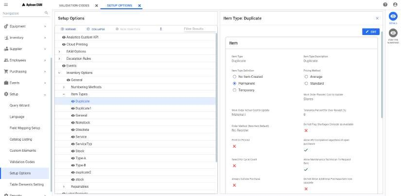

---  

title: "Create New Item"  
draft: false 
type: Article

---

Menu Path: Inventory > Create New Item

The **Create Inventory Item** window allows you to add a new item if you got the security access to create the new item.

To create a new item, perform the following:

1.  From the navigation menu, select **Inventory \> Create New Item**.

    Or

    In the [Inventory Search](Using-the-Inventory-Search.md) screen, select any grid record and click **New Item** from the action bar.

    The **Create Inventory Item** window opens.

2.  Select the **Item Type** from the drop down. It is a mandatory field.

    You can set the required item types in **Setup \> Setup Options \> Inventory Options \> Item Types \> DETAILS**.

    

    Only the item types marked as **Permanent** will be listed in the **Item Type** drop-down.

3.  Enter the unique id in **New Inventory Item Id** field. It is the mandatory field. The inventory item will be auto assigned if the setup option to auto assign item ID is chosen for the selected item type. If the setup auto assign item id is enabled, upon selecting the item type, **Item Id will be auto generated for this item type.** message will be displayed and **New**

    **Inventory Item Id** field will be disabled. The id will be assigned based on the Item numbering settings selected in Setup and Security module.

4.  Optionally, If you want to create the new item by copying the values from an existing item, enter the existing item ID in **Copy from Existing Item** field or you can also search an exist- ing item ID or Description using search icon. If an item is selected in search, **Stores Location\*** and **Initial Item Quantity in Bin** fields will be visible with copied values. You can update these fields if required.

    Documents from the existing item id will not be copied.

5.  Click **Next**. The **Item: \#\<Item Id\>** page opens. You will get an alert message only if you are creating the item from copying the existing item. You can see the message and proceed accordingly.
6.  Enter the necessary and mandatory details in the **Main** tab and click on **Create**. The new item will be created. You can update other tabs in the **Item Module**. For more information, see the [Item Module](Using-the-Inventory-Notebook.md).
