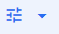

---  

title: "Issue"  
draft: false 
type: Article

---

Inventory Issue will allow a Storeroom Clerk or manager to allocate requested items to Work Orders/Requisitions and Accounts.

When materials have been withdrawn from stores, an attendant uses the Inventory Issues windows to record the transactions. The process takes less time if requester has preplanned, creating requisitions for their needs. The cost of materials issued can be charged to an account, to a requisition or work order.

Issue can be performed in two ways:

1.  Full Issue: Items can be issued from a previous work order, account, requisition, or pick list. Arbitrary item can also be issue to an account. Full issue is launched from the inventory menu by selecting issues or can be launched from within the work order, requisition, or pick list.
2.  Ad-hoc Issue: Any items may be issued, even items not currently on a pick list, stores request, requisition, or work order. This is launched either from item search or from the item module. Charge can be allocated to a work order, requisition, or account.

## Full Issue

Perform the following in full issue:

1.  Select **Issue** from Inventory module in navigation menu. The **Account Set Up** window opens.
2.  Select any of the required module from the following in **Charge To** section:
    -   Account: Select this radio button if you are issuing materials not preplanned on an account.
    -   Work Order: Select this radio button if you are issuing preplanned materials or issuing unplanned materials chargeable to a work order.
    -   Requisition: Select this radio button if you are issuing preplanned materials or issuing unplanned materials chargeable to a requisition.
    -   Pick List: Select this radio button if you are issuing preplanned materials chargeable to the picklist.
3. \  You need to enter the following fields if your selection is
    -   Account: This is displayed by default. Select the required values from **Account, Area, Department** and **Project** drop down. You must select the required **Stores Location\*** from the drop down if Multiple Warehousing is enabled. if not, it will automatically consider the location as **Main**.
    -   Work Order: Enter/Search the **Work Order \*** and select **Stores Location\***.
    -   Requisition: Enter/Search the **Requisition\*** and select **Stores Location\***. If the selected requisition is charge to account, then you can not issue items to that requisition.
    -   Pick List: Enter/Search the **PickList\*** and select **Stores Location\***.

4.  Enter **Issue to Employee** and **Comments** fields if required in **Delivery** section.
5.  Click Next. Issue to \<Work Order/Requisition/Account\> \<Work Order Number/Requisition Number/Account Name/Picklist Name\>: \<Work Order-**/Requisition/Account Description/Pick List Name\>** screen appears. Refer [Issue](Issue.md#issue-grid) for more details.

## Issue Grid

In the Issue grid, initially only unissued filter will be selected. As soon as you enter the screen, all unissued line items will be listed even if it is available or not. See Grid Operations also.

You can select **Available Items** or **Unissued Items** or both from the filter icon(). The grid will only display the items according to the selection. By default, Unissued Items option is checked when the issue window is open.

You can click on **Issue Qty** field and you can update the issue qty in the grid if the item is non serialized. If the item is serialized, it will open the pop up to see the list of serial ids linked for the selected item. You can select one or multiple serials to update the Issue Quantity.

You can perform the following actions on grid records:

### New Item

You can add a new permanent item to the grid to issue. To add a new item, click on New Item button. **Add New Item** panel appears. This button will not be visible if you are issuing items for a requisition and that requisition is charge to account.

You can see the following fields:

-   Item: You can enter or search the required item that belongs the selected Stores Location. If not, you will get an error message. If you search and select the item from the item search window, following fields will be auto populated:
-   Description
-   Unit of Measure
-   Quantity on Hand after Issue: This is calculated by taking issue quantity (the entered value) value. If the bin details window is used to enter issue quantity from specific bins then the “Quantity on Hand After Issue” is the sum of the lines from the bin details window. This value can be negative also. If negative, it will display the warning, error or no message based on setting in Xi when adding the item to the grid. You can click on **Yes** to proceed further.
-   You can not update the Requested Quantity, Remain to Issue, and Primary Bin values and they will be extracted from the system back-end.
-   You can enter the required Issue Qty for non-serialized items. The default value will be set to 0. Quantity on Hand after Issue value will be decremented based on the Issue Qty value. If an item has multiple bins, there will be an icon () beside the quantity to allow the user to select different quantities from different bins. The default value will be the primary bin, but can be changed.

>[!important]
>If the item is serialized ([Serial Tracking](Using-the-Inventory-Notebook.md#properties) toggle is enabled), Issue Quantity is read only and Quantity on Hand after Issue field will not be visible. Issue quantity will be filled in once you select the serial numbers using the Enter Serial Info hyperlink. The list of serial numbers to issue, will be all serial numbers currently in inventory in the stores location. If you click on the hyperlink, you can see the list of serial ids linked for the selected item. You can select one or multiple serials to update the Issue Quantity. One serial can have one item, but one item can have multiple serials.

-   Stores Location field is read only and displays the selected value from the previous screen.

-   You must enter or select **Issue to Employee** field if it was not entered in the previous screen.
-   Enter the Unit Cost if required.
-   Date Issued will be defaulted to Today's date. You can update it if required.
-   You can enter the Comments if required.

After updating the required fields, you can select any one on of the following buttons:

-   **Add Item**: Selecting this will add the item to the grid. If any error, the pop up will be dis- played. You can see the details and proceed accordingly.
-   **Clear All**: Selecting this will clear all the default values in the fields.
-   **X**: Selecting this will close the panel.

### Edit Item

You can edit the required item/s in the grid. To edit the items, you can select the required item from the grid and click on **Edit Item** button. **Edit Item \<Item Name\>: \< Item Description\>** panel appears. The fields will be similar to **New Item** panel fields explained above.

You can update the following fields if the item is non serialized:

-   Issue Qty: You can update this field if you are using Primary bin. If you have previously entered an issue quantity or adjust quantity for any bin except the primary, then when click- ing this field open the bin selector pop up. Because you can only access bins besides primary using the pop up.
-   Issued to Employee\*
-   Date Issued\*
-   Comments

You can update the following fields if the item is serialized:

-   You can click on Enter Serial Info to update the issue qty.
-   Issued to Employee\*
-   Date Issued\*
-   Comments

After updating the values you can select any of the following buttons:

-   **Save**: Selecting this will save the updated values. If any error, the pop up will be displayed. You can see the details and proceed accordingly.
-   **Clear All**: Selecting this will clear all the default values in the fields.
-   **X**: Selecting this will close the panel.

#### Edit Multiple Items

You can edit the multiple items together. To edit the multiple items, you can select the required items from the grid and click on **Edit Item** button. **(1 of n) Edit Item \<Item Name\>: \< Item Description\>** panel appears. Where, n is the number of items selected.

Here, you can update each items and navigate to next item using **Next** button. If you navigate to the next item, you can click on **Previous** to navigate to the previous item. You can Save each item updates and the navigation will be moved to the next item automatically.

Next button is not available for the last item and Previous button is not available for the first item.

### Remove Item

You can remove the item from the grid. You can not remove the item if it is issued or if it is on requisition line.

To remove the item, you can perform the following:

-   Select an item from the grid.
-   Click on **Remove Item** button.
-   Item delete confirmation message appears. You can click on **Delete** to delete that item. If deleted, it will be removed from the grid. If any error, You can see the error and proceed accordingly.

>[!note]
>New Item and Remove Item options will not be visible if you are issuing items to the Pick List.

### Adjust Quantity

You can adjust the Quantity on Hand for the selected item. This feature is visible only if the item has atleast one bin.

To adjust the quantity for non serialized items,

-   Select an item from the grid.
-   Click on **Adjust Qty** button.
-   **Adjust Qty** window appears with the list of bins associated with the selected item.
-   You can update the Actual Qty on Hand field that will be on hand after the quantity is issued.
-   You can also update the Comments if required.
-   After updating the value, Click on **Save** to update hat value to the grid. You can click on Cancel to exit the window.
-   If saved, the grid will be refreshed and **Available** column will be updated with the new On hand quantity value.

>[!NOTE]
>Adjustment transaction will be created and the transaction is visible in Stores Activity window if you perform the Adjust Quantity each time.

To adjust the quantity for serialized items,

-   Select an item from the grid.
-   Click on **Adjust Qty** button.
-   **Adjust Qty** window appears with the list of all the serials associated with the selected item. See [Track Serial](Locations-and-Bins.md#track-serial) for more details.

## Item Issue

You can select the required item/s in the grid and click on **Issue** on top of the screen to issue those items to the respective requisitions, work order or account.

If successfully issued, you can see the success mark () under **Status** column. If not you can see the error or warning icons and you can read the error or warning description to proceed further.

If successfully issued, you can see the Issue transaction for each issues in **Stores Activity** window.

For requisitions, if an item is issued, the details will also be updated in corresponding Requisition lines.

#### Contextual Panel

You can see the following contextual panel items in Issue grid screen:

-   [Details](Using-the-Inventory-Notebook.md): Opens the Item module for the selected item.
-   Hierarchy: Opens the hierarchy window to allow you to select an item and drag it to the grid using Import button.
-   [Inventory Search](Using-the-Inventory-Search.md): Opens inventory search to add the item to issue. You can select the required item/s and click on Add to Grid to add the items to the grid.

    While importing the items from Hierarchy and Inventory Search, by default, the [stores location](#StoreLocation) which is selected while performing item issue will be considered. If the imported items will not belong to that stores location, then the error message will be displayed.

    If multiwarehousing is off, then the stores location will always be main.

>[!note]
> Hierarchy and Inventory Search options will not be visible if you are issuing items to the Pick List.

## Ad-hoc Issue

In the ad-hoc issue, you can charge the issued item to an account, requisition or work order. Any items are treated as unplanned and when issued to a requisition or work order, they do not get added back to the associated requisition. The biggest difference between full issue and ad-hoc issue is, when invoked from the item search grid, everything is done in the bottom panel with the search results still up top. You can also perform ad hoc issue from the item module and the issue panel will open for that one item.

In ad-hoc issue, you can issue one item at a time. Perform the following in ad-hoc issue:

1.  In the **Inventory Search** screen grid, select one or multiple items. You can also issue from the item module by selecting **Issue** from the action menu. The remaining steps for issuing from the module are the same as issue from the search grid described below: When issuing from search grid, if multiple warehousing is enabled, your search query must include the stores location or the issue button will be disabled.

2.  Select **Issue** from the action bar or select Issue from Item Module. **Issue** panel appears.
3.  Select any of the required module from the following:
    -   Account: Select this radio button if you are issuing materials not preplanned on an account.
    -   Work Order: Select this radio button if you are issuing preplanned materials or issuing unplanned materials chargeable to a work order.
    -   Requisition: Select this radio button if you are issuing preplanned materials or issuing unplanned materials chargeable to a requisition.
4.  You need to enter the following fields if your selection is
    -   Account: This is displayed by default. Select the required values from **Account, Area, Department** and **Project** drop down.
    -   Work Order: Enter/Search the **Work Order \*** and select **Stores Location\***.
    -   Requisition: Enter/Search the **Requisition\*** and select **Stores Location\***.
1.  Enter **Issue to Employee** and **Comments** fields if required. Issue to Employee field will be auto populated if you search and select the requisition to which the delivery information is provided during the requisition creation.
2.  Click **Next**. Issue panel appears.
3.  Consider the following:
    -   Item, Description, Unit of Measure, Requested Quantity, Remain to Issue, and Primary Bin fields will be auto populated with the selected item.
    -   Quantity on Hand after Issue: This is calculated by taking quantity available issue quantity (the entered value). If the bin details window is used to enter issue quantity from specific bins then the “Quantity on Hand After Issue” is the sum of the lines from the bin details window. This value can be negative also. If negative, an error pop up will be displayed when adding the item to the grid. You can click on **Yes** to proceed further.
    -   You can enter the required Issue Qty for non serialized items. The default value will be set to 0. Quantity on Hand after Issue value will be decremented based on the Issue Qty value. If an item has multiple bins, there will be an icon () beside the quantity to allow the user to select different quantities from different bins. The default value will be the primary bin, but can be changed.

>[!IMPORTANT]
>If the item is serialized ([Serial Tracking](Using-the-Inventory-Notebook.md#main-tab#serialtracking) toggle is enabled), Issue Quantity is read only and Quantity on Hand after Issue field will not be visible. Issue quantity will be filled in once you select the serial numbers using the Enter Serial Info hyperlink. The list of serial numbers eligible to issue will be all serial numbers currently in inventory in the selected stores location. If you click on the hyperlink, you can see the list of serial ids linked for the selected item. You can select one or multiple serials to update the Issue Quantity.
One serial can have one item, but one item can have multiple serials.

-   Stores Location field is read only and displays the selected value from the previous screen.
    -   You must enter or select **Issue to Employee** field if it was not entered in the previous screen.
    -   Date Issued will be defaulted to Today's date. You can update it if required.
    -   You can enter the Comments if required.

After updating the required fields, you can select any one on of the following buttons:

-   **Save**: Selecting this will issue the item directly to the selected account/requisition/work order. Any items issued are not added back to the requisition/ work order, they simply use the charge to information from the requisition or work order. For a requisition that is charge to account, you cannot do an ad-hoc issue. You can only issue planned items. To issue unplanned item to an account, select charge to account. If any error, the pop up will be dis- played. You can see the details and proceed accordingly.
-   **Next**: Selecting this will save the details and issue the item directly to the selected account/requisition/work order. The navigation will be moved to the next item in the selected items queue.

>[!note]
>If successfully issued, you can see the Issue transaction for each issues in Stores Activity window.

-   **Previous**: Selecting this will navigate back to the previous item in the selected items queue.

>[!note]
>For requisitions, if an item is issued, the details will also be updated in corresponding Requisition lines. In Requisition line details, the Requested Quantity will always be 0 for ad-hoc issue.
-   **ClearAll**: Selecting this will clear all the default values in the fields.
-   **X**: Selecting this will close the panel.

>[!note]
>: Next and Previous buttons will be visible only if multiple items are selected for issue. Next button is not available for the last item and Previous button is not available for the first item.

### Issue Repairable Items

All the items will not be considered as repairable items. Only the items configured as repairable will be considered for repairs. To configure an item as repairable:

1.  Navigate to **Inventory** \> Search **Item**.
2.  Search and select the item.
3.  From the right pane, click **DETAILS**.
4.  In the **MAIN** tab, click the **EDIT** button.
5.  In the **Item Details** \> **PROPERTIES** section, turn ON the Repairables toggle button.
6.  Click **Save**.

>[!note]
>You can also configure the Repair Restock Value from this section. This setting will override the setting configured at Setup > Setup Options > Inventory Options > Repairables
> DETAILS > General.

You can issue the repairable items from picklist, item search, requisition, and work order. You can also issue Work Order/Requisition/Pick List associated with repairable directly from Inventory \> ISSUE.

#### Issue Repairable Items from Work Order

You can issue repairable items from a work order, requisition, item search, and inventory issue. To issue a work order:

1.  Navigate to the **Account Set Up** page.

2.  In the **CHARGE TO** section, select **Work Order**.  

For example, select Work Order.

3.  Enter the Work Order associated with repairable item.
4.  Select the **Stores Location**.
5.  In the **DELIVERY** section, search and select **Issue To Employee**.
6.  Click **NEXT**.  
    The Issue TO Work Order page appears.

7.  Select the Issue Qty for the item.

>[!note]
>If the selected item is serialized, you can click and select the item quantity. If the item is not serialized, you can directly enter the Item Qty.

8.  Ensure the **Core Return Expected** is set to **Yes**.
9.  Select the item and Click **ISSUE**. The work order will be issued.
Navigate to Inventory \> Repair Log to view the issued Work Order.
You can select the issued work order and **RETURN FOR REPAIR/ISSUE FOR REPAIR**. 

**Issue Repairable Items from PickList**

You need to create a picklist for a work order/requisition, to issue repairable item from a picklist To issue repairable item from a picklist:

1.  Navigate to **Inventory** \> **Manage PickList**.
2.  Select a **PickList** with repairable item.
3.  From the right pane, click **ISSUE**.
4.  In the **Account Setup** screen \> **DELIVERY**, search and select **Issue To Employee**.
5.  Enter the comments and click **NEXT**. The Account Setup Up page appears.
6.  Continue the steps to issue work order.

#### Repairables Query

By default, All Repair Logs and Open Repair Logs query will be created, for the Repair Log module. You can also create a new query according to your requirement.

Filter by REPAIR STATUS

In the Repair Log page, you can filter the items based on the repair status. To filter the repair log:

1.  In the Repair Log page, from the **HEADER**, click **REPAIR STATUS**. A drop-down list appears with the statues.
2.  Select the status by which you want to filter the repair log. You can select multiple statuses.
3.  Click **SEARCH**.
4.  The **Repair Log** will list the items with the selected status(es).

#### Contextual Panel

In the Activity Log Search window, you can select a record to enable the Contextual Panel located at the right of the window. The Activity Log Search window remains open when you jump to other windows using the Contextual Panel. When multiple items are selected, the contextual buttons will be disabled. The Contextual Panel consists of the following:

-   ITEM
-   SERIAL ID REPAIRED
-   SERIAL ISSUED
-   REPAIR REQUISITION
-   PURCHASE ORDER
-   ISSUING WORK ORDER
-   REPAIR WORK ORDER
-   COMMENTS
-   KEY STORES ACTIVITY

#### Issue Material

You can issue materials for a work order, item, requisition, and picklist, from the respective contextual panel.

#### Issue Material for Work Order

To issue material for work order:

1.  Navigate to the work order to which you want to issue material.
2.  From the right contextual pane, click **ISSUE MATERIAL**.
3.  The **Account Set Up** page appears.
4.  Select the **Stores Location**.
5.  In the **Issue To Employee** field, search and select the employee to whom you want to assign for delivery.
6.  Enter your comments and click **NEXT**.
7.  The **Issue to Work Order** page appears.
8.  Select an issue item and enter the Issue Qty and then click **ISSUE**. The item will be issued to the work order with a serial ID. The Repair Status will be changed to Not Returned and the activity will be recorded in the Repair Log.

#### Transfer Requisition to Purchase Order

When the item is issued for repair, you can convert that to a purchase order from the Buyers Backlog \> Ready For Purchase page. You can also configure it to automatically convert to purchase order, in the setup page.

1.  Navigate to **Buyers Backlog** \> **Ready for Purchase**.
2.  Select the requisition that you want to transfer to a purchase order, click **TRANSFER PURCHASE ORDER**.

>[!note]
>If the selected item is serialized, you can click and select the item quantity. If the item is not serialized, you can directly enter the Item Qty.

The Transfer Selected to Purchase Order dialog box appears. You have the option to create a new purchase order or to transfer to an existing purchase order.

### Create New Purchase Order

1.  From the Transfer Selected to Purchase Order dialog box, select **Create New Purchase Order** to create a new purchase order.
2.  Click **NEXT**. The **Create Purchase Order** page appears.
3.  Enter the **Purchase Order ID** and click **NEXT**. The **Purchase Order** page appears.
4.  Enter the required details and click **CREATE**. The purchase order will be created using the selected requisition.
5.  From the top right of the purchase order screen, click **ACTIONS** \> **ISSUE**.

 **Existing Purchase Order**

1.  Select Transfer to **Existing Purchase Order** and click **NEXT**. The **Create Purchase Order** page appears.
2.  Select the **Purchase Order ID** to which you want to transfer and click **NEXT**. The **Purchase Order** page appears.
3.  Enter/modify the required details and click **CREATE**.

    The purchase order will be created using the selected requisition.

4.  From the Purchase order screen, click **PO RECEIPTS** in the contextual pane. The PO Receipts page appears.
5.  Ensure that the Qty Received is 1. It should be 1 even though you issue a quantity greater than 1 for non-serialized items.
6.  Update the Qty Received to 1. The confirmation message appears for serialized repairable item..
7. Click **OK**.
8. Enter your comments and click **SAVE**.

>[!note]
>You can navigate to the Work Order > REPAIR WORK ORDER > PLANNING to view the repair requisition details for the work order.
You can navigate to the Work Order > REPAIR WORK ORDER > FINANCIAL > Cost Summary to view the Store Material repair cost details.

### Issue Purchase Order

To issue a purchase order:

1.  Navigate to the purchase order you want to issue.
2.  From the **LINES** tab, select the line to issue.
3.  From the top right of the page, click **ACTIONS** and click **ISSUE**. The PO will be issued.

4.  Navigate to the repair log.
5.  Select the item and click **REPAIR REQUISITION** from the contextual pane.
6.  Pop out the **REQUISITION PAGE**.
7.  Select the line that has been issued. You can see the option to **CHANGE ORDER** in the header.
8.  Click **CHANGE ORDER**.
9.  The **Requisition Line** detail appears. Update/change the order details according to the requirement.
10. Click **CREATE**. The change order will be created.
