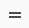

---  

title: "Using the Inventory Search"  
draft: false 
type: Article

---

Using the **Inventory Search**, you can search for and display records related to the inventory items. From the list of items displayed, you can click an Item hyperlink or select the required item and click **Details** in the **contextual panel** to access the item module that contains detailed information about the selected inventory item.

The inventory search window allows you to search by item. If you do not enter a value in the item and description or do not select Stores Location from the drop-down , the search uses only the selection criteria of the selected query.

To perform a search:

1.  Select a **Query** from the drop-down list and click **Search**.

    It displays all the items for the selected query.

2.  To search for a specific item, perform the following:
    -   Enter a full or partial value in the **Item** or the **Description** field. You can select the required value from the **Stores Location** drop-down. The value you enter becomes an add-on to the selection criteria built into the selected query. The more complete the description entered, the narrower the resulting search will be.
    -   Click **Search**.

It displays a list of items matching the selection criteria. See Generic Components and Troubleshooting also.

## Inventory Search Screen Grid

In the inventory search screen, a list of items matching the selection criteria will be displayed in grid. See Grid Operations for more details on grid.

Action bar

In the **Inventory Search** window, you can select one or more of the displayed records to enable the action bar located at the top of the window. The Inventory Search window remains open when you jump to other windows using the action buttons. The actions buttons are:

-   [New Item](Create-New-Item.md): Opens New Item window to create a new inventory item.
-   [Issue](Issue.md): Opens Issue item window to issue the selected item to any work order, requisition, account or a picklist.
-   [Return](Return.md): Opens Return window to return the over issued quantities to the inventory.
-   [Move](Locations-and-Bins.md#move): Opens Move window to move the item from one stored location or bin to another.
-   [Count Item](Using-the-Inventory-Search.md#count-item): Opens Count Item window to check the actual on hand quantity available for that item.
-   [PickList](Create-PickList.md#picklist): Opens the PickList window to create picklists for the selected item/s.
-   Requisition: Opens Requisition creation window to create the new requisition for the selected item.
-   [Rename](Using-the-Inventory-Search.md#rename-item): Opens Rename Item window to rename the selected item.
-   [Delete](Using-the-Inventory-Search.md#delete-item): Opens Delete pop up to delete the selected Item.
-   **Export**: Exports the grid data to an excel sheet. The data will be downloaded in excel and you can open the excel to view the grid details.

### Contextual Panel

In the **Item Search** window, you can select a record to enable the Contextual Panel located at the right of the window. The Item Search window remains open when you jump to other windows using the Contextual Panel. The Contextual Panel consists of the following:

-   [Details](Using-the-Inventory-Notebook.md): Opens the Item module for the selected item.
-   [Documents](Using-the-Inventory-Notebook.md#configuration-tab): Opens Document window which contains all the reference documents attached for the selected item.
-   Where Used: Allows you to see child-to-parent node relationships for the selected item in the hierarchy.
-   [Suppliers](Using-the-Inventory-Search.md#suppliers): Allows you to link the suppliers for the selected item.
-   [Stores Activity](Stores-Activity.md) : Allows you to view all the transactions for the selected item.
-   **Key Stores Activity**: Allows you to view the last 12 months transaction of the selected item for transaction types issue/return/receipt(PO and Non PO)/adjustment. If selected, **Key**

**Stores Activity for \<Item\>** screen will be displayed. See [Contextual Query](Using-the-Inventory-Search.md#contextual-panel) for more details. This feature is available in Item module as well. But, this button is always enabled in Item Module.

When multiple items are selected, the above buttons will be disabled.

### Move an Item

You can move the required item/s from one bin/stores location to another bin/stores location. To move an item or multiple items:

1.  In the [Inventory Search](Using-the-Inventory-Search.md) window, select an item or items to move.
2.  Click **Move** from the action bar. **Transfer between bins for item \<Item\>** window appears. **(1 of n) Transfer between bins for item \<Item\>** window appears if you have selected the multiple items. Refer [Track Serial](Locations-and-Bins.md#track-serial) if you have selected serialized item.
3.  In the **From** section, you can perform the following:
    -   Select the required **Stores Location** from the drop down. By default, the current stores location will be displayed.
    -   Select the required **Bin\*** from the drop down. It is a mandatory field.
    -   Enter the appropriate value in **Qty to Move** field. This is the mandatory field. This indicates the number of quantities to transfer between the bins. By default, the value is zero and entered value should be greater than 0.
4.  In the **To** section, you can perform the following:
    -   Select the required **Stores Location** from the drop down. By default, the current stores location will be displayed. If multiwarehousing is not used, then this field will not be visible.
    -   Select the required **Bin\*** from the drop down to which the item will be moved. It is a mandatory field.
    -   You can change the **Requested By** field if required. By default, the logged in user name will be displayed.
5.  After the updating the values, you can select any of the following buttons:
-   **Save**: This will save the details and move the requested quantities to the new location and bin. If any error, error pop up will be displayed.
    -   **Next**: This will navigate to the next item in the selected list.
    -   **Previous**: This will navigate to the previous item in the selected list.
    -   **Clear All**: This will clear all the updated values.
    -   **X**: This will close the panel.

Next button is not available for the last item and Previous button is not available for the first item. You can see each item movement transactions (Bibo) in [Stores Activity](Stores-Activity.md).

### Count Item

The Count Item window enables you to enter physical item counts to adjust inventory system balances. As balances are adjusted upward, Aptean EAM checks work orders in awaiting material status for additional material allocations. When item balances are adjusted downward, Aptean EAM tests the replenishment calculations to determine whether reordering is necessary to bring balances within desired limits.

To perform count item:

1.  In the [Inventory Search](Using-the-Inventory-Search.md) window, select an item or multiple items.
2.  Click **Count Item** from the action bar. **Count Actual Qty on Hand for Item \<Item\>** grid appears. **(1 of n) Count Actual Qty on Hand for Item \<Item\>** grid appears if you have selected multiple items. Refer [Track Serial](Locations-and-Bins.md#track-serial) if you have selected the serialized item.
3.  You can see the following columns in the grid:
    -   Location
    -   Bin
    -   On Hand: It is the on hand quantity from the inventory system balance.
    -   Last Counted: Date, Month and Year
    -   Actual Count: It is the physical item count. By default, the value is same as On Hand
quantity column. You can edit this field to update the new value.
    -   Comment: You can enter any comments related to the quantity adjust if required.
1.  After the updating the values, you can select any of the following buttons:
    -   **Save**: This will save the details and update the On Hand column value with the Actual Count column value.
    -   **Next**: This will navigate to the next item in the selected list.
    -   **Previous**: This will navigate to the previous item in the selected list.
    -   **Clear All**: This will clear all the updated values and reset each column with the original values.
    -   **X**: This will close the panel.

### Delete Item

You can delete an item from the inventory. To delete an item:

1.  In the [Inventory Search](Using-the-Inventory-Search.md) window, select an item to delete.
2.  Click **Delete** from the action bar.  
    A message prompt appears: **Are you sure you want to delete Item (\<Item\>)?** with the following buttons:

    1.  **Delete**: You can select this to delete an Item. If deleted successfully, the **Item \<Item\> Deleted Successfully** notification appears and the item will be removed from the inventory. Error pop up will be displayed if the selected item can not be removed. You can see the various conditions for not deleting the item and proceed further.
    2.  **Cancel**: You can select this to cancel the item deletion.

### Rename Item

You can assign a new name to an existing item. To Rename an Item:

1.  Select an item to rename.
2.  Click **Rename** from the action bar.

    The **Rename Item** window opens.

3.  Enter a value in the **New Item \#**.
4.  Click the check box to acknowledge the renaming action.
5.  Click **Save**. You can click on **X** button to close the pop up.

>[!note]
>The renaming changes can take a long time to execute, changes on the Rename Item window are normally handled through Task Management Portal. If the job is not on a regular schedule, you may need to notify your systems support to have it executed. Refer Task Management User Guide for more details.

## Suppliers

The Suppliers feature helps you establish the list of suppliers for an item and rank them in order of preference. You can also specify quoted lead days, unit of purchase, and package quantity for the item when shipped. You have the option of entering the manufacturer and part number that applies to a particular supplier.

Perform the following in Supplier:

1.  In the [Inventory Search](Using-the-Inventory-Search.md) window, select an item.
2.  Click **Suppliers** from the contextual panel.
3.  **Suppliers Of \<Item\>** page opens to list the suppliers linked if any in grid. You can click on **X**

    to close the page.

4.  You can see the details of **Rank, Supplier, Supplier Name** and **Part Number** for each sup- plier. See Grid Operations also.
5.  You can perform the following operations on each grid record:
    -   **New Supplier**: Allows you to add a new supplier to the selected item. See [New Supplier](Using-the-Inventory-Search.md#new-supplier) for more details.
    -   **Edit Supplier**: Allows you to edit the existing supplier. See Edit Supplier for more details.
    -   **Remove Supplier**: Allows you to remove the supplier from the grid. You can select the required supplier from the list and click on **Remove Supplier**. The record will deleted from the list.
    -   **Change Rank**: Allows you to change the rank of the supplier in the list. Change Rank button will be enabled only if there are more than one record in the grid. If there are more records, you can click on **Change Rank** to provide the rank for each suppliers. See [Change Rank](Using-the-Inventory-Search.md#change-rank) for more details.

### New Supplier

You can enter the following fields in **Add Supplier** screen to add the new supplier:

-   **Rank**: It will display the number 1 if you are adding for the first time. The rank will continue in number if you keep on adding the suppliers. This field will be disabled and non editable.

-   **Supplier**\*: You can enter or search for the specific supplier using Supplier QW.
-   **Supplier Name**: It will be updated along with the selected supplier.
-   **Manufacturer**\*: You can enter the manufacturer for the supplier.
-   **Part Number**\*: You can enter the part number to refer the selected item from the supplier end.
-   **Package Qty**\*: By default, it will be 1. You can increment to the required value. It indicates the number of quantities that should be in each package.
-   **Purchase U/M**: It is the unit of measure for each purchase. You can select the required value from the drop-down. This field gets enabled only if the package qty is greater than 1.
-   **Current Price**: You can enter the required value as current price.
-   **Last Price Paid**: This is disabled by default. It indicates the last price paid for the selected item.
-   **Lead Days**: You can enter the required number of lead days in this field.

>[!note]
>The fields marked with * are mandatory.

After entering the above values, you can select any of the following buttons:

1.  **Save**: Selecting this will save and add the new supplier to the grid list.
2.  **Cancel**: Selecting this will exit the new supplier screen.

### Edit Supplier

You can edit the existing supplier from the list. In the **Edit Supplier Info** screen, you can update the required fields with new values. The fields will be as similar to the fields in [New Supplier](Using-the-Inventory-Search.md#new-supplier) screen.

After updating the required values, you can select any of the following buttons:

1.  **Save**: Selecting this will save the updated details.
2.  **Cancel**: Selecting this will exit the edit supplier screen.

### Change Rank

In the Change Rank screen, hover a cursor on  icon and drag - drop the row to the required position. Accordingly, **New Rank** column will be updated. The old Rank will be visible in the **Rank** column. After placing to the new position, click on **Save** to update the rank. After saving, New Rank column will not be visible. This is the extra column displayed only clicking on Change Rank.

You can click on **Cancel** to exit the screen.

The supplier with Rank 1 will be considered as the default supplier to create work orders and requisition.

If the supplier is removed from the grid, the rank will be auto adjusted by the system.
