---  
 
title: "Approve Access to Aptean Support"  
draft: false 
type: KB Article
 
---

The scope of this document is to provide instructions on how to grant access to the production
environment for Aptean support and other personnel who require access.  

## Request Access for Company

When the Aptean Support team needs access to a company, the support team can request
access from the Manage Company page, which will be then approved by the customer
administrator.  
To request access to a company, follow these steps:
1. Navigate to the **Manage Company** page.

    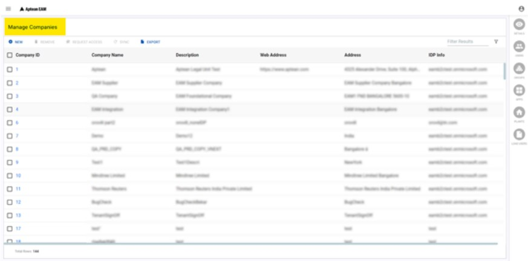

2. From the list of available companies, select the Company ID to which you want to request
access and Click **REQUEST ACCESS** on the action bar. 

    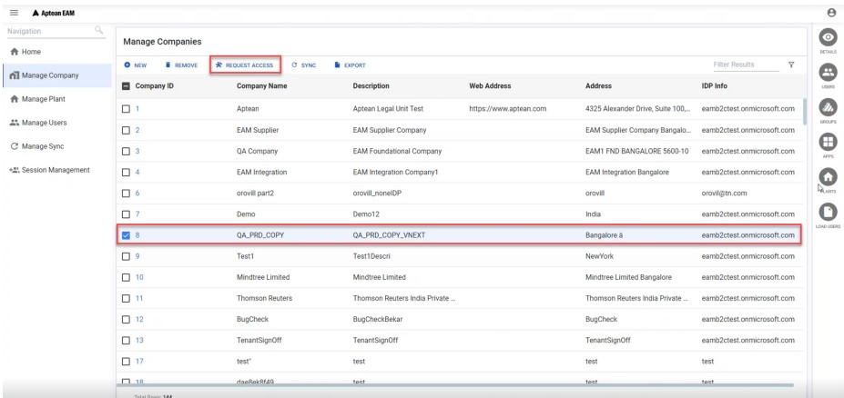

    The **Administrator Data Access Request** popup will appear, prompting you to confirm the
    request.

    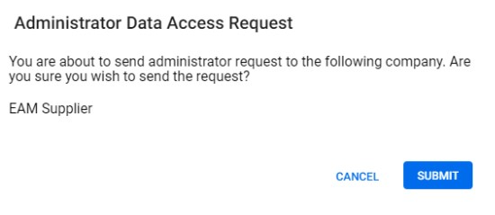

3. Click **SUBMIT** to confirm the request. An email will be sent to the account manager for this
request, and a confirmation message will appear.

    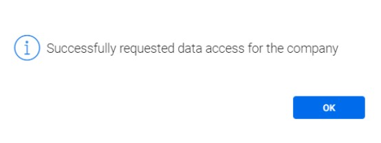

4. Click **OK** to close the popup.  

> [!Note]  
> After the customer administrators grant access to the plants within a company, the
respective plants will be listed on the Plant List available on the home page. You can
navigate to the Manage Sync page, to confirm successful synchronization and access.

## Manage Access to Company

Customer administrators possess the capability to authorize a requested user's access to plants
within a company.  

### Approve Access to Company

Customer administrators can grant access to a company from the notification card or the Manage
Users page. Please note that the notification card will only appear on the home page when there
is a pending request for approval.  
  
**Approve Access from Notification Card**

To approve access to a company from the notification card, follow these steps:
1. Log in with the customer administrator credentials.

2. If there are any requests for admin access to companies, you will see them in the **Pending
Aptean Admin Access notification card.

    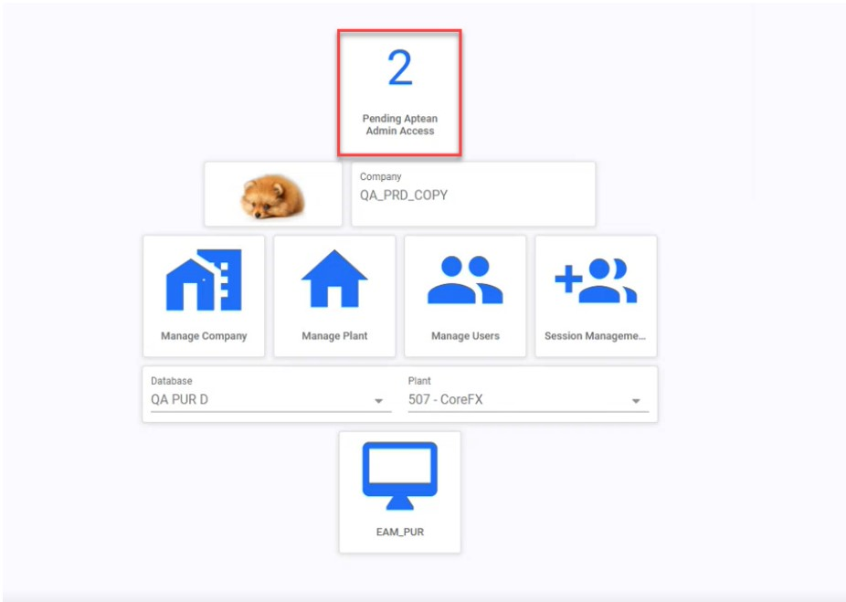

3. Click the Pending Aptean Admin Access** notification card.  
The **Aptean Administrator** page appears with the status of the users.

    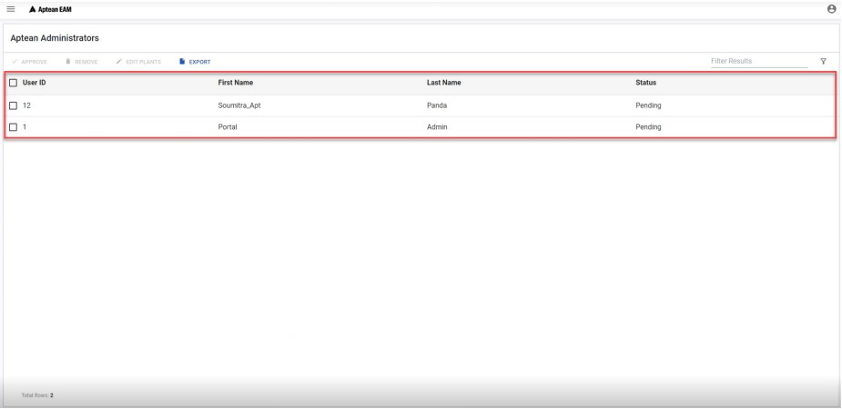

4. To approve the request, select the **User ID** and then click **APPROVE** on the action bar.  

    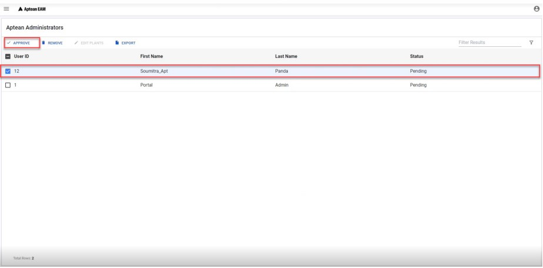

    The **Approve Data Access Request for Aptean Administrator** dialog box appears.
    
    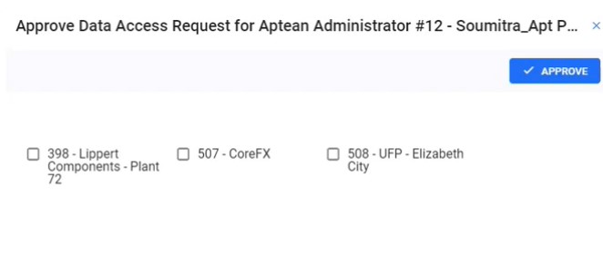

5. Select the plants to which you want to grant access and click **APPROVE**.  
The access will be granted to the user and a success message appears.

    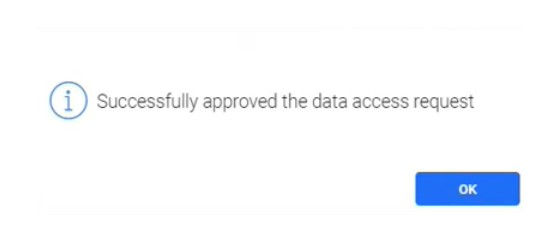

6. Click **OK** to close the pop-up.  
The status of the user will be changed to active on the Aptean Administrators page.

    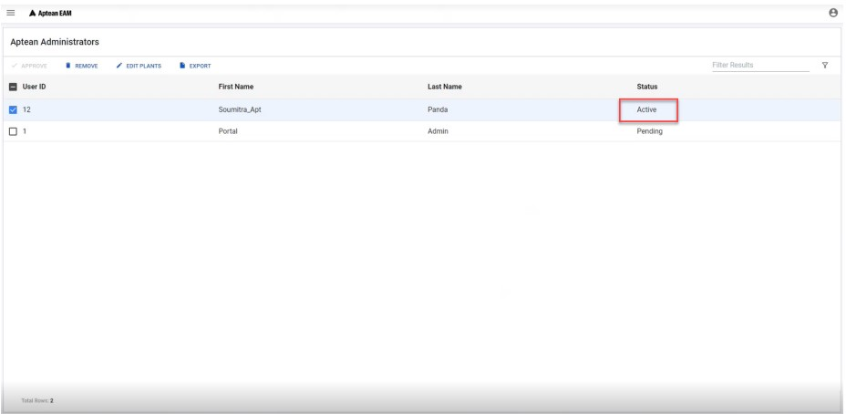

**Approve Access from Manage Users Page**

To approve access to a company from the Manage Users page, follow these steps:

1. Log in with the customer administrator credentials.
2. From the left pane, click **Manage Users**.

3. From the contextual pane, click **APTEAN ADMINISTRATORS**.  

    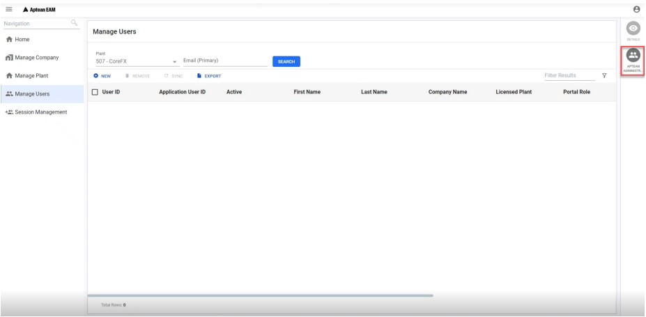

    The **Aptean Administrator** page appears with the status of the users.

    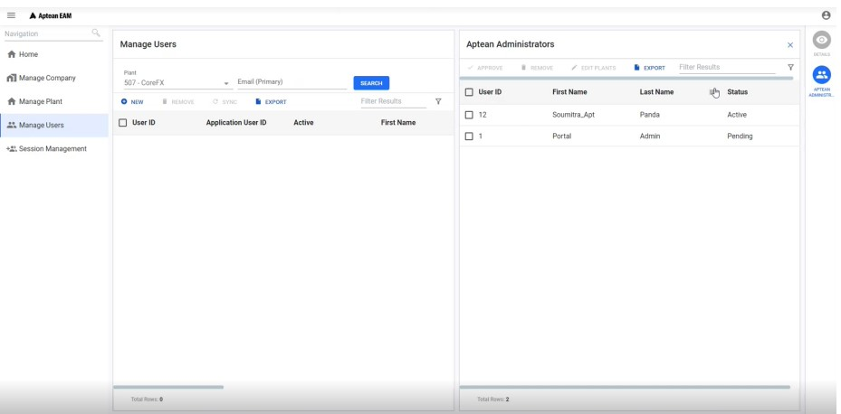

4. To approve the request, select the **User ID** and then click **APPROVE** on the action bar.   

    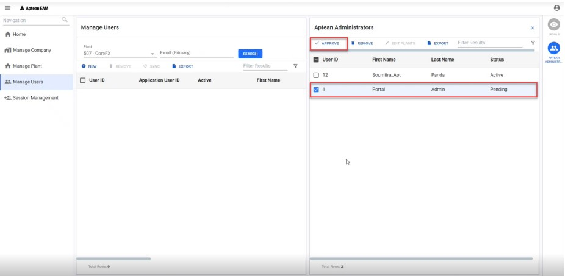

    The **Approve Data Access Request for Aptean Administrator** dialog box appears.

    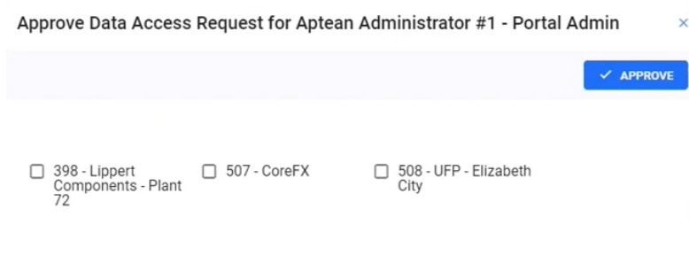

5. Select the plants to which you want to grant access and click **APPROVE**.  
The access will be granted to the user and a success message appears.

    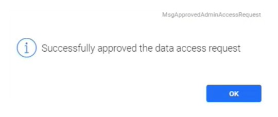

6. Click **OK** to close the pop-up.  
The status of the user will be changed to active on the Aptean Administrators page.

**Manage Plant Access**  

After approving the request for plant access, the customer administrator can add or remove the
plant access.  
To change plant access to a company, follow these steps: 

1. Navigate to the **Aptean Administrators** page.  

    > [!Note]   
    > You can navigate to Aptean Administrators page from the notification card and the Manage Users > APTEAN ADMINISTRATOR contextual icon.

2. Select the User ID to which you have to change the access and then click EDIT PLANTS on
the action bar.

    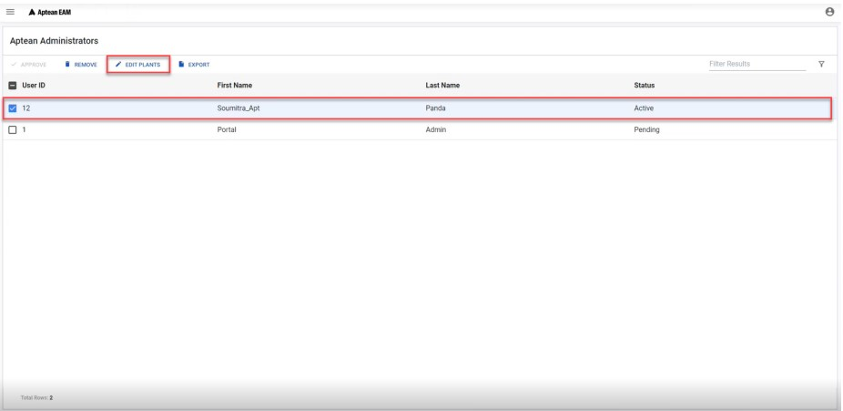

    The Edit Plants for Aptean Administrator dialog box appears.

    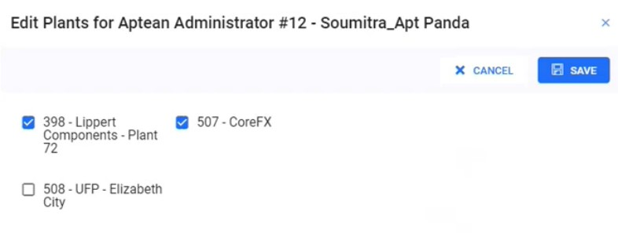

3. Select the plant to which you want to grant access and clear the selection of the plant to
which you want to remove the access and then click SAVE.  
The access will be updated for the user and a success message appears.

    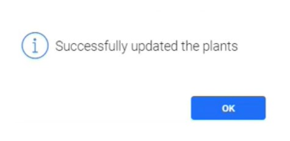

4. Click **OK** to close the pop-up.

**Remove User from Aptean Administrators**

To remove a user from the Aptean Administrators list, follow these steps:

1. Navigate to the Aptean Administrators page.

    > [!Note]  
    > You can navigate to **Aptean Administrators** page from the notification card and the Manage Users > APTEAN ADMINISTRATOR contextual icon.

2. Select the **User ID** you have to remove the administrator access and click **REMOVE** on the
action bar.  

    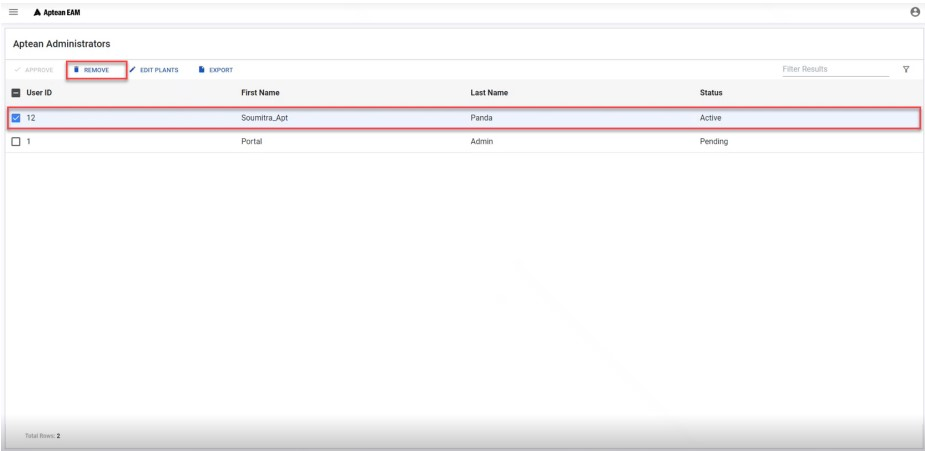

    The user will be removed from the **Aptean Administrators** list.

