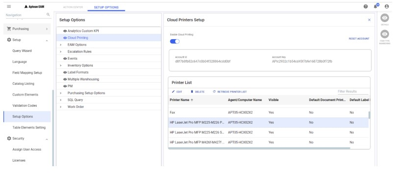

---  
 
title: "Setup and Cloud Printing"  
draft: false 
type: KB Article
 
---

Setting up the cloud printing allows you to print documents and labels on any printers configured
in the network cloud.

## Setting Up Cloud Printing to Print Documents and Labels

To enable cloud printing in EAM, perform the following steps:
1. From the left panel, navigate to Setup > Setup Options.

    

2. In the Setup Options panel, click Cloud Printing.
3. From the right panel, turn on the Enable Cloud Printing toggle button.
4. In the Account Id field, enter the account id.
5. In the Account Key field, enter the API key.  

    > [!Note]  
    > Contact your PM to get the account details for Production. PM can refer to the internal document (**Cloud Printing Account Setup and Agent Configuration**) to
    create cloud printing account.  

> [!Tip]  
The Account information is unique for each plant and it can be used for printing
to multiple printer servers.

6. Click the SETUP ACCOUNT button. All the available physical printers installed on the agent
computer will be displayed in the **Printer List** section.

> [!Note]  
> The **Cloud Printing** option will be enabled for Work Management, Requisition ,
Purchasing, Picklist, and Cycle Count modules.  
The **Print Labels** option will also be enabled for Inventory module.  
You can reset the account configured using the **RESET ACCOUNT** button.

From the Printer List section, you can perform the following actions:
* Edit the printer details
* Delete a printer
* Retrieve printer list  

On setting up the cloud printing, you can print the Work order, Purchase order, Pick List, Cycle
Count, and Requisition, and item labels on any printer configured in the network cloud.

### Edit Printer Details

Using this option, you can hide a printer/ make it visible in the printer list, set the default document
printer, and set the default label printer.  

**Visible**: Turn on the toggle button to make it visible in the printer selection list. Turn off the toggle
button to hide it in the printer list. By default, this option is set to Yes when a printer is initially
found and added to the printer list. 

**Default Document Printing**: Turn ON the toggle button to make it as a default document printer.

**Default Label Printing**: Turn ON the toggle button to make it as a default label printer.

### Delete Printer

Using this option, you can delete a printer and remove the printer from the printer list. Once
deleted the printer will not be available for cloud printing.

### Retrieve Printer List

Using this option, you can retrieve the deleted printer and the latest list of printers. Retrieving
printer list will not erase the current settings, such as visibility of the printer, default document
printer, and label printer, for the existing printers.  

> [!Tip]  
> If a new printer is added to a printer server, restart the Aptean Print service on that
server, and then click the RETRIEVE PRINTER LIST button in EAM to get the latest list of
printers.

## Configure Multiple Printer Servers

The Account information is unique for each plant and you can use the same account details to
configure multiple printer servers. To configure another printer server, repeat the process of
installing the cloud printing agent and entering the account details.

## Work Order Cloud Printing

To cloud print a work order, perform the following steps:
1. Navigate to the Work Order Search page and select the work order to be printed and click
DETAILS.
2. From the **ACTIONS** menu, click **PRINT**.

    

    The Print Options pop-up appears.

    

3. Select the options to print.
4. Click the CLOUD PRINT button, to print the documents through the default document
printer.

    

5. To select a printer, click the drop-down arrow and then select the printer. The document will
be printed through the selected cloud printer.
6. Once the printing is completed/failed, you will get a notification. 

> [!Note]  
> The procedure for cloud printing in following modules is almost same as the
printing in work order module.  
> * Purchase Order Cloud Printing
> * Requisition Cloud Printing
> * Pick List Cloud Printing
> * Cycle Count Cloud Printing

## Batch Work Order Printing

To perform batch work order printing, perform the following steps:
1. In Task Management, create a schedule for WO_Print task.
Enable Cloud Print in Print Options screen and choose an available physical printer.

    

2. Click OK to submit this task schedule.

## Setting up Label Format

To print a label, you need to setup a label format in the system first.  
To setup a label format, perform the following steps:
1. Navigate to Setup > Setup Options.

2. In the Setup Options panel, click label Formats.
3. From the right panel, click the New button to upload a new label format.

    > [!Note]  
    > To create a label format record in the system, you need a BTW file locally for
    uploading.

4. Click the UPLOAD LABEL FORMAT button and select the local BTW file. For example,
DefaultBinLabel.btw.

5. The Label Name will be auto populated. Enter a Description for the label.

    

6. Enter the name of the Bartender Connection Properties Name which will be used as the
label data source. For example, DefaultBinLabel.

    > [!Note]  
    > Bartender Connection Properties Name is the name of the XML file which is
    used to map the data to the related BTW file to form the label. To review the data on this file
    locally, from the Inventory page select the item and click EXPORT XML to download the
    XML file.

7. You can turn on the Default Label toggle button to make this label format as a default label
format in this plant.

8. Click ADD. The label format will be added to the Label Format list.  
Once a label format is added, you can edit, delete, or download the label format.

## Item Label Cloud Printing

To cloud print an item label, perform the following:
1. Navigate to the Inventory page (navigate from Search Item menu), choose one existing
query, for example, **DefaultBinLabel**, and select the items in the results for which the label
will be printed.

    

2. Click the **PRINT LABELS** option. The Print Item Labels page opens. The columns in this new
screen are same as the ones in existing query **DefaultBinLabel**.

    > [!Note]:  
    The PRINT LABELS option will be enabled only if the Cloud Print option is enabled.

3. From the Label Format drop-down menu, select the required label format.

    

4. From the Printer Selection drop-down menu, select the required printer.
5. If default printer and/or default label format is setup, then the respective one will be auto
selected.
6. You also have an option to print multiple copies of labels. In the Number of Labels to Print
field enter the number of copies required to print.
7. Click CLOUD PRINT. The label will be printed.

    > [!Note]  
    > If you receive an error message saying, **Please fill required fields**, despite
properly filling in the # of labels, make sure that the **Default Label Printing** and the
**Visible** options, for the virtual printer **Label Printer** are set to **Yes**.
Although the Label Printer is set as the default printer, you cannot print using it. You
will need to use a valid printer instead.

8. Once the printing is completed/failed, you will get a notification.

> [!Note]  
> Using the EXPORT LABEL DATA button you can export the label data in a XML file
to review locally.

