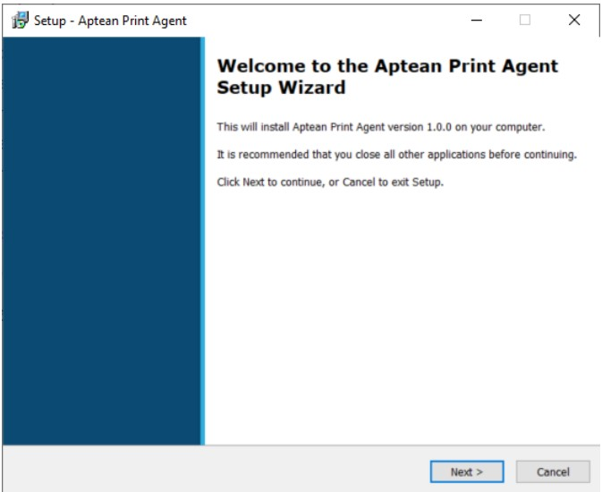
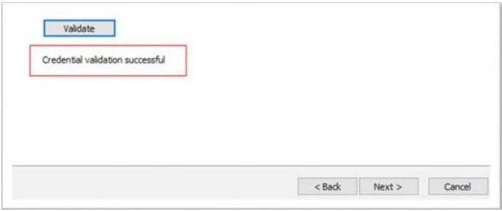
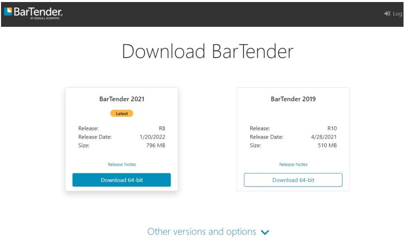
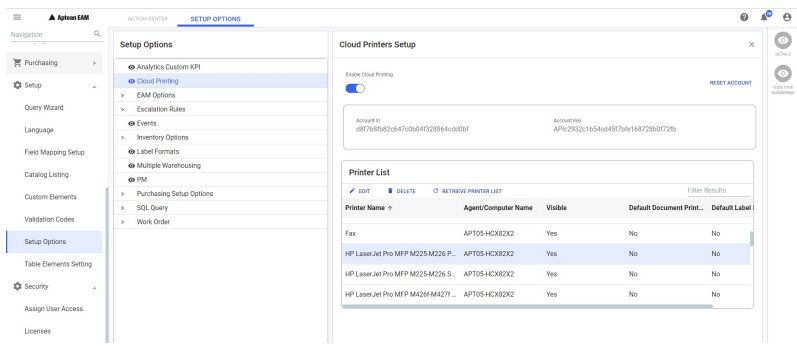

---  
 
title: "Cloud Printing Account"  
draft: false 
type: KB Article
 
---

Cloud Printing Account is the prerequisite to setup cloud printers and install Cloud Printing Agent
on Agent computer. Cloud Printing Account includes following information:
* Account ID
* API Key
* Agent Key  

To setup cloud printers, customers will use **Account ID** and API Key in the Cloud Printer
Maintenance screen in EAM. The **Account ID** and **Agent Key** are used when installing the Cloud
Printing Agent on Agent computer.

> [!Note]  
> Contact your PM to get the account details for Production. PM can refer to the
internal document (Cloud Printing Account Setup and Agent Configuration) to create
cloud printing account.

> [!Tip]  
>The Account information is unique for each plant and it can be used for printing to
multiple printer servers.

# Configure Cloud Printing in Agent Computer

Configuring cloud printing in agent computer includes:
* Downloading Cloud Printing Agent
* Installing Cloud Printing Agent
* Configuring Agent Computer for Label Printing

## Downloading Cloud Printing Agent

To download cloud printing agent, perform the following steps:
1. Go to the Production environment home page <https://print.api.apteancloud.com/> in a
browser.

    > [!Note]  
    > If it prompts for a username and password, enter the Account ID and API Key
provided in the Cloud Printing Account section.

    

2. In the Aptean Print Service page, click the Print Agent Windows Installer link to download
the ApteanPrintAgentSetup.exe file.

## Installing Cloud Printing Agent

The Cloud Printing Agent must be installed locally on the Agent Computer, at the user side, which
is used to receive printing jobs. The print jobs are directed from Cloud Printing Service to the local
printers through the Print Agent.  
To install the cloud printing agent, perform the following steps:

1. Double-click **ApteanPrintAgentSetup.exe** file that you downloaded from the Production
environment home page <https://print.api.apteancloud.com/>.  
The welcome page appears.

    

2. Click **Next**.
3. In the **Select Destination Location** screen, select the default folder or a folder in a location
of your choice to install the **Aptean Print Agent**, and then click **Next**.

    

4. In the **Print Service Authentication Details** screen, enter the Account ID and Agent Key,
and then select **Production**.

    

> [!Note]  
> If you want to validate the account entered, click the Validate button. If the
account ID and Agent Key are correct, the Credential validation successful message
appears.

5. Click **Next**.

6. In the **Ready to Install** page, click the **Install** button.  
Wait until the installation is completed.

    

## Configuring Agent Computer for Label Printing

To configure the agent computer for label printing, perform the following steps:
1. Download the *EAMLabelPrintIntegration.rar* from the SharePoint.

2. Unzip the download RAR file and copy the entire folder to directory C:\Program Files\Aptean
on the agent computer, as shown below:

    

3. Go to the ApteanPrintAgent folder, and open the application.yaml file for edit.

    > [!Note]  
    > Normally, you can see the ApteanPrintAgent folder at C:\Program Files
    (x86). 

     

Copy the below information to the file and update the values highlighted in blue, in the image (no
need to change other config information).  

    computerName: APT05-XXXXXXX  
    commands:  
    - name: LabelPrinter
    command: C:\Program Files\Aptean\EAMLabelPrintIntegration\EAMLabelPrintIntegration.exe  
    working-dir: c:\tmp  
    arguments: [ "--file", "$(FILENAME)" ]  
    drop-dir: c:\tmp  
    delete-file: false  
    - name: Local Drop  
    drop-dir: C:\tmp\tmp  

> [!Note]  
> Do not change any format in above commands, even the spaces before each line.
Otherwise, the Agent service may not be started.
The updated file cannot be directly saved in this folder to replace the original one. Save it on
another place first, for example, on the desktop, then copy it to this folder to replace the
original one.

> [!Tip]  
> You can configure multiple printer servers using the same account details. To configure another printer server, repeat the process of installing the cloud printing agent and
entering the account details.

## Install and Activate Bartender software on Agent Computer

To install and activate the latest Bartender software on Agent Computer, perform the following
steps:
1. Download the latest Bartender installation file from the [BarTender download](https://portal.seagullscientific.com/downloads/bartender) page and install it on the agent.

    

2. For the company, you can purchase the official license key to activate it.
3. For the internal testing, you can apply for a 30-Day Trial in through following URL:
[Download 30-Day Trial | BarTender](https://www.seagullscientific.com/30-day-trial/) 

    

4. After installing the BarTender software, enable the Cloud Printing option in EAM, and fill in the
account information.

## Enable Cloud Printing in EAM

To enable cloud printing in EAM, perform the following steps:
1. From the left panel, navigate to **Setup** > **Setup Options**.

2. In the **Setup Options** panel, click **Cloud Printing**.

    

3. From the right panel, turn on the **Enable cloud Printing** toggle button.

4. In the **AccountId** field, enter the account id.

5. In the **Account Key** field, enter the API key.

6. Click the **SETUP ACCOUNT** button. All the available physical printers installed on the agent
computer will be displayed in the **Printer List** section.

> [!Note]  
> The Cloud Printing option will be enabled for Work Management, Requisition, Picklist, and
Cycle Count modules. The **Print Labels** option will also be enabled for Inventory module.
You can reset the account configured using the **RESET ACCOUNT** button.

> [!Tip]  
> If a new printer is added to a printer server, restart the Aptean Print service on that
server, and then click the RETRIEVE PRINTER LIST button in EAM to get the latest list of
printers.

