---  
 
title: "User Management"  
draft: false 
type: KB Article
 
---

Aptean EAM allows the customer administrators to add and manage users in the Tenant portal.
Adding a user includes:
1. Creating a user
2. Assigning a license to the user

3. Configuring security access to application modules and functionalities

> [!Note]  
> To make the user fully functional, the administrator must complete all the above
configurations.

## Creating a user
The first step to add a user to Aptean EAM is creating a user in the tenant portal. You can add a
user through the user interface or using the bulk data loader tool.  
To create a user through the user interface, perform the following:
1. From the Tenant Portal home page, click **Manage Users**.

    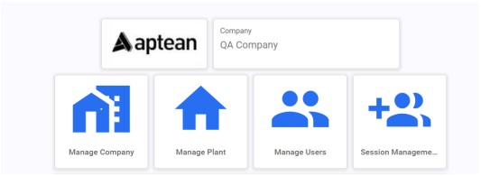

    The Manage Users page appears.

    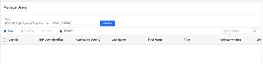

2. Click the **New** button. The **New User** pop-up page appears.  

    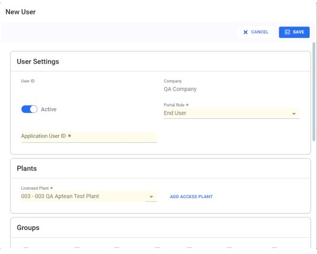
    
    The New User page contains the following sections:
    * User Settings
    * Plants
    * Groups
    * General Information
    * Contact Information

3. In the User Settings section:

    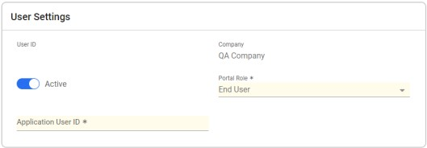

    1. From the **Portal Role** drop-down menu, select either **Customer Administrator** role or End User role.

        > [!Note]  
        > **Customer administrator** role allows the users to create users, manage
        users, update access information, etc., It is advised to have at least 2 administrators
        for a site, so that there will be always an administrator available.

    2. In the Application User ID field, enter an application ID for the user.

        > [!Note]  
        > You can enter any characters for application user ID, up to 10-character limit.

        To guarantee its uniqueness, Aptean EAM will append a number at the end of the
        characters you entered. This application ID is used to easily identify the user in the
        EAM application. For consistency, develop a pattern for the application user ID. For
        example, firstinitial_lastname.

    3. If the customer has opted for customer authentication, then you will see a IDP User
    Identifier field. Enter the **IDP User Identifier**. The identifier must exactly match the
    customer’s IDP identifier for this user. You cannot make up a value to enter in this
    field. For more information on authentication handled in Aptean, refer to the [User Authentication](Aptean_EAM_User_Management.md#user-authentication) section.

        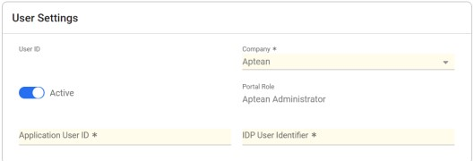

    4. By default, the **Active** toggle button is turned on. You can also turn off the toggle button to make the user inactive.

4. In the **Plants** section:

    1. From the Licensed Plant drop-down menu, select the licensing plant for this user.

        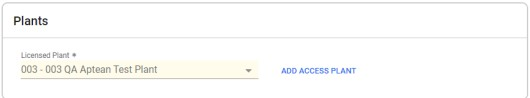 

        > [!Note]  
        > If you have only a single plant in your implementation, then the plant will be the licensing plant by default. If you have multiple plants in your implementation, then you will have the choice to select the licensing plant for the user. For more information, refer to the [Single and Multiple plant implementation](Aptean_EAM_User_Management.md#single-and-multiple-plant-implementation) section.

    2. To provide access to other plants to this user, click **ADD ACCESS PLANT** and select the plant from the drop-down list.

        > [!Note]  
        > You can provide access to multiple plants to a user. To delete access to a plant, click the delete button next to it.

5. In the **Groups** section, select the application access groups to which you want to add the
user. You will have application access groups for the Test and Production environments.
The Test environment applications will have the word ‘Test’ in them, below. 

    

    The groups will provide application access from the portal as mentioned below.

    > [!Note]  
    > Application tile will appear only once for a user if a user is assigned to different
    application groups which overlap.

    * EAM Core – Access to the EAM application and Technician application tiles. These enable
    the user to access all core EAM functionality (subject to security access for the user.)

    * Requester – Access to the Requester application tile.
    * Administrator – Access to all application tiles, including the Task Manager
    * Analytics – Access to the Analytics application

        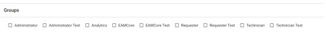

6. In the **General Information** section, enter the basic information of the user such as **First
Name**, **Last Name**, **Middle Name**, and **Title**.

    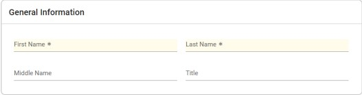

7. In the **Contact Information section**, enter the contact details of the user. This must be a
valid email address. The user will not be able to use the system without a valid email
address, as password reset information and other pertinent authentication related tasks,
will be managed through the user’s email address.

    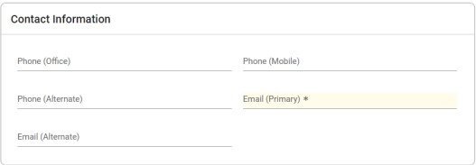

8. Click **Save**. The user will be created, and a confirmation pop-up appears:

    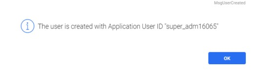

    You can also see the user created in the **Manage Users** page.

    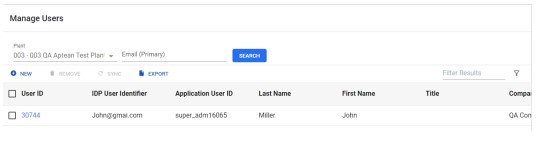

## User Authentication

There are two types of authentications handled in Aptean EAM. They are:

* Aptean Authentication
* Customer Authentication

### Aptean Authentication

Aptean Authentication is used for the customers who want us to manage their users and
passwords. This does not require the customer authentication provider i.e., Identity Provider (IDP)
to authenticate the users.

### Customer Authentication

Customer Authentication is used for the customers who want to integrate their IDP to manage
their users’ password and authentication. There is a one-time setup configured in the system to
integrate the customer’s IDP. Once configured, each user’s IDP User Identifier will have to be
assigned in the tenant portal. For this, you will have an additional field in the user setup page.

### Single and Multiple plant implementation

#### Single plant

If you have implemented single plant, then only that plant will be available as a licensing plant.

#### Multiple plant implementation

If you have implemented multiple plants, then you will have the choice to allocate their licenses.
Based on the requirement, each user can be allocated to the appropriate licensing plant.

### Licensing all users to a single plant in the enterprise

Customers may allocate all their licenses to a single licensing plant. Users will still be granted
security access only to the plants which are relevant to the user, but the licenses are treated as a
pool of licenses to be shared across the enterprise.

The advantages of this approach are:

* It is easier to manage all licenses being in one place (since all users are allocated to a
single licensing plant).

* It ensures that you are maximizing your license allocation.  

The disadvantage is that it is harder to manage the number of licensed users across the sites for
a fair distribution of the licenses.

### Licensing users across multiple plants in the enterprise

Customers can allocate licenses across multiple plants. The customers will have to determine the
plants to allocate licenses, and to determine on a case-by-case basis which licensing plant is the
perfect match for each user. Users will still be granted security access only to the plants which are
relevant to the user. This means that the plants to which a user can access do not have to be
related to their licensing plant. A user could get a license from Plant 1, but do all their work in
Plant 2.

This approach is useful for organizations that have strict license allocations for their sites (For
example, the financial model may be that each site pays for its own licenses, so they want to
ensure that they get what they have paid for.)

The downside is the complexity of managing the different license allocations across plants, and
the user allotments to each (For example, a user who would have access to multiple plants can
still be licensed to only one plant, so they must find which one would fit correctly.)

## Assigning License to Users

After creating the user, you need to allocate licenses to the users. OneEAM has three types of
licenses:

* EAM Core (Security group name is ***CoreNamedLicense***): These users are licensed for all
modules in the system. These users have license fees associated with them.

* Requester (Security group name is ***RequesterNamedLicense***): These users are licensed
for the Work Requester application. You have unlimited number of these licenses available
at no additional charge. A user licensed only in the Requester group will not consume an
EAM Core license.

* Analytics (Security group name is ***AnalyticsNamedLicense***): These users are licensed for
the Analytics application.

> [!Hint]   
> Remember that you can type characters in the drop-down box to filter the values.
Typing in “license” will filter the list to the valid license types, as a quick way to locate them.

> [!Note]  
> Each user must be registered to a licensing plant. This is NOT necessarily the plant
that the user has security access to.

To assign a license to user, perform the following:
1. From the left menu, click Security and click Assign User Access.

2. From the Assign User Access page, select the user to whom you want to assign license.
3. From the right pane, click Groups. The groups for the users appear.
4. From the Has Access column, select the check box of the respective license groups to
provide the license grant. You may assign a user to one more than one license group,
depending on the user’s role.  
Now the user will be privileged with the selected license.

## Assigning security access to users

After a user is assigned with a license, you can assign the security access to the user. Users can
belong to multiple security groups. Note that these override rules which apply to multiple security
group assignments for a user:

1. If a user has window access enabled for a function in any one of the security groups
assigned to them, then the user has access to that functionality. These configurations are
in the **Security** module under **Assign User Access**.

    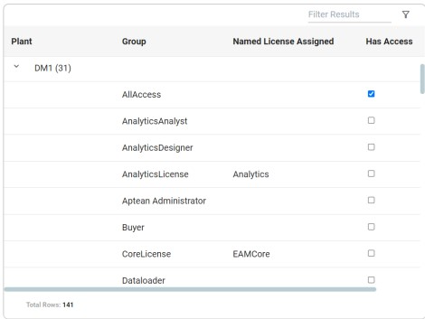

2. If the user’s field visibility or protect configuration is different from the base configuration
in any one of the security groups assigned to them, then the user will see this override.
These configurations are in the Setup module under Table Element Setting.

    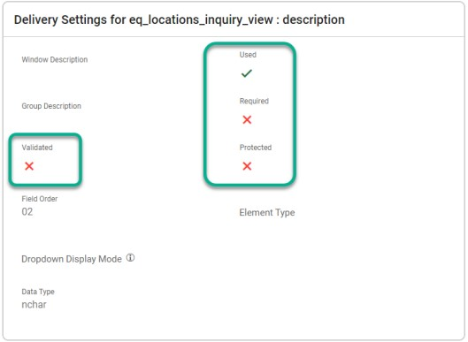

## Managing Security Groups

To assign security actions to a security group, perform the following:

1. From the left menu, click **Security** and click **Security Groups**.

2. From the **Security Groups** page, select the group in which you want to assign security
access.

3. From the right pane, click **WINDOW ACCESS**. The window access for the group appears.

4. From the Module drop-down menu, select the module in which you provide the access to
for the user.
5. From the **Has Access** column, select the check box of the respective window t o provide
the access.  
Now the user can access the windows selected for the module.  

## Frequently Asked Questions

### How do I configure a Requester user?

To configure a Requester user, perform the following steps:

1. In the tenant portal, add the user and assign to the Requester application group:

    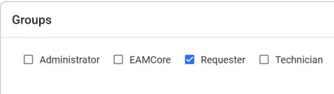

2. In EAM, navigate to Security > Assign User Access, and assign the user to the
license and security group for Requesters.

    1. **Assigning License Type**: A Requester uses a special license type, which is the
Requester license. Users who have ONLY this license type will not be counted
against your EAM Core licenses.  

        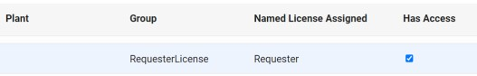

    2. **Assigning Security Group**: Requesters should be assigned to the Work Requester security group.

        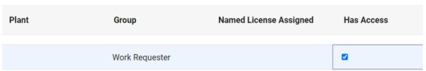

### How do I configure a Technician user?

To configure a Technician user, perform the following steps:

1. In the tenant portal, add the user and assign to the Technician application group:

    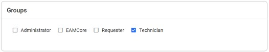

2. In EAM, navigate to **Security** > **Assign User Access**, and assign the user to the license
and security group for Technicians.  
    1. **Assigning License Type**: A Technician uses an EAM Core license. Assign the CoreLicense group to the user:

        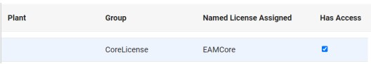

    2. **Assigning Security Group**: Technicians should be assigned to the Work Technician security group.

        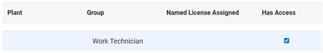

### How do I configure a user for Task Management?

To configure a user for Task Management, perform the following steps:

1. In the tenant portal, add the user and assign to the **Administrator** application group:

    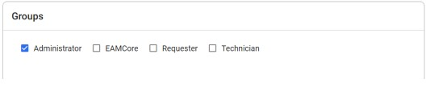 

2. In EAM, navigate to **Security** > **Assign User Access**, and assign the user to the **CoreLicense** group for Core EAM.

    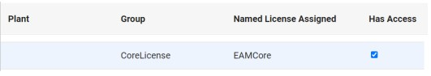

3. Assign the user to the **Task Management Administrator** security group.

    

### How do I configure a user for Analytics?

To configure a user for Analytics, perform the following steps:

1. In the tenant portal, add the user and assign to the Analytics application group:

    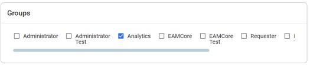

2. In EAM, navigate to **Security** > **Assign User Access**, and assign the user to the license group for Analytics.

    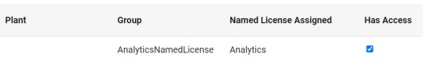

3. Assign one of the Analytics Security groups:

    1. The Analytics Analyst group can view and interact with all KPIs which are available to the plant.

    2. The Analytics Designer group has all the capabilities of the Analyst group, and the ability to design new reports.

        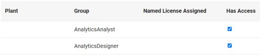

